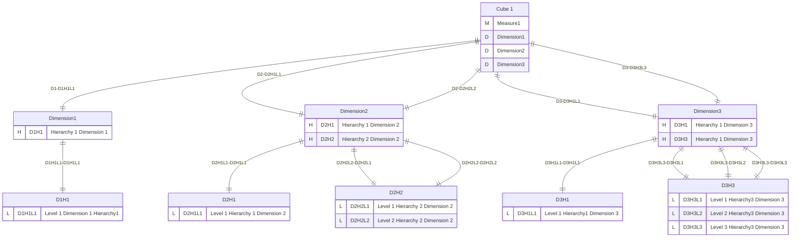
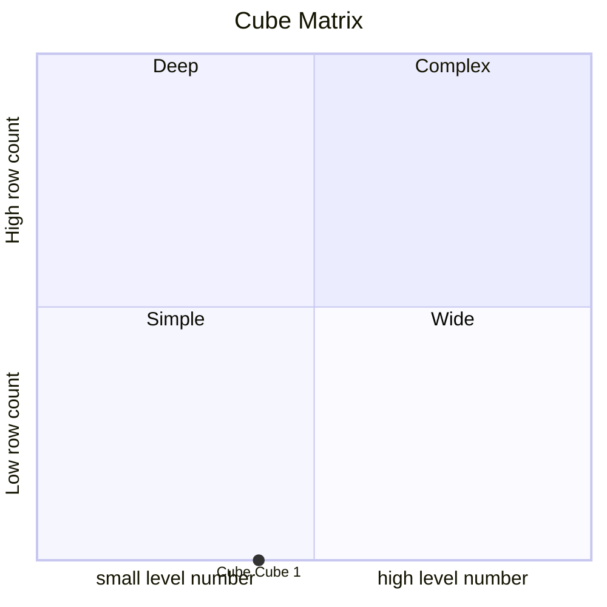
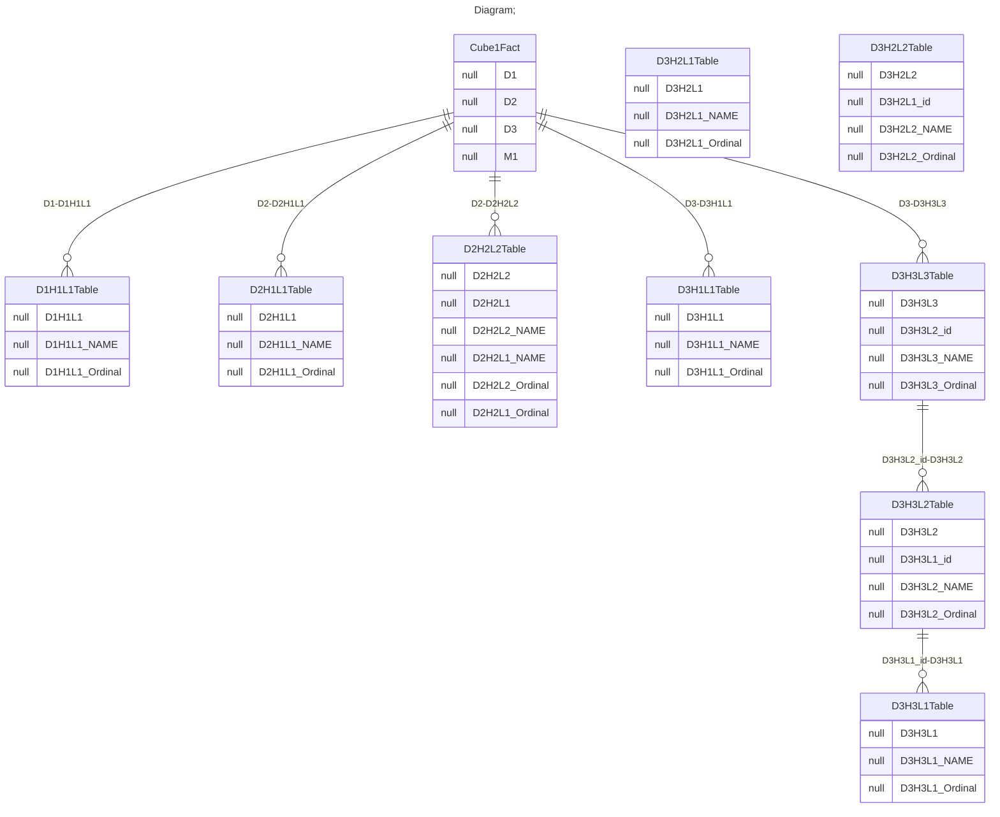

# Documentation
### CatalogName : complex_ExpressiveNames
## Olap Context Details:
## Schemas:
### Schema ExpressiveNames : 

    
        Expressive names schema.
    
  
### Public Dimensions:

    Dimension1, Dimension2, Dimension3

##### Dimension "Dimension1":

Hierarchies:

    D1H1

##### Hierarchy D1H1:

Tables: "D1H1L1Table"

Levels: "D1H1L1"

###### Level "D1H1L1" :

    column(s): D1H1L1

##### Dimension "Dimension2":

Hierarchies:

    D2H1, D2H2

##### Hierarchy D2H1:

Tables: "D2H1L1Table"

Levels: "D2H1L1"

###### Level "D2H1L1" :

    column(s): D2H1L1

##### Hierarchy D2H2:

Tables: "D2H2L2Table"

Levels: "D2H2L1, D2H2L2"

###### Level "D2H2L1" :

    column(s): D2H2L1

###### Level "D2H2L2" :

    column(s): D2H2L2

##### Dimension "Dimension3":

Hierarchies:

    D3H1, D3H3

##### Hierarchy D3H1:

Tables: "D3H1L1Table"

Levels: "D3H1L1"

###### Level "D3H1L1" :

    column(s): D3H1L1

##### Hierarchy D3H3:

Tables: "D3H3L3Table,D3H3L2Table,D3H3L1Table"

Levels: "D3H3L1, D3H3L2, D3H3L3"

###### Level "D3H3L1" :

    column(s): D3H3L1

###### Level "D3H3L2" :

    column(s): D3H3L2

###### Level "D3H3L3" :

    column(s): D3H3L3

---
### Cubes :

    Cube 1

---
#### Cube "Cube 1":

    Test Cube

##### Table: "Cube1Fact"

##### Dimensions:
##### Dimension: "Dimension1 -> Dimension1":

##### Dimension: "Dimension2 -> Dimension2":

##### Dimension: "Dimension3 -> Dimension3":

### Cube "Cube 1" diagram:

---

---
### Cube Matrix for ExpressiveNames:

---
### Database :
---

---
## Validation result for schema ExpressiveNames
## WARNING : 
|Type|   |
|----|---|
|SCHEMA|Level: Type should be set for D2H1L1|
|SCHEMA|Level: Type should be set for D3H3L3|
|SCHEMA|Level: Type should be set for D3H3L2|
|SCHEMA|Level: Type should be set for D2H2L2|
|SCHEMA|Level: Type should be set for D3H3L1|
|SCHEMA|Level: Type should be set for D2H2L1|
|SCHEMA|Level: Type should be set for D1H1L1|
|SCHEMA|Level: Type should be set for D3H1L1|
|DATABASE|Table: Schema must be set|
