```mermaid
---
title: Diagram;
---
erDiagram
account{
int account_id
int account_parent
string account_description
string account_type
string account_rollup
string Custom_Members
}
agg_c_10_sales_fact_1997{
int month_of_year
string quarter
int the_year
null store_sales
null store_cost
null unit_sales
int customer_count
int fact_count
}
agg_c_14_sales_fact_1997{
int product_id
int customer_id
int store_id
int promotion_id
int month_of_year
string quarter
int the_year
null store_sales
null store_cost
null unit_sales
int fact_count
}
agg_c_special_sales_fact_1997{
int product_id
int promotion_id
int customer_id
int store_id
int time_month
string time_quarter
int time_year
null store_sales_sum
null store_cost_sum
null unit_sales_sum
int fact_count
}
agg_g_ms_pcat_sales_fact_1997{
string gender
string marital_status
string product_family
string product_department
string product_category
int month_of_year
string quarter
int the_year
null store_sales
null store_cost
null unit_sales
int customer_count
int fact_count
}
agg_l_03_sales_fact_1997{
int time_id
int customer_id
null store_sales
null store_cost
null unit_sales
int fact_count
}
agg_l_04_sales_fact_1997{
int time_id
null store_sales
null store_cost
null unit_sales
int customer_count
int fact_count
}
agg_l_05_sales_fact_1997{
int product_id
int customer_id
int promotion_id
int store_id
null store_sales
null store_cost
null unit_sales
int fact_count
}
agg_lc_06_sales_fact_1997{
int time_id
string city
string state_province
string country
null store_sales
null store_cost
null unit_sales
int fact_count
}
agg_lc_100_sales_fact_1997{
int product_id
int customer_id
string quarter
int the_year
null store_sales
null store_cost
null unit_sales
int fact_count
}
agg_ll_01_sales_fact_1997{
int product_id
int time_id
int customer_id
null store_sales
null store_cost
null unit_sales
int fact_count
}
agg_pl_01_sales_fact_1997{
int product_id
int time_id
int customer_id
null store_sales_sum
null store_cost_sum
null unit_sales_sum
int fact_count
}
category{
string category_id
string category_parent
string category_description
string category_rollup
}
currency{
int currency_id
date date
string currency
null conversion_ratio
}
customer{
int customer_id
string account_num
string lname
string fname
string mi
string address1
string address2
string address3
string address4
string city
string state_province
string postal_code
string country
int customer_region_id
string phone1
string phone2
date birthdate
string marital_status
string yearly_income
string gender
int total_children
int num_children_at_home
string education
date date_accnt_opened
string member_card
string occupation
string houseowner
int num_cars_owned
string fullname
}
days{
int day
string week_day
}
department{
int department_id
string department_description
}
employee{
int employee_id
string full_name
string first_name
string last_name
int position_id
string position_title
int store_id
int department_id
date birth_date
string hire_date
string end_date
null salary
int supervisor_id
string education_level
string marital_status
string gender
string management_role
}
employee_closure{
int employee_id
int supervisor_id
int distance
}
expense_fact{
int store_id
int account_id
timestamp exp_date
int time_id
string category_id
int currency_id
null amount
}
inventory_fact_1997{
int product_id
int time_id
int warehouse_id
int store_id
int units_ordered
int units_shipped
null warehouse_sales
null warehouse_cost
int supply_time
null store_invoice
}
inventory_fact_1998{
int product_id
int time_id
int warehouse_id
int store_id
int units_ordered
int units_shipped
null warehouse_sales
null warehouse_cost
int supply_time
null store_invoice
}
position{
int position_id
string position_title
string pay_type
null min_scale
null max_scale
string management_role
}
position_{
int position_id
string position_title
string pay_type
null min_scale
null max_scale
string management_role
}
product{
int product_class_id
int product_id
string brand_name
string product_name
string SKU
null SRP
null gross_weight
null net_weight
boolean recyclable_package
boolean low_fat
int units_per_case
int cases_per_pallet
null shelf_width
null shelf_height
null shelf_depth
}
product_class{
int product_class_id
string product_subcategory
string product_category
string product_department
string product_family
}
promotion{
int promotion_id
int promotion_district_id
string promotion_name
string media_type
null cost
timestamp start_date
timestamp end_date
}
region{
int region_id
string sales_city
string sales_state_province
string sales_district
string sales_region
string sales_country
int sales_district_id
}
reserve_employee{
int employee_id
string full_name
string first_name
string last_name
int position_id
string position_title
int store_id
int department_id
timestamp birth_date
timestamp hire_date
timestamp end_date
null salary
int supervisor_id
string education_level
string marital_status
string gender
}
salary{
timestamp pay_date
int employee_id
int department_id
int currency_id
null salary_paid
null overtime_paid
null vacation_accrued
null vacation_used
}
sales_fact_1997{
int product_id
int time_id
int customer_id
int promotion_id
int store_id
null store_sales
null store_cost
null unit_sales
}
sales_fact_1998{
int product_id
int time_id
int customer_id
int promotion_id
int store_id
null store_sales
null store_cost
null unit_sales
}
sales_fact_dec_1998{
int product_id
int time_id
int customer_id
int promotion_id
int store_id
null store_sales
null store_cost
null unit_sales
}
store{
int store_id
string store_type
int region_id
string store_name
int store_number
string store_street_address
string store_city
string store_state
string store_postal_code
string store_country
string store_manager
string store_phone
string store_fax
timestamp first_opened_date
timestamp last_remodel_date
int store_sqft
int grocery_sqft
int frozen_sqft
int meat_sqft
boolean coffee_bar
boolean video_store
boolean salad_bar
boolean prepared_food
boolean florist
}
store_ragged{
int store_id
string store_type
int region_id
string store_name
int store_number
string store_street_address
string store_city
string store_state
string store_postal_code
string store_country
string store_manager
string store_phone
string store_fax
timestamp first_opened_date
timestamp last_remodel_date
int store_sqft
int grocery_sqft
int frozen_sqft
int meat_sqft
boolean coffee_bar
boolean video_store
boolean salad_bar
boolean prepared_food
boolean florist
}
time_by_day{
int time_id
timestamp the_date
string the_day
string the_month
int the_year
int day_of_month
int week_of_year
int month_of_year
string quarter
string fiscal_period
}
warehouse{
int warehouse_id
int warehouse_class_id
int stores_id
string warehouse_name
string wa_address1
string wa_address2
string wa_address3
string wa_address4
string warehouse_city
string warehouse_state_province
string warehouse_postal_code
string warehouse_country
string warehouse_owner_name
string warehouse_phone
string warehouse_fax
}
warehouse_class{
int warehouse_class_id
string description
}

"sales_fact_1997" ||--o{ "store" : "store_id-store_id"
"sales_fact_1997" ||--o{ "store" : "store_id-store_id"
"sales_fact_1997" ||--o{ "store" : "store_id-store_id"
"sales_fact_1997" ||--o{ "time_by_day" : "time_id-time_id"
"sales_fact_1997" ||--o{ "time_by_day" : "time_id-time_id"
"sales_fact_1997" ||--o{ "product" : "product_id-product_id"
"product" ||--o{ "product_class" : "product_class_id-product_class_id"
"sales_fact_1997" ||--o{ "promotion" : "promotion_id-promotion_id"
"sales_fact_1997" ||--o{ "promotion" : "promotion_id-promotion_id"
"sales_fact_1997" ||--o{ "customer" : "customer_id-customer_id"
"sales_fact_1997" ||--o{ "customer" : "customer_id-customer_id"
"sales_fact_1997" ||--o{ "customer" : "customer_id-customer_id"
"sales_fact_1997" ||--o{ "customer" : "customer_id-customer_id"
"sales_fact_1997" ||--o{ "customer" : "customer_id-customer_id"
"inventory_fact_1997" ||--o{ "store" : "store_id-store_id"
"inventory_fact_1997" ||--o{ "store" : "store_id-store_id"
"inventory_fact_1997" ||--o{ "store" : "store_id-store_id"
"inventory_fact_1997" ||--o{ "time_by_day" : "time_id-time_id"
"inventory_fact_1997" ||--o{ "time_by_day" : "time_id-time_id"
"inventory_fact_1997" ||--o{ "product" : "product_id-product_id"
"product" ||--o{ "product_class" : "product_class_id-product_class_id"
"inventory_fact_1997" ||--o{ "warehouse" : "warehouse_id-warehouse_id"
"salary" ||--o{ "time_by_day" : "pay_date-the_date"
"salary" ||--o{ "employee" : "employee_id-employee_id"
"employee" ||--o{ "store" : "store_id-store_id"
"salary" ||--o{ "employee" : "employee_id-employee_id"
"employee" ||--o{ "position" : "position_id-position_id"
"salary" ||--o{ "employee" : "employee_id-employee_id"
"employee" ||--o{ "store" : "store_id-store_id"
"salary" ||--o{ "employee" : "employee_id-employee_id"
"salary" ||--o{ "department" : "department_id-department_id"
"salary" ||--o{ "employee" : "employee_id-employee_id"
"sales_fact_1997" ||--o{ "store_ragged" : "store_id-store_id"
"sales_fact_1997" ||--o{ "store_ragged" : "store_id-store_id"
"sales_fact_1997" ||--o{ "store" : "store_id-store_id"
"sales_fact_1997" ||--o{ "store" : "store_id-store_id"
"sales_fact_1997" ||--o{ "time_by_day" : "time_id-time_id"
"sales_fact_1997" ||--o{ "time_by_day" : "time_id-time_id"
"sales_fact_1997" ||--o{ "product" : "product_id-product_id"
"product" ||--o{ "product_class" : "product_class_id-product_class_id"
"sales_fact_1997" ||--o{ "promotion" : "promotion_id-promotion_id"
"sales_fact_1997" ||--o{ "promotion" : "promotion_id-promotion_id"
"sales_fact_1997" ||--o{ "customer" : "customer_id-customer_id"
"sales_fact_1997" ||--o{ "customer" : "customer_id-customer_id"
"sales_fact_1997" ||--o{ "customer" : "customer_id-customer_id"
"sales_fact_1997" ||--o{ "customer" : "customer_id-customer_id"
"sales_fact_1997" ||--o{ "customer" : "customer_id-customer_id"
"sales_fact_1997" ||--o{ "time_by_day" : "time_id-time_id"
"sales_fact_1997" ||--o{ "time_by_day" : "time_id-time_id"
"sales_fact_1997" ||--o{ "product" : "product_id-product_id"
"product" ||--o{ "product_class" : "product_class_id-product_class_id"
"sales_fact_1997" ||--o{ "customer" : "customer_id-customer_id"
```

# Documentation
### CatalogName : complex_FoodMart
## Olap Context Details:
## Schemas:
### Schema FoodMart : 
### Public Dimensions:

    Store, Store Size in SQFT, Store Type, Time, Product, Warehouse

##### Dimension "Store":

Hierarchies:

    Hierarchy0

##### Hierarchy Hierarchy0:

Tables: "store"

Levels: "Store Country, Store State, Store City, Store Name"

###### Level "Store Country" :

    column(s): store_country

###### Level "Store State" :

    column(s): store_state

###### Level "Store City" :

    column(s): store_city

###### Level "Store Name" :

    column(s): store_name

##### Dimension "Store Size in SQFT":

Hierarchies:

    Hierarchy0

##### Hierarchy Hierarchy0:

Tables: "store"

Levels: "Store Sqft"

###### Level "Store Sqft" :

    column(s): store_sqft

##### Dimension "Store Type":

Hierarchies:

    Hierarchy0

##### Hierarchy Hierarchy0:

Tables: "store"

Levels: "Store Type"

###### Level "Store Type" :

    column(s): store_type

##### Dimension "Time":

Hierarchies:

    Hierarchy0, Weekly

##### Hierarchy Hierarchy0:

Tables: "time_by_day"

Levels: "Year, Quarter, Month"

###### Level "Year" :

    column(s): the_year

###### Level "Quarter" :

    column(s): quarter

###### Level "Month" :

    column(s): month_of_year

##### Hierarchy Weekly:

Tables: "time_by_day"

Levels: "Year, Week, Day"

###### Level "Year" :

    column(s): the_year

###### Level "Week" :

    column(s): week_of_year

###### Level "Day" :

    column(s): day_of_month

##### Dimension "Product":

Hierarchies:

    Hierarchy0

##### Hierarchy Hierarchy0:

Tables: "product,product_class"

Levels: "Product Family, Product Department, Product Category, Product Subcategory, Brand Name, Product Name"

###### Level "Product Family" :

    column(s): product_family

###### Level "Product Department" :

    column(s): product_department

###### Level "Product Category" :

    column(s): product_category

###### Level "Product Subcategory" :

    column(s): product_subcategory

###### Level "Brand Name" :

    column(s): brand_name

###### Level "Product Name" :

    column(s): product_name

##### Dimension "Warehouse":

Hierarchies:

    Hierarchy0

##### Hierarchy Hierarchy0:

Tables: "warehouse"

Levels: "Country, State Province, City, Warehouse Name"

###### Level "Country" :

    column(s): warehouse_country

###### Level "State Province" :

    column(s): warehouse_state_province

###### Level "City" :

    column(s): warehouse_city

###### Level "Warehouse Name" :

    column(s): warehouse_name

---
### Cubes :

    Sales, Warehouse, Store, HR, Sales Ragged, Sales 2

---
#### Cube "Sales":

    

##### Table: "sales_fact_1997"

##### Dimensions:
##### Dimension: "Store -> Store":

##### Dimension: "Store Size in SQFT -> Store Size in SQFT":

##### Dimension: "Store Type -> Store Type":

##### Dimension: "Time -> Time":

##### Dimension: "Product -> Product":

##### Dimension "Promotion Media":

Hierarchies:

    Hierarchy0

##### Hierarchy Hierarchy0:

Tables: "promotion"

Levels: "Media Type"

###### Level "Media Type" :

    column(s): media_type

##### Dimension "Promotions":

Hierarchies:

    Hierarchy0

##### Hierarchy Hierarchy0:

Tables: "promotion"

Levels: "Promotion Name"

###### Level "Promotion Name" :

    column(s): promotion_name

##### Dimension "Customers":

Hierarchies:

    Hierarchy0

##### Hierarchy Hierarchy0:

Tables: "customer"

Levels: "Country, State Province, City, Name"

###### Level "Country" :

    column(s): country

###### Level "State Province" :

    column(s): state_province

###### Level "City" :

    column(s): city

###### Level "Name" :

    column(s): customer_id

##### Dimension "Education Level":

Hierarchies:

    Hierarchy0

##### Hierarchy Hierarchy0:

Tables: "customer"

Levels: "Education Level"

###### Level "Education Level" :

    column(s): education

##### Dimension "Gender":

Hierarchies:

    Hierarchy0

##### Hierarchy Hierarchy0:

Tables: "customer"

Levels: "Gender"

###### Level "Gender" :

    column(s): gender

##### Dimension "Marital Status":

Hierarchies:

    Hierarchy0

##### Hierarchy Hierarchy0:

Tables: "customer"

Levels: "Marital Status"

###### Level "Marital Status" :

    column(s): marital_status

##### Dimension "Yearly Income":

Hierarchies:

    Hierarchy0

##### Hierarchy Hierarchy0:

Tables: "customer"

Levels: "Yearly Income"

###### Level "Yearly Income" :

    column(s): yearly_income

### Cube "Sales" diagram:

---

```mermaid
%%{init: {
"theme": "default",
"themeCSS": [
    ".er.entityBox {stroke: black;}",
    ".er.attributeBoxEven {stroke: black;}",
    ".er.attributeBoxOdd {stroke: black;}",
    "[id^=entity-c] .er.entityBox { fill: lightgreen;} ",
    "[id^=entity-d] .er.entityBox { fill: powderblue;} ",
    "[id^=entity-h] .er.entityBox { fill: pink;} "
]
}}%%
erDiagram
c0["Sales"]{
M Unit Sales ""M Store Cost ""M Store Sales ""M Sales Count ""M Customer Count ""M Promotion Sales ""D Store ""
D Store Size in SQFT ""
D Store Type ""
D Time ""
D Product ""
D Promotion Media ""
D Promotions ""
D Customers ""
D Education Level ""
D Gender ""
D Marital Status ""
D Yearly Income ""
}
d00[Store] {
H null ""
}
h000[null] {
L Store Country ""
L Store State ""
L Store City ""
L Store Name ""
}
d01[Store Size in SQFT] {
H null ""
}
h010[null] {
L Store Sqft ""
}
d02[Store Type] {
H null ""
}
h020[null] {
L Store Type ""
}
d03[Time] {
H null ""
H Weekly ""
}
h030[null] {
L Year ""
L Quarter ""
L Month ""
}
h031[Weekly] {
L Year ""
L Week ""
L Day ""
}
d04[Product] {
H null ""
}
h040[null] {
L Product Family ""
L Product Department ""
L Product Category ""
L Product Subcategory ""
L Brand Name ""
L Product Name ""
}
d05[Promotion Media] {
H null ""
}
h050[null] {
L Media Type ""
}
d06[Promotions] {
H null ""
}
h060[null] {
L Promotion Name ""
}
d07[Customers] {
H null ""
}
h070[null] {
L Country ""
L State Province ""
L City ""
L Name ""
}
d08[Education Level] {
H null ""
}
h080[null] {
L Education Level ""
}
d09[Gender] {
H null ""
}
h090[null] {
L Gender ""
}
d010[Marital Status] {
H null ""
}
h0100[null] {
L Marital Status ""
}
d011[Yearly Income] {
H null ""
}
h0110[null] {
L Yearly Income ""
}
"c0" ||--|| "d00" : "store_id-store_id"
"d00" ||--|| "h000" : "store_id-store_country"
"d00" ||--|| "h000" : "store_id-store_state"
"d00" ||--|| "h000" : "store_id-store_city"
"d00" ||--|| "h000" : "store_id-store_name"
"c0" ||--|| "d01" : "store_id-store_id"
"d01" ||--|| "h010" : "store_id-store_sqft"
"c0" ||--|| "d02" : "store_id-store_id"
"d02" ||--|| "h020" : "store_id-store_type"
"c0" ||--|| "d03" : "time_id-time_id"
"d03" ||--|| "h030" : "time_id-the_year"
"d03" ||--|| "h030" : "time_id-quarter"
"d03" ||--|| "h030" : "time_id-month_of_year"
"c0" ||--|| "d03" : "time_id-time_id"
"d03" ||--|| "h031" : "time_id-the_year"
"d03" ||--|| "h031" : "time_id-week_of_year"
"d03" ||--|| "h031" : "time_id-day_of_month"
"c0" ||--|| "d04" : "product_id-product_id"
"d04" ||--|| "h040" : "product_id-product_family"
"d04" ||--|| "h040" : "product_id-product_department"
"d04" ||--|| "h040" : "product_id-product_category"
"d04" ||--|| "h040" : "product_id-product_subcategory"
"d04" ||--|| "h040" : "product_id-brand_name"
"d04" ||--|| "h040" : "product_id-product_name"
"c0" ||--|| "d05" : "promotion_id-promotion_id"
"d05" ||--|| "h050" : "promotion_id-media_type"
"c0" ||--|| "d06" : "promotion_id-promotion_id"
"d06" ||--|| "h060" : "promotion_id-promotion_name"
"c0" ||--|| "d07" : "customer_id-customer_id"
"d07" ||--|| "h070" : "customer_id-country"
"d07" ||--|| "h070" : "customer_id-state_province"
"d07" ||--|| "h070" : "customer_id-city"
"d07" ||--|| "h070" : "customer_id-customer_id"
"c0" ||--|| "d08" : "customer_id-customer_id"
"d08" ||--|| "h080" : "customer_id-education"
"c0" ||--|| "d09" : "customer_id-customer_id"
"d09" ||--|| "h090" : "customer_id-gender"
"c0" ||--|| "d010" : "customer_id-customer_id"
"d010" ||--|| "h0100" : "customer_id-marital_status"
"c0" ||--|| "d011" : "customer_id-customer_id"
"d011" ||--|| "h0110" : "customer_id-yearly_income"
```
---
---
#### Cube "Warehouse":

    

##### Table: "inventory_fact_1997"

##### Dimensions:
##### Dimension: "Store -> Store":

##### Dimension: "Store Size in SQFT -> Store Size in SQFT":

##### Dimension: "Store Type -> Store Type":

##### Dimension: "Time -> Time":

##### Dimension: "Product -> Product":

##### Dimension: "Warehouse -> Warehouse":

### Cube "Warehouse" diagram:

---

```mermaid
%%{init: {
"theme": "default",
"themeCSS": [
    ".er.entityBox {stroke: black;}",
    ".er.attributeBoxEven {stroke: black;}",
    ".er.attributeBoxOdd {stroke: black;}",
    "[id^=entity-c] .er.entityBox { fill: lightgreen;} ",
    "[id^=entity-d] .er.entityBox { fill: powderblue;} ",
    "[id^=entity-h] .er.entityBox { fill: pink;} "
]
}}%%
erDiagram
c1["Warehouse"]{
M Store Invoice ""M Supply Time ""M Warehouse Cost ""M Warehouse Sales ""M Units Shipped ""M Units Ordered ""M Warehouse Profit ""D Store ""
D Store Size in SQFT ""
D Store Type ""
D Time ""
D Product ""
D Warehouse ""
}
d10[Store] {
H null ""
}
h100[null] {
L Store Country ""
L Store State ""
L Store City ""
L Store Name ""
}
d11[Store Size in SQFT] {
H null ""
}
h110[null] {
L Store Sqft ""
}
d12[Store Type] {
H null ""
}
h120[null] {
L Store Type ""
}
d13[Time] {
H null ""
H Weekly ""
}
h130[null] {
L Year ""
L Quarter ""
L Month ""
}
h131[Weekly] {
L Year ""
L Week ""
L Day ""
}
d14[Product] {
H null ""
}
h140[null] {
L Product Family ""
L Product Department ""
L Product Category ""
L Product Subcategory ""
L Brand Name ""
L Product Name ""
}
d15[Warehouse] {
H null ""
}
h150[null] {
L Country ""
L State Province ""
L City ""
L Warehouse Name ""
}
"c1" ||--|| "d10" : "store_id-store_id"
"d10" ||--|| "h100" : "store_id-store_country"
"d10" ||--|| "h100" : "store_id-store_state"
"d10" ||--|| "h100" : "store_id-store_city"
"d10" ||--|| "h100" : "store_id-store_name"
"c1" ||--|| "d11" : "store_id-store_id"
"d11" ||--|| "h110" : "store_id-store_sqft"
"c1" ||--|| "d12" : "store_id-store_id"
"d12" ||--|| "h120" : "store_id-store_type"
"c1" ||--|| "d13" : "time_id-time_id"
"d13" ||--|| "h130" : "time_id-the_year"
"d13" ||--|| "h130" : "time_id-quarter"
"d13" ||--|| "h130" : "time_id-month_of_year"
"c1" ||--|| "d13" : "time_id-time_id"
"d13" ||--|| "h131" : "time_id-the_year"
"d13" ||--|| "h131" : "time_id-week_of_year"
"d13" ||--|| "h131" : "time_id-day_of_month"
"c1" ||--|| "d14" : "product_id-product_id"
"d14" ||--|| "h140" : "product_id-product_family"
"d14" ||--|| "h140" : "product_id-product_department"
"d14" ||--|| "h140" : "product_id-product_category"
"d14" ||--|| "h140" : "product_id-product_subcategory"
"d14" ||--|| "h140" : "product_id-brand_name"
"d14" ||--|| "h140" : "product_id-product_name"
"c1" ||--|| "d15" : "warehouse_id-warehouse_id"
"d15" ||--|| "h150" : "warehouse_id-warehouse_country"
"d15" ||--|| "h150" : "warehouse_id-warehouse_state_province"
"d15" ||--|| "h150" : "warehouse_id-warehouse_city"
"d15" ||--|| "h150" : "warehouse_id-warehouse_name"
```
---
---
#### Cube "Store":

    

##### Table: "store"

##### Dimensions:
##### Dimension "Store Type":

Hierarchies:

    Hierarchy0

##### Hierarchy Hierarchy0:

Tables: ""

Levels: "Store Type"

###### Level "Store Type" :

    column(s): store_type

##### Dimension: "Store -> Store":

##### Dimension "Has coffee bar":

Hierarchies:

    Hierarchy0

##### Hierarchy Hierarchy0:

Tables: ""

Levels: "Has coffee bar"

###### Level "Has coffee bar" :

    column(s): coffee_bar

### Cube "Store" diagram:

---

```mermaid
%%{init: {
"theme": "default",
"themeCSS": [
    ".er.entityBox {stroke: black;}",
    ".er.attributeBoxEven {stroke: black;}",
    ".er.attributeBoxOdd {stroke: black;}",
    "[id^=entity-c] .er.entityBox { fill: lightgreen;} ",
    "[id^=entity-d] .er.entityBox { fill: powderblue;} ",
    "[id^=entity-h] .er.entityBox { fill: pink;} "
]
}}%%
erDiagram
c2["Store"]{
M Store Sqft ""M Grocery Sqft ""D Store Type ""
D Store ""
D Has coffee bar ""
}
d20[Store Type] {
H null ""
}
h200[null] {
L Store Type ""
}
d21[Store] {
H null ""
}
h210[null] {
L Store Country ""
L Store State ""
L Store City ""
L Store Name ""
}
d22[Has coffee bar] {
H null ""
}
h220[null] {
L Has coffee bar ""
}
"c2" ||--|| "d20" : ""
"d20" ||--|| "h200" : "store_type"
"c2" ||--|| "d21" : "store_id"
"d21" ||--|| "h210" : "store_id-store_country"
"d21" ||--|| "h210" : "store_id-store_state"
"d21" ||--|| "h210" : "store_id-store_city"
"d21" ||--|| "h210" : "store_id-store_name"
"c2" ||--|| "d22" : ""
"d22" ||--|| "h220" : "coffee_bar"
```
---
---
#### Cube "HR":

    

##### Table: "salary"

##### Dimensions:
##### Dimension "Time":

Hierarchies:

    Hierarchy0

##### Hierarchy Hierarchy0:

Tables: "time_by_day"

Levels: "Year, Quarter, Month"

###### Level "Year" :

    column(s): the_year

###### Level "Quarter" :

    column(s): quarter

###### Level "Month" :

    column(s): month_of_year

##### Dimension "Store":

Hierarchies:

    Hierarchy0

##### Hierarchy Hierarchy0:

Tables: "employee,store"

Levels: "Store Country, Store State, Store City, Store Name"

###### Level "Store Country" :

    column(s): store_country

###### Level "Store State" :

    column(s): store_state

###### Level "Store City" :

    column(s): store_city

###### Level "Store Name" :

    column(s): store_name

##### Dimension "Pay Type":

Hierarchies:

    Hierarchy0

##### Hierarchy Hierarchy0:

Tables: "employee,position"

Levels: "Pay Type"

###### Level "Pay Type" :

    column(s): pay_type

##### Dimension "Store Type":

Hierarchies:

    Hierarchy0

##### Hierarchy Hierarchy0:

Tables: "employee,store"

Levels: "Store Type"

###### Level "Store Type" :

    column(s): store_type

##### Dimension "Position":

Hierarchies:

    Hierarchy0

##### Hierarchy Hierarchy0:

Tables: "employee"

Levels: "Management Role, Position Title"

###### Level "Management Role" :

    column(s): management_role

###### Level "Position Title" :

    column(s): position_title

##### Dimension "Department":

Hierarchies:

    Hierarchy0

##### Hierarchy Hierarchy0:

Tables: "department"

Levels: "Department Description"

###### Level "Department Description" :

    column(s): department_id

##### Dimension "Employees":

Hierarchies:

    Hierarchy0

##### Hierarchy Hierarchy0:

Tables: "employee"

Levels: "Employee Id"

###### Level "Employee Id" :

    column(s): employee_id

### Cube "HR" diagram:

---

```mermaid
%%{init: {
"theme": "default",
"themeCSS": [
    ".er.entityBox {stroke: black;}",
    ".er.attributeBoxEven {stroke: black;}",
    ".er.attributeBoxOdd {stroke: black;}",
    "[id^=entity-c] .er.entityBox { fill: lightgreen;} ",
    "[id^=entity-d] .er.entityBox { fill: powderblue;} ",
    "[id^=entity-h] .er.entityBox { fill: pink;} "
]
}}%%
erDiagram
c3["HR"]{
M Org Salary ""M Count ""M Number of Employees ""D Time ""
D Store ""
D Pay Type ""
D Store Type ""
D Position ""
D Department ""
D Employees ""
}
d30[Time] {
H null ""
}
h300[null] {
L Year ""
L Quarter ""
L Month ""
}
d31[Store] {
H null ""
}
h310[null] {
L Store Country ""
L Store State ""
L Store City ""
L Store Name ""
}
d32[Pay Type] {
H null ""
}
h320[null] {
L Pay Type ""
}
d33[Store Type] {
H null ""
}
h330[null] {
L Store Type ""
}
d34[Position] {
H null ""
}
h340[null] {
L Management Role ""
L Position Title ""
}
d35[Department] {
H null ""
}
h350[null] {
L Department Description ""
}
d36[Employees] {
H null ""
}
h360[null] {
L Employee Id ""
}
"c3" ||--|| "d30" : "pay_date-the_date"
"d30" ||--|| "h300" : "the_date-the_year"
"d30" ||--|| "h300" : "the_date-quarter"
"d30" ||--|| "h300" : "the_date-month_of_year"
"c3" ||--|| "d31" : "employee_id-employee_id"
"d31" ||--|| "h310" : "employee_id-store_country"
"d31" ||--|| "h310" : "employee_id-store_state"
"d31" ||--|| "h310" : "employee_id-store_city"
"d31" ||--|| "h310" : "employee_id-store_name"
"c3" ||--|| "d32" : "employee_id-employee_id"
"d32" ||--|| "h320" : "employee_id-pay_type"
"c3" ||--|| "d33" : "employee_id-employee_id"
"d33" ||--|| "h330" : "employee_id-store_type"
"c3" ||--|| "d34" : "employee_id-employee_id"
"d34" ||--|| "h340" : "employee_id-management_role"
"d34" ||--|| "h340" : "employee_id-position_title"
"c3" ||--|| "d35" : "department_id-department_id"
"d35" ||--|| "h350" : "department_id-department_id"
"c3" ||--|| "d36" : "employee_id-employee_id"
"d36" ||--|| "h360" : "employee_id-employee_id"
```
---
---
#### Cube "Sales Ragged":

    

##### Table: "sales_fact_1997"

##### Dimensions:
##### Dimension "Store":

Hierarchies:

    Hierarchy0

##### Hierarchy Hierarchy0:

Tables: "store_ragged"

Levels: "Store Country, Store State, Store City, Store Name"

###### Level "Store Country" :

    column(s): store_country

###### Level "Store State" :

    column(s): store_state

###### Level "Store City" :

    column(s): store_city

###### Level "Store Name" :

    column(s): store_name

##### Dimension "Geography":

Hierarchies:

    Hierarchy0

##### Hierarchy Hierarchy0:

Tables: "store_ragged"

Levels: "Country, State, City"

###### Level "Country" :

    column(s): store_country

###### Level "State" :

    column(s): store_state

###### Level "City" :

    column(s): store_city

##### Dimension: "Store Size in SQFT -> Store Size in SQFT":

##### Dimension: "Store Type -> Store Type":

##### Dimension: "Time -> Time":

##### Dimension: "Product -> Product":

##### Dimension "Promotion Media":

Hierarchies:

    Hierarchy0

##### Hierarchy Hierarchy0:

Tables: "promotion"

Levels: "Media Type"

###### Level "Media Type" :

    column(s): media_type

##### Dimension "Promotions":

Hierarchies:

    Hierarchy0

##### Hierarchy Hierarchy0:

Tables: "promotion"

Levels: "Promotion Name"

###### Level "Promotion Name" :

    column(s): promotion_name

##### Dimension "Customers":

Hierarchies:

    Hierarchy0

##### Hierarchy Hierarchy0:

Tables: "customer"

Levels: "Country, State Province, City, Name"

###### Level "Country" :

    column(s): country

###### Level "State Province" :

    column(s): state_province

###### Level "City" :

    column(s): city

###### Level "Name" :

    column(s): null

##### Dimension "Education Level":

Hierarchies:

    Hierarchy0

##### Hierarchy Hierarchy0:

Tables: "customer"

Levels: "Education Level"

###### Level "Education Level" :

    column(s): education

##### Dimension "Gender":

Hierarchies:

    Hierarchy0

##### Hierarchy Hierarchy0:

Tables: "customer"

Levels: "Gender"

###### Level "Gender" :

    column(s): gender

##### Dimension "Marital Status":

Hierarchies:

    Hierarchy0

##### Hierarchy Hierarchy0:

Tables: "customer"

Levels: "Marital Status"

###### Level "Marital Status" :

    column(s): marital_status

##### Dimension "Yearly Income":

Hierarchies:

    Hierarchy0

##### Hierarchy Hierarchy0:

Tables: "customer"

Levels: "Yearly Income"

###### Level "Yearly Income" :

    column(s): yearly_income

### Cube "Sales Ragged" diagram:

---

```mermaid
%%{init: {
"theme": "default",
"themeCSS": [
    ".er.entityBox {stroke: black;}",
    ".er.attributeBoxEven {stroke: black;}",
    ".er.attributeBoxOdd {stroke: black;}",
    "[id^=entity-c] .er.entityBox { fill: lightgreen;} ",
    "[id^=entity-d] .er.entityBox { fill: powderblue;} ",
    "[id^=entity-h] .er.entityBox { fill: pink;} "
]
}}%%
erDiagram
c4["Sales Ragged"]{
M Unit Sales ""M Store Cost ""M Store Sales ""M Sales Count ""M Customer Count ""D Store ""
D Geography ""
D Store Size in SQFT ""
D Store Type ""
D Time ""
D Product ""
D Promotion Media ""
D Promotions ""
D Customers ""
D Education Level ""
D Gender ""
D Marital Status ""
D Yearly Income ""
}
d40[Store] {
H null ""
}
h400[null] {
L Store Country ""
L Store State ""
L Store City ""
L Store Name ""
}
d41[Geography] {
H null ""
}
h410[null] {
L Country ""
L State ""
L City ""
}
d42[Store Size in SQFT] {
H null ""
}
h420[null] {
L Store Sqft ""
}
d43[Store Type] {
H null ""
}
h430[null] {
L Store Type ""
}
d44[Time] {
H null ""
H Weekly ""
}
h440[null] {
L Year ""
L Quarter ""
L Month ""
}
h441[Weekly] {
L Year ""
L Week ""
L Day ""
}
d45[Product] {
H null ""
}
h450[null] {
L Product Family ""
L Product Department ""
L Product Category ""
L Product Subcategory ""
L Brand Name ""
L Product Name ""
}
d46[Promotion Media] {
H null ""
}
h460[null] {
L Media Type ""
}
d47[Promotions] {
H null ""
}
h470[null] {
L Promotion Name ""
}
d48[Customers] {
H null ""
}
h480[null] {
L Country ""
L State Province ""
L City ""
L Name ""
}
d49[Education Level] {
H null ""
}
h490[null] {
L Education Level ""
}
d410[Gender] {
H null ""
}
h4100[null] {
L Gender ""
}
d411[Marital Status] {
H null ""
}
h4110[null] {
L Marital Status ""
}
d412[Yearly Income] {
H null ""
}
h4120[null] {
L Yearly Income ""
}
"c4" ||--|| "d40" : "store_id-store_id"
"d40" ||--|| "h400" : "store_id-store_country"
"d40" ||--|| "h400" : "store_id-store_state"
"d40" ||--|| "h400" : "store_id-store_city"
"d40" ||--|| "h400" : "store_id-store_name"
"c4" ||--|| "d41" : "store_id-store_id"
"d41" ||--|| "h410" : "store_id-store_country"
"d41" ||--|| "h410" : "store_id-store_state"
"d41" ||--|| "h410" : "store_id-store_city"
"c4" ||--|| "d42" : "store_id-store_id"
"d42" ||--|| "h420" : "store_id-store_sqft"
"c4" ||--|| "d43" : "store_id-store_id"
"d43" ||--|| "h430" : "store_id-store_type"
"c4" ||--|| "d44" : "time_id-time_id"
"d44" ||--|| "h440" : "time_id-the_year"
"d44" ||--|| "h440" : "time_id-quarter"
"d44" ||--|| "h440" : "time_id-month_of_year"
"c4" ||--|| "d44" : "time_id-time_id"
"d44" ||--|| "h441" : "time_id-the_year"
"d44" ||--|| "h441" : "time_id-week_of_year"
"d44" ||--|| "h441" : "time_id-day_of_month"
"c4" ||--|| "d45" : "product_id-product_id"
"d45" ||--|| "h450" : "product_id-product_family"
"d45" ||--|| "h450" : "product_id-product_department"
"d45" ||--|| "h450" : "product_id-product_category"
"d45" ||--|| "h450" : "product_id-product_subcategory"
"d45" ||--|| "h450" : "product_id-brand_name"
"d45" ||--|| "h450" : "product_id-product_name"
"c4" ||--|| "d46" : "promotion_id-promotion_id"
"d46" ||--|| "h460" : "promotion_id-media_type"
"c4" ||--|| "d47" : "promotion_id-promotion_id"
"d47" ||--|| "h470" : "promotion_id-promotion_name"
"c4" ||--|| "d48" : "customer_id-customer_id"
"d48" ||--|| "h480" : "customer_id-country"
"d48" ||--|| "h480" : "customer_id-state_province"
"d48" ||--|| "h480" : "customer_id-city"
"d48" ||--|| "h480" : "customer_id-"
"c4" ||--|| "d49" : "customer_id-customer_id"
"d49" ||--|| "h490" : "customer_id-education"
"c4" ||--|| "d410" : "customer_id-customer_id"
"d410" ||--|| "h4100" : "customer_id-gender"
"c4" ||--|| "d411" : "customer_id-customer_id"
"d411" ||--|| "h4110" : "customer_id-marital_status"
"c4" ||--|| "d412" : "customer_id-customer_id"
"d412" ||--|| "h4120" : "customer_id-yearly_income"
```
---
---
#### Cube "Sales 2":

    

##### Table: "sales_fact_1997"

##### Dimensions:
##### Dimension: "Time -> Time":

##### Dimension: "Product -> Product":

##### Dimension "Gender":

Hierarchies:

    Hierarchy0

##### Hierarchy Hierarchy0:

Tables: "customer"

Levels: "Gender"

###### Level "Gender" :

    column(s): gender

### Cube "Sales 2" diagram:

---

```mermaid
%%{init: {
"theme": "default",
"themeCSS": [
    ".er.entityBox {stroke: black;}",
    ".er.attributeBoxEven {stroke: black;}",
    ".er.attributeBoxOdd {stroke: black;}",
    "[id^=entity-c] .er.entityBox { fill: lightgreen;} ",
    "[id^=entity-d] .er.entityBox { fill: powderblue;} ",
    "[id^=entity-h] .er.entityBox { fill: pink;} "
]
}}%%
erDiagram
c5["Sales 2"]{
M Sales Count ""M Unit Sales ""M Store Sales ""M Store Cost ""M Customer Count ""D Time ""
D Product ""
D Gender ""
}
d50[Time] {
H null ""
H Weekly ""
}
h500[null] {
L Year ""
L Quarter ""
L Month ""
}
h501[Weekly] {
L Year ""
L Week ""
L Day ""
}
d51[Product] {
H null ""
}
h510[null] {
L Product Family ""
L Product Department ""
L Product Category ""
L Product Subcategory ""
L Brand Name ""
L Product Name ""
}
d52[Gender] {
H null ""
}
h520[null] {
L Gender ""
}
"c5" ||--|| "d50" : "time_id-time_id"
"d50" ||--|| "h500" : "time_id-the_year"
"d50" ||--|| "h500" : "time_id-quarter"
"d50" ||--|| "h500" : "time_id-month_of_year"
"c5" ||--|| "d50" : "time_id-time_id"
"d50" ||--|| "h501" : "time_id-the_year"
"d50" ||--|| "h501" : "time_id-week_of_year"
"d50" ||--|| "h501" : "time_id-day_of_month"
"c5" ||--|| "d51" : "product_id-product_id"
"d51" ||--|| "h510" : "product_id-product_family"
"d51" ||--|| "h510" : "product_id-product_department"
"d51" ||--|| "h510" : "product_id-product_category"
"d51" ||--|| "h510" : "product_id-product_subcategory"
"d51" ||--|| "h510" : "product_id-brand_name"
"d51" ||--|| "h510" : "product_id-product_name"
"c5" ||--|| "d52" : "customer_id-customer_id"
"d52" ||--|| "h520" : "customer_id-gender"
```
---
### Roles :##### Role: "California manager"

##### Role: "No HR Cube"

##### Role: "Administrator"

### Database :
---

---
## Validation result for schema FoodMart
## <span style='color: blue;'>WARNING</span> : 
|Type|   |
|----|---|
|SCHEMA|Level: Type should be set for Promotion Name|
|SCHEMA|Level: Type should be set for City|
|SCHEMA|Level: Type should be set for Week|
|SCHEMA|Level: Type should be set for Education Level|
|SCHEMA|Level: Type should be set for State|
|SCHEMA|Level: Type should be set for Year|
|SCHEMA|Level: Type should be set for Store Name|
|SCHEMA|Level: Type should be set for Product Department|
|SCHEMA|Level: Type should be set for Quarter|
|SCHEMA|Level: Type should be set for State Province|
|SCHEMA|Level: Type should be set for Product Name|
|SCHEMA|Level: Type should be set for Day|
|SCHEMA|Level: Type should be set for Store Country|
|SCHEMA|Level: Type should be set for Store City|
|SCHEMA|Level: Type should be set for Brand Name|
|SCHEMA|Level: Type should be set for Department Description|
|SCHEMA|Level: Type should be set for Pay Type|
|SCHEMA|Level: Type should be set for Position Title|
|SCHEMA|Level: Type should be set for Warehouse Name|
|SCHEMA|Level: Type should be set for Yearly Income|
|SCHEMA|Level: Type should be set for Media Type|
|SCHEMA|Level: Type should be set for Product Subcategory|
|SCHEMA|Level: Type should be set for Product Category|
|SCHEMA|Level: Type should be set for Store Sqft|
|SCHEMA|Level: Type should be set for Employee Id|
|SCHEMA|Level: Type should be set for Marital Status|
|SCHEMA|Level: Type should be set for Has coffee bar|
|SCHEMA|Level: Type should be set for Product Family|
|SCHEMA|Level: Type should be set for Gender|
|SCHEMA|Level: Type should be set for Management Role|
|SCHEMA|Level: Type should be set for Country|
|SCHEMA|Level: Type should be set for Name|
|SCHEMA|Level: Type should be set for Month|
|SCHEMA|Level: Type should be set for Store Type|
|SCHEMA|Level: Type should be set for Store State|
|DATABASE|Table: Schema must be set|
