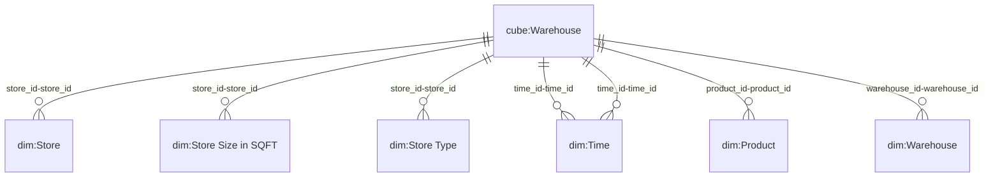
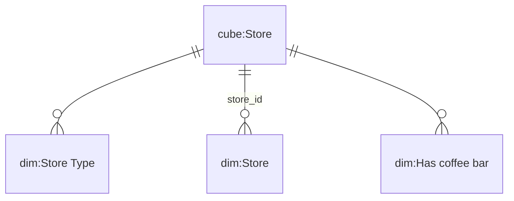
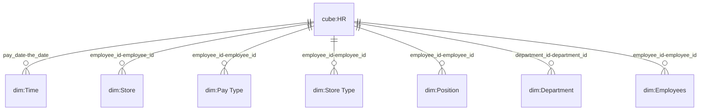
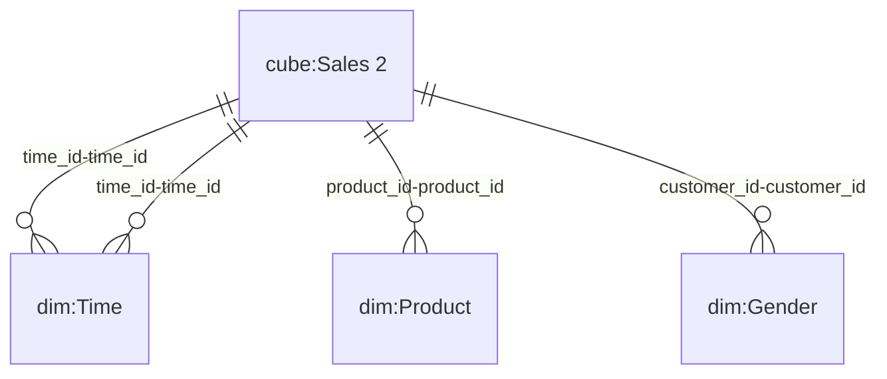

```mermaid
erDiagram
"cube:Sales"{}

"cube:Sales" ||--o{ "dim:Store" : "store_id-store_id"
"cube:Sales" ||--o{ "dim:Store Size in SQFT" : "store_id-store_id"
"cube:Sales" ||--o{ "dim:Store Type" : "store_id-store_id"
"cube:Sales" ||--o{ "dim:Time" : "time_id-time_id"
"cube:Sales" ||--o{ "dim:Time" : "time_id-time_id"
"cube:Sales" ||--o{ "dim:Product" : "product_id-product_id"
"cube:Sales" ||--o{ "dim:Promotion Media" : "promotion_id-promotion_id"
"cube:Sales" ||--o{ "dim:Promotions" : "promotion_id-promotion_id"
"cube:Sales" ||--o{ "dim:Customers" : "customer_id-customer_id"
"cube:Sales" ||--o{ "dim:Education Level" : "customer_id-customer_id"
"cube:Sales" ||--o{ "dim:Gender" : "customer_id-customer_id"
"cube:Sales" ||--o{ "dim:Marital Status" : "customer_id-customer_id"
"cube:Sales" ||--o{ "dim:Yearly Income" : "customer_id-customer_id"
```

```mermaid
erDiagram
"cube:Sales Ragged"{}

"cube:Sales Ragged" ||--o{ "dim:Store" : "store_id-store_id"
"cube:Sales Ragged" ||--o{ "dim:Geography" : "store_id-store_id"
"cube:Sales Ragged" ||--o{ "dim:Store Size in SQFT" : "store_id-store_id"
"cube:Sales Ragged" ||--o{ "dim:Store Type" : "store_id-store_id"
"cube:Sales Ragged" ||--o{ "dim:Time" : "time_id-time_id"
"cube:Sales Ragged" ||--o{ "dim:Time" : "time_id-time_id"
"cube:Sales Ragged" ||--o{ "dim:Product" : "product_id-product_id"
"cube:Sales Ragged" ||--o{ "dim:Promotion Media" : "promotion_id-promotion_id"
"cube:Sales Ragged" ||--o{ "dim:Promotions" : "promotion_id-promotion_id"
"cube:Sales Ragged" ||--o{ "dim:Customers" : "customer_id-customer_id"
"cube:Sales Ragged" ||--o{ "dim:Education Level" : "customer_id-customer_id"
"cube:Sales Ragged" ||--o{ "dim:Gender" : "customer_id-customer_id"
"cube:Sales Ragged" ||--o{ "dim:Marital Status" : "customer_id-customer_id"
"cube:Sales Ragged" ||--o{ "dim:Yearly Income" : "customer_id-customer_id"
```

# Documentation
### CatalogName : complex_FoodMart
## Olap Context Details:
## Schemas:
### Schema FoodMart : 
### Public Dimensions:

    Store, Store Size in SQFT, Store Type, Time, Product, Warehouse

##### Dimension "Store":

Hierarchies:

    Hierarchy0

##### Hierarchy Hierarchy0:

Tables: "store"

Levels: "Store Country, Store State, Store City, Store Name"

###### Level "Store Country" :

    column(s): store_country

###### Level "Store State" :

    column(s): store_state

###### Level "Store City" :

    column(s): store_city

###### Level "Store Name" :

    column(s): store_name

##### Dimension "Store Size in SQFT":

Hierarchies:

    Hierarchy0

##### Hierarchy Hierarchy0:

Tables: "store"

Levels: "Store Sqft"

###### Level "Store Sqft" :

    column(s): store_sqft

##### Dimension "Store Type":

Hierarchies:

    Hierarchy0

##### Hierarchy Hierarchy0:

Tables: "store"

Levels: "Store Type"

###### Level "Store Type" :

    column(s): store_type

##### Dimension "Time":

Hierarchies:

    Hierarchy0, Weekly

##### Hierarchy Hierarchy0:

Tables: "time_by_day"

Levels: "Year, Quarter, Month"

###### Level "Year" :

    column(s): the_year

###### Level "Quarter" :

    column(s): quarter

###### Level "Month" :

    column(s): month_of_year

##### Hierarchy Weekly:

Tables: "time_by_day"

Levels: "Year, Week, Day"

###### Level "Year" :

    column(s): the_year

###### Level "Week" :

    column(s): week_of_year

###### Level "Day" :

    column(s): day_of_month

##### Dimension "Product":

Hierarchies:

    Hierarchy0

##### Hierarchy Hierarchy0:

Tables: "product,product_class"

Levels: "Product Family, Product Department, Product Category, Product Subcategory, Brand Name, Product Name"

###### Level "Product Family" :

    column(s): product_family

###### Level "Product Department" :

    column(s): product_department

###### Level "Product Category" :

    column(s): product_category

###### Level "Product Subcategory" :

    column(s): product_subcategory

###### Level "Brand Name" :

    column(s): brand_name

###### Level "Product Name" :

    column(s): product_name

##### Dimension "Warehouse":

Hierarchies:

    Hierarchy0

##### Hierarchy Hierarchy0:

Tables: "warehouse"

Levels: "Country, State Province, City, Warehouse Name"

###### Level "Country" :

    column(s): warehouse_country

###### Level "State Province" :

    column(s): warehouse_state_province

###### Level "City" :

    column(s): warehouse_city

###### Level "Warehouse Name" :

    column(s): warehouse_name

---
### Cubes :

    Sales, Warehouse, Store, HR, Sales Ragged, Sales 2

---
#### Cube "Sales":

    

##### Table: "sales_fact_1997"

##### Dimensions:
##### Dimension: "Store -> Store":

##### Dimension: "Store Size in SQFT -> Store Size in SQFT":

##### Dimension: "Store Type -> Store Type":

##### Dimension: "Time -> Time":

##### Dimension: "Product -> Product":

##### Dimension "Promotion Media":

Hierarchies:

    Hierarchy0

##### Hierarchy Hierarchy0:

Tables: "promotion"

Levels: "Media Type"

###### Level "Media Type" :

    column(s): media_type

##### Dimension "Promotions":

Hierarchies:

    Hierarchy0

##### Hierarchy Hierarchy0:

Tables: "promotion"

Levels: "Promotion Name"

###### Level "Promotion Name" :

    column(s): promotion_name

##### Dimension "Customers":

Hierarchies:

    Hierarchy0

##### Hierarchy Hierarchy0:

Tables: "customer"

Levels: "Country, State Province, City, Name"

###### Level "Country" :

    column(s): country

###### Level "State Province" :

    column(s): state_province

###### Level "City" :

    column(s): city

###### Level "Name" :

    column(s): customer_id

##### Dimension "Education Level":

Hierarchies:

    Hierarchy0

##### Hierarchy Hierarchy0:

Tables: "customer"

Levels: "Education Level"

###### Level "Education Level" :

    column(s): education

##### Dimension "Gender":

Hierarchies:

    Hierarchy0

##### Hierarchy Hierarchy0:

Tables: "customer"

Levels: "Gender"

###### Level "Gender" :

    column(s): gender

##### Dimension "Marital Status":

Hierarchies:

    Hierarchy0

##### Hierarchy Hierarchy0:

Tables: "customer"

Levels: "Marital Status"

###### Level "Marital Status" :

    column(s): marital_status

##### Dimension "Yearly Income":

Hierarchies:

    Hierarchy0

##### Hierarchy Hierarchy0:

Tables: "customer"

Levels: "Yearly Income"

###### Level "Yearly Income" :

    column(s): yearly_income

### Cube "Sales" diagram:

---

---
---
#### Cube "Warehouse":

    

##### Table: "inventory_fact_1997"

##### Dimensions:
##### Dimension: "Store -> Store":

##### Dimension: "Store Size in SQFT -> Store Size in SQFT":

##### Dimension: "Store Type -> Store Type":

##### Dimension: "Time -> Time":

##### Dimension: "Product -> Product":

##### Dimension: "Warehouse -> Warehouse":

### Cube "Warehouse" diagram:

---

---
---
#### Cube "Store":

    

##### Table: "store"

##### Dimensions:
##### Dimension "Store Type":

Hierarchies:

    Hierarchy0

##### Hierarchy Hierarchy0:

Tables: ""

Levels: "Store Type"

###### Level "Store Type" :

    column(s): store_type

##### Dimension: "Store -> Store":

##### Dimension "Has coffee bar":

Hierarchies:

    Hierarchy0

##### Hierarchy Hierarchy0:

Tables: ""

Levels: "Has coffee bar"

###### Level "Has coffee bar" :

    column(s): coffee_bar

### Cube "Store" diagram:

---

---
---
#### Cube "HR":

    

##### Table: "salary"

##### Dimensions:
##### Dimension "Time":

Hierarchies:

    Hierarchy0

##### Hierarchy Hierarchy0:

Tables: "time_by_day"

Levels: "Year, Quarter, Month"

###### Level "Year" :

    column(s): the_year

###### Level "Quarter" :

    column(s): quarter

###### Level "Month" :

    column(s): month_of_year

##### Dimension "Store":

Hierarchies:

    Hierarchy0

##### Hierarchy Hierarchy0:

Tables: "employee,store"

Levels: "Store Country, Store State, Store City, Store Name"

###### Level "Store Country" :

    column(s): store_country

###### Level "Store State" :

    column(s): store_state

###### Level "Store City" :

    column(s): store_city

###### Level "Store Name" :

    column(s): store_name

##### Dimension "Pay Type":

Hierarchies:

    Hierarchy0

##### Hierarchy Hierarchy0:

Tables: "employee,position"

Levels: "Pay Type"

###### Level "Pay Type" :

    column(s): pay_type

##### Dimension "Store Type":

Hierarchies:

    Hierarchy0

##### Hierarchy Hierarchy0:

Tables: "employee,store"

Levels: "Store Type"

###### Level "Store Type" :

    column(s): store_type

##### Dimension "Position":

Hierarchies:

    Hierarchy0

##### Hierarchy Hierarchy0:

Tables: "employee"

Levels: "Management Role, Position Title"

###### Level "Management Role" :

    column(s): management_role

###### Level "Position Title" :

    column(s): position_title

##### Dimension "Department":

Hierarchies:

    Hierarchy0

##### Hierarchy Hierarchy0:

Tables: "department"

Levels: "Department Description"

###### Level "Department Description" :

    column(s): department_id

##### Dimension "Employees":

Hierarchies:

    Hierarchy0

##### Hierarchy Hierarchy0:

Tables: "employee"

Levels: "Employee Id"

###### Level "Employee Id" :

    column(s): employee_id

### Cube "HR" diagram:

---

---
---
#### Cube "Sales Ragged":

    

##### Table: "sales_fact_1997"

##### Dimensions:
##### Dimension "Store":

Hierarchies:

    Hierarchy0

##### Hierarchy Hierarchy0:

Tables: "store_ragged"

Levels: "Store Country, Store State, Store City, Store Name"

###### Level "Store Country" :

    column(s): store_country

###### Level "Store State" :

    column(s): store_state

###### Level "Store City" :

    column(s): store_city

###### Level "Store Name" :

    column(s): store_name

##### Dimension "Geography":

Hierarchies:

    Hierarchy0

##### Hierarchy Hierarchy0:

Tables: "store_ragged"

Levels: "Country, State, City"

###### Level "Country" :

    column(s): store_country

###### Level "State" :

    column(s): store_state

###### Level "City" :

    column(s): store_city

##### Dimension: "Store Size in SQFT -> Store Size in SQFT":

##### Dimension: "Store Type -> Store Type":

##### Dimension: "Time -> Time":

##### Dimension: "Product -> Product":

##### Dimension "Promotion Media":

Hierarchies:

    Hierarchy0

##### Hierarchy Hierarchy0:

Tables: "promotion"

Levels: "Media Type"

###### Level "Media Type" :

    column(s): media_type

##### Dimension "Promotions":

Hierarchies:

    Hierarchy0

##### Hierarchy Hierarchy0:

Tables: "promotion"

Levels: "Promotion Name"

###### Level "Promotion Name" :

    column(s): promotion_name

##### Dimension "Customers":

Hierarchies:

    Hierarchy0

##### Hierarchy Hierarchy0:

Tables: "customer"

Levels: "Country, State Province, City, Name"

###### Level "Country" :

    column(s): country

###### Level "State Province" :

    column(s): state_province

###### Level "City" :

    column(s): city

###### Level "Name" :

    column(s): null

##### Dimension "Education Level":

Hierarchies:

    Hierarchy0

##### Hierarchy Hierarchy0:

Tables: "customer"

Levels: "Education Level"

###### Level "Education Level" :

    column(s): education

##### Dimension "Gender":

Hierarchies:

    Hierarchy0

##### Hierarchy Hierarchy0:

Tables: "customer"

Levels: "Gender"

###### Level "Gender" :

    column(s): gender

##### Dimension "Marital Status":

Hierarchies:

    Hierarchy0

##### Hierarchy Hierarchy0:

Tables: "customer"

Levels: "Marital Status"

###### Level "Marital Status" :

    column(s): marital_status

##### Dimension "Yearly Income":

Hierarchies:

    Hierarchy0

##### Hierarchy Hierarchy0:

Tables: "customer"

Levels: "Yearly Income"

###### Level "Yearly Income" :

    column(s): yearly_income

### Cube "Sales Ragged" diagram:

---

---
---
#### Cube "Sales 2":

    

##### Table: "sales_fact_1997"

##### Dimensions:
##### Dimension: "Time -> Time":

##### Dimension: "Product -> Product":

##### Dimension "Gender":

Hierarchies:

    Hierarchy0

##### Hierarchy Hierarchy0:

Tables: "customer"

Levels: "Gender"

###### Level "Gender" :

    column(s): gender

### Cube "Sales 2" diagram:

---

---
### Roles :##### Role: "California manager"

##### Role: "No HR Cube"

##### Role: "Administrator"

### Database :
---

---
## Validation result for schema FoodMart
## WARNING : 
|Type|   |
|----|---|
|SCHEMA|Level: Type should be set for Promotion Name|
|SCHEMA|Level: Type should be set for City|
|SCHEMA|Level: Type should be set for Week|
|SCHEMA|Level: Type should be set for Education Level|
|SCHEMA|Level: Type should be set for State|
|SCHEMA|Level: Type should be set for Year|
|SCHEMA|Level: Type should be set for Store Name|
|SCHEMA|Level: Type should be set for Product Department|
|SCHEMA|Level: Type should be set for Quarter|
|SCHEMA|Level: Type should be set for State Province|
|SCHEMA|Level: Type should be set for Product Name|
|SCHEMA|Level: Type should be set for Day|
|SCHEMA|Level: Type should be set for Store Country|
|SCHEMA|Level: Type should be set for Store City|
|SCHEMA|Level: Type should be set for Brand Name|
|SCHEMA|Level: Type should be set for Department Description|
|SCHEMA|Level: Type should be set for Pay Type|
|SCHEMA|Level: Type should be set for Position Title|
|SCHEMA|Level: Type should be set for Warehouse Name|
|SCHEMA|Level: Type should be set for Yearly Income|
|SCHEMA|Level: Type should be set for Media Type|
|SCHEMA|Level: Type should be set for Product Subcategory|
|SCHEMA|Level: Type should be set for Product Category|
|SCHEMA|Level: Type should be set for Store Sqft|
|SCHEMA|Level: Type should be set for Employee Id|
|SCHEMA|Level: Type should be set for Marital Status|
|SCHEMA|Level: Type should be set for Has coffee bar|
|SCHEMA|Level: Type should be set for Product Family|
|SCHEMA|Level: Type should be set for Gender|
|SCHEMA|Level: Type should be set for Management Role|
|SCHEMA|Level: Type should be set for Country|
|SCHEMA|Level: Type should be set for Name|
|SCHEMA|Level: Type should be set for Month|
|SCHEMA|Level: Type should be set for Store Type|
|SCHEMA|Level: Type should be set for Store State|
|DATABASE|Table: Schema must be set|
