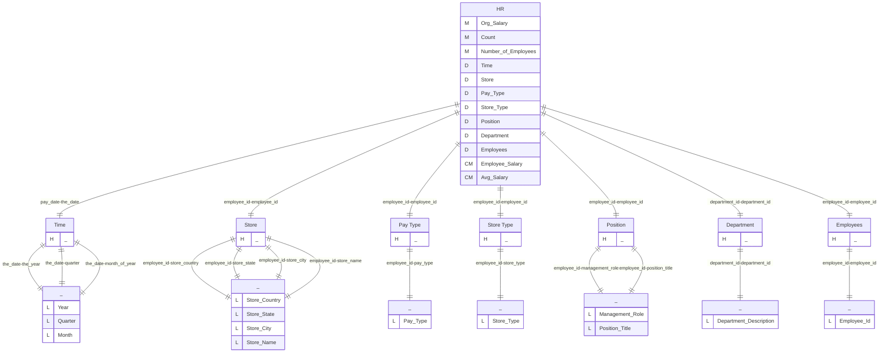

```mermaid
%%{init: {
"theme": "default",
"themeCSS": [
    ".er.entityBox {stroke: black;}",
    ".er.attributeBoxEven {stroke: black;}",
    ".er.attributeBoxOdd {stroke: black;}",
    "[id^=entity-c] .er.entityBox { fill: lightgreen;} ",
    "[id^=entity-d] .er.entityBox { fill: powderblue;} ",
    "[id^=entity-h] .er.entityBox { fill: pink;} "
]
}}%%
erDiagram
c4["Sales Ragged"]{
M Unit_Sales ""
M Store_Cost ""
M Store_Sales ""
M Sales_Count ""
M Customer_Count ""
D Store ""
D Geography ""
D Store_Size_in_SQFT ""
D Store_Type ""
D Time ""
D Product ""
D Promotion_Media ""
D Promotions ""
D Customers ""
D Education_Level ""
D Gender ""
D Marital_Status ""
D Yearly_Income ""
}
d40["Store"] {
H _ ""
}
h400["_"] {
L Store_Country ""
L Store_State ""
L Store_City ""
L Store_Name ""
}
d41["Geography"] {
H _ ""
}
h410["_"] {
L Country ""
L State ""
L City ""
}
d42["Store Size in SQFT"] {
H _ ""
}
h420["_"] {
L Store_Sqft ""
}
d43["Store Type"] {
H _ ""
}
h430["_"] {
L Store_Type ""
}
d44["Time"] {
H _ ""
H Weekly ""
}
h440["_"] {
L Year ""
L Quarter ""
L Month ""
}
h441["Weekly"] {
L Year ""
L Week ""
L Day ""
}
d45["Product"] {
H _ ""
H Product_Family ""
H Product_Department ""
H Product_Category ""
H Product_Subcategory ""
H Brand_Name ""
H Product_Name ""
}
h450["_"] {
L Product_Family ""
L Product_Department ""
L Product_Category ""
L Product_Subcategory ""
L Brand_Name ""
L Product_Name ""
}
h451["Product_Family"] {
L Product_Family ""
}
h452["Product_Department"] {
L Product_Department ""
}
h453["Product_Category"] {
L Product_Category ""
}
h454["Product_Subcategory"] {
L Product_Subcategory ""
}
h455["Brand_Name"] {
L Brand_Name ""
}
h456["Product_Name"] {
L Product_Name ""
}
d46["Promotion Media"] {
H _ ""
}
h460["_"] {
L Media_Type ""
}
d47["Promotions"] {
H _ ""
}
h470["_"] {
L Promotion_Name ""
}
d48["Customers"] {
H _ ""
}
h480["_"] {
L Country ""
L State_Province ""
L City ""
L Name ""
}
d49["Education Level"] {
H _ ""
}
h490["_"] {
L Education_Level ""
}
d410["Gender"] {
H _ ""
}
h4100["_"] {
L Gender ""
}
d411["Marital Status"] {
H _ ""
}
h4110["_"] {
L Marital_Status ""
}
d412["Yearly Income"] {
H _ ""
}
h4120["_"] {
L Yearly_Income ""
}
"c4" ||--|| "d40" : "store_id-store_id"
"d40" ||--|| "h400" : "store_id-store_country"
"d40" ||--|| "h400" : "store_id-store_state"
"d40" ||--|| "h400" : "store_id-store_city"
"d40" ||--|| "h400" : "store_id-store_name"
"c4" ||--|| "d41" : "store_id-store_id"
"d41" ||--|| "h410" : "store_id-store_country"
"d41" ||--|| "h410" : "store_id-store_state"
"d41" ||--|| "h410" : "store_id-store_city"
"c4" ||--|| "d42" : "store_id-store_id"
"d42" ||--|| "h420" : "store_id-store_sqft"
"c4" ||--|| "d43" : "store_id-store_id"
"d43" ||--|| "h430" : "store_id-store_type"
"c4" ||--|| "d44" : "time_id-time_id"
"d44" ||--|| "h440" : "time_id-the_year"
"d44" ||--|| "h440" : "time_id-quarter"
"d44" ||--|| "h440" : "time_id-month_of_year"
"c4" ||--|| "d44" : "time_id-time_id"
"d44" ||--|| "h441" : "time_id-the_year"
"d44" ||--|| "h441" : "time_id-week_of_year"
"d44" ||--|| "h441" : "time_id-day_of_month"
"c4" ||--|| "d45" : "product_id-product_id"
"d45" ||--|| "h450" : "product_id-product_family"
"d45" ||--|| "h450" : "product_id-product_department"
"d45" ||--|| "h450" : "product_id-product_category"
"d45" ||--|| "h450" : "product_id-product_subcategory"
"d45" ||--|| "h450" : "product_id-brand_name"
"d45" ||--|| "h450" : "product_id-product_name"
"c4" ||--|| "d45" : "product_id-product_id"
"d45" ||--|| "h451" : "product_id-product_family"
"c4" ||--|| "d45" : "product_id-product_id"
"d45" ||--|| "h452" : "product_id-product_department"
"c4" ||--|| "d45" : "product_id-product_id"
"d45" ||--|| "h453" : "product_id-product_category"
"c4" ||--|| "d45" : "product_id-product_id"
"d45" ||--|| "h454" : "product_id-product_subcategory"
"c4" ||--|| "d45" : "product_id-product_id"
"d45" ||--|| "h455" : "product_id-brand_name"
"c4" ||--|| "d45" : "product_id-product_id"
"d45" ||--|| "h456" : "product_id-product_name"
"c4" ||--|| "d46" : "promotion_id-promotion_id"
"d46" ||--|| "h460" : "promotion_id-media_type"
"c4" ||--|| "d47" : "promotion_id-promotion_id"
"d47" ||--|| "h470" : "promotion_id-promotion_name"
"c4" ||--|| "d48" : "customer_id-customer_id"
"d48" ||--|| "h480" : "customer_id-country"
"d48" ||--|| "h480" : "customer_id-state_province"
"d48" ||--|| "h480" : "customer_id-city"
"d48" ||--|| "h480" : "customer_id-"
"c4" ||--|| "d49" : "customer_id-customer_id"
"d49" ||--|| "h490" : "customer_id-education"
"c4" ||--|| "d410" : "customer_id-customer_id"
"d410" ||--|| "h4100" : "customer_id-gender"
"c4" ||--|| "d411" : "customer_id-customer_id"
"d411" ||--|| "h4110" : "customer_id-marital_status"
"c4" ||--|| "d412" : "customer_id-customer_id"
"d412" ||--|| "h4120" : "customer_id-yearly_income"
```

# Documentation
### CatalogName : complex_FoodMart
### Schema FoodMart : 
### Public Dimensions:

    Store, Store Size in SQFT, Store Type, Time, Product, Warehouse

##### Dimension "Store":

Hierarchies:

    Hierarchy0

##### Hierarchy Hierarchy0:

Tables: "store"

Levels: "Store Country, Store State, Store City, Store Name"

###### Level "Store Country" :

    column(s): store_country

###### Level "Store State" :

    column(s): store_state

###### Level "Store City" :

    column(s): store_city

###### Level "Store Name" :

    column(s): store_name

##### Dimension "Store Size in SQFT":

Hierarchies:

    Hierarchy0

##### Hierarchy Hierarchy0:

Tables: "store"

Levels: "Store Sqft"

###### Level "Store Sqft" :

    column(s): store_sqft

##### Dimension "Store Type":

Hierarchies:

    Hierarchy0

##### Hierarchy Hierarchy0:

Tables: "store"

Levels: "Store Type"

###### Level "Store Type" :

    column(s): store_type

##### Dimension "Time":

Hierarchies:

    Hierarchy0, Weekly

##### Hierarchy Hierarchy0:

Tables: "time_by_day"

Levels: "Year, Quarter, Month"

###### Level "Year" :

    column(s): the_year

###### Level "Quarter" :

    column(s): quarter

###### Level "Month" :

    column(s): month_of_year

##### Hierarchy Weekly:

Tables: "time_by_day"

Levels: "Year, Week, Day"

###### Level "Year" :

    column(s): the_year

###### Level "Week" :

    column(s): week_of_year

###### Level "Day" :

    column(s): day_of_month

##### Dimension "Product":

Hierarchies:

    Hierarchy0, Product Family, Product Department, Product Category, Product Subcategory, Brand Name, Product Name

##### Hierarchy Hierarchy0:

Tables: "product,product_class"

Levels: "Product Family, Product Department, Product Category, Product Subcategory, Brand Name, Product Name"

###### Level "Product Family" :

    column(s): product_family

###### Level "Product Department" :

    column(s): product_department

###### Level "Product Category" :

    column(s): product_category

###### Level "Product Subcategory" :

    column(s): product_subcategory

###### Level "Brand Name" :

    column(s): brand_name

###### Level "Product Name" :

    column(s): product_name

##### Hierarchy Product Family:

Tables: "product,product_class"

Levels: "Product Family"

###### Level "Product Family" :

    column(s): product_family

##### Hierarchy Product Department:

Tables: "product,product_class"

Levels: "Product Department"

###### Level "Product Department" :

    column(s): product_department

##### Hierarchy Product Category:

Tables: "product,product_class"

Levels: "Product Category"

###### Level "Product Category" :

    column(s): product_category

##### Hierarchy Product Subcategory:

Tables: "product,product_class"

Levels: "Product Subcategory"

###### Level "Product Subcategory" :

    column(s): product_subcategory

##### Hierarchy Brand Name:

Tables: "product,product_class"

Levels: "Brand Name"

###### Level "Brand Name" :

    column(s): brand_name

##### Hierarchy Product Name:

Tables: "product,product_class"

Levels: "Product Name"

###### Level "Product Name" :

    column(s): product_name

##### Dimension "Warehouse":

Hierarchies:

    Hierarchy0

##### Hierarchy Hierarchy0:

Tables: "warehouse"

Levels: "Country, State Province, City, Warehouse Name"

###### Level "Country" :

    column(s): warehouse_country

###### Level "State Province" :

    column(s): warehouse_state_province

###### Level "City" :

    column(s): warehouse_city

###### Level "Warehouse Name" :

    column(s): warehouse_name

---
### Cubes :

    Sales, Warehouse, Store, HR, Sales Ragged, Sales 2

---
#### Cube "Sales":

    

##### Table: "sales_fact_1997"

##### Dimensions:
##### Dimension: "Store -> Store":

##### Dimension: "Store Size in SQFT -> Store Size in SQFT":

##### Dimension: "Store Type -> Store Type":

##### Dimension: "Time -> Time":

##### Dimension: "Product -> Product":

##### Dimension "Promotion Media":

Hierarchies:

    Hierarchy0

##### Hierarchy Hierarchy0:

Tables: "promotion"

Levels: "Media Type"

###### Level "Media Type" :

    column(s): media_type

##### Dimension "Promotions":

Hierarchies:

    Hierarchy0

##### Hierarchy Hierarchy0:

Tables: "promotion"

Levels: "Promotion Name"

###### Level "Promotion Name" :

    column(s): promotion_name

##### Dimension "Customers":

Hierarchies:

    Hierarchy0

##### Hierarchy Hierarchy0:

Tables: "customer"

Levels: "Country, State Province, City, Name"

###### Level "Country" :

    column(s): country

###### Level "State Province" :

    column(s): state_province

###### Level "City" :

    column(s): city

###### Level "Name" :

    column(s): customer_id

##### Dimension "Education Level":

Hierarchies:

    Hierarchy0

##### Hierarchy Hierarchy0:

Tables: "customer"

Levels: "Education Level"

###### Level "Education Level" :

    column(s): education

##### Dimension "Gender":

Hierarchies:

    Hierarchy0

##### Hierarchy Hierarchy0:

Tables: "customer"

Levels: "Gender"

###### Level "Gender" :

    column(s): gender

##### Dimension "Marital Status":

Hierarchies:

    Hierarchy0

##### Hierarchy Hierarchy0:

Tables: "customer"

Levels: "Marital Status"

###### Level "Marital Status" :

    column(s): marital_status

##### Dimension "Yearly Income":

Hierarchies:

    Hierarchy0

##### Hierarchy Hierarchy0:

Tables: "customer"

Levels: "Yearly Income"

###### Level "Yearly Income" :

    column(s): yearly_income

---
#### Cube "Warehouse":

    

##### Table: "inventory_fact_1997"

##### Dimensions:
##### Dimension: "Store -> Store":

##### Dimension: "Store Size in SQFT -> Store Size in SQFT":

##### Dimension: "Store Type -> Store Type":

##### Dimension: "Time -> Time":

##### Dimension: "Product -> Product":

##### Dimension: "Warehouse -> Warehouse":

---
#### Cube "Store":

    

##### Table: "store"

##### Dimensions:
##### Dimension "Store Type":

Hierarchies:

    Hierarchy0

##### Hierarchy Hierarchy0:

Tables: ""

Levels: "Store Type"

###### Level "Store Type" :

    column(s): store_type

##### Dimension: "Store -> Store":

##### Dimension "Has coffee bar":

Hierarchies:

    Hierarchy0

##### Hierarchy Hierarchy0:

Tables: ""

Levels: "Has coffee bar"

###### Level "Has coffee bar" :

    column(s): coffee_bar

---
#### Cube "HR":

    

##### Table: "salary"

##### Dimensions:
##### Dimension "Time":

Hierarchies:

    Hierarchy0

##### Hierarchy Hierarchy0:

Tables: "time_by_day"

Levels: "Year, Quarter, Month"

###### Level "Year" :

    column(s): the_year

###### Level "Quarter" :

    column(s): quarter

###### Level "Month" :

    column(s): month_of_year

##### Dimension "Store":

Hierarchies:

    Hierarchy0

##### Hierarchy Hierarchy0:

Tables: "employee,store"

Levels: "Store Country, Store State, Store City, Store Name"

###### Level "Store Country" :

    column(s): store_country

###### Level "Store State" :

    column(s): store_state

###### Level "Store City" :

    column(s): store_city

###### Level "Store Name" :

    column(s): store_name

##### Dimension "Pay Type":

Hierarchies:

    Hierarchy0

##### Hierarchy Hierarchy0:

Tables: "employee,position"

Levels: "Pay Type"

###### Level "Pay Type" :

    column(s): pay_type

##### Dimension "Store Type":

Hierarchies:

    Hierarchy0

##### Hierarchy Hierarchy0:

Tables: "employee,store"

Levels: "Store Type"

###### Level "Store Type" :

    column(s): store_type

##### Dimension "Position":

Hierarchies:

    Hierarchy0

##### Hierarchy Hierarchy0:

Tables: "employee"

Levels: "Management Role, Position Title"

###### Level "Management Role" :

    column(s): management_role

###### Level "Position Title" :

    column(s): position_title

##### Dimension "Department":

Hierarchies:

    Hierarchy0

##### Hierarchy Hierarchy0:

Tables: "department"

Levels: "Department Description"

###### Level "Department Description" :

    column(s): department_id

##### Dimension "Employees":

Hierarchies:

    Hierarchy0

##### Hierarchy Hierarchy0:

Tables: "employee"

Levels: "Employee Id"

###### Level "Employee Id" :

    column(s): employee_id

---
#### Cube "Sales Ragged":

    

##### Table: "sales_fact_1997"

##### Dimensions:
##### Dimension "Store":

Hierarchies:

    Hierarchy0

##### Hierarchy Hierarchy0:

Tables: "store_ragged"

Levels: "Store Country, Store State, Store City, Store Name"

###### Level "Store Country" :

    column(s): store_country

###### Level "Store State" :

    column(s): store_state

###### Level "Store City" :

    column(s): store_city

###### Level "Store Name" :

    column(s): store_name

##### Dimension "Geography":

Hierarchies:

    Hierarchy0

##### Hierarchy Hierarchy0:

Tables: "store_ragged"

Levels: "Country, State, City"

###### Level "Country" :

    column(s): store_country

###### Level "State" :

    column(s): store_state

###### Level "City" :

    column(s): store_city

##### Dimension: "Store Size in SQFT -> Store Size in SQFT":

##### Dimension: "Store Type -> Store Type":

##### Dimension: "Time -> Time":

##### Dimension: "Product -> Product":

##### Dimension "Promotion Media":

Hierarchies:

    Hierarchy0

##### Hierarchy Hierarchy0:

Tables: "promotion"

Levels: "Media Type"

###### Level "Media Type" :

    column(s): media_type

##### Dimension "Promotions":

Hierarchies:

    Hierarchy0

##### Hierarchy Hierarchy0:

Tables: "promotion"

Levels: "Promotion Name"

###### Level "Promotion Name" :

    column(s): promotion_name

##### Dimension "Customers":

Hierarchies:

    Hierarchy0

##### Hierarchy Hierarchy0:

Tables: "customer"

Levels: "Country, State Province, City, Name"

###### Level "Country" :

    column(s): country

###### Level "State Province" :

    column(s): state_province

###### Level "City" :

    column(s): city

###### Level "Name" :

    column(s): 

##### Dimension "Education Level":

Hierarchies:

    Hierarchy0

##### Hierarchy Hierarchy0:

Tables: "customer"

Levels: "Education Level"

###### Level "Education Level" :

    column(s): education

##### Dimension "Gender":

Hierarchies:

    Hierarchy0

##### Hierarchy Hierarchy0:

Tables: "customer"

Levels: "Gender"

###### Level "Gender" :

    column(s): gender

##### Dimension "Marital Status":

Hierarchies:

    Hierarchy0

##### Hierarchy Hierarchy0:

Tables: "customer"

Levels: "Marital Status"

###### Level "Marital Status" :

    column(s): marital_status

##### Dimension "Yearly Income":

Hierarchies:

    Hierarchy0

##### Hierarchy Hierarchy0:

Tables: "customer"

Levels: "Yearly Income"

###### Level "Yearly Income" :

    column(s): yearly_income

---
#### Cube "Sales 2":

    

##### Table: "sales_fact_1997"

##### Dimensions:
##### Dimension: "Time -> Time":

##### Dimension: "Product -> Product":

##### Dimension "Gender":

Hierarchies:

    Hierarchy0

##### Hierarchy Hierarchy0:

Tables: "customer"

Levels: "Gender"

###### Level "Gender" :

    column(s): gender

### Roles :##### Role: "California manager"

##### Role: "No HR Cube"

##### Role: "Administrator"

### Cube "Sales" diagram:

---

---
### Cube "Warehouse" diagram:

---

---
### Cube "Store" diagram:

---

---
### Cube "HR" diagram:

---

---
### Cube "Sales Ragged" diagram:

---

---
### Cube "Sales 2" diagram:

---

---
### Virtual Cube "Warehouse and Sales" diagram:

---

---
### Cube Matrix for FoodMart:

---
### Database :
---

---
## Validation result for schema FoodMart
## ERROR : 
|Type|   |
|----|---|
|SCHEMA|Virtual Cube Dimension Cube name must be set|
|DATABASE|Syntax error in SQL statement "[*]""fname"" || ' ' || ""lname"""; SQL statement:"fname" || ' ' || "lname" [42000-224]|
|DATABASE|Syntax error in SQL statement "[*]""warehouse_sales"" - ""inventory_fact_1997"".""warehouse_cost"""; SQL statement:"warehouse_sales" - "inventory_fact_1997"."warehouse_cost" [42000-224]|
|DATABASE|Syntax error in SQL statement "([*]case when ""sales_fact_1997"".""promotion_id"" = 0 then 0 else ""sales_fact_1997"".""store_sales"" end)"; expected "(, SELECT, TABLE, VALUES"; SQL statement:(case when "sales_fact_1997"."promotion_id" = 0 then 0 else "sales_fact_1997"."store_sales" end) [42001-224]|
## WARNING : 
|Type|   |
|----|---|
|DATABASE|Agg Exclude table agg_lc_10_sales_fact_1997 does not exist in database .|
|DATABASE|Table: Schema must be set|
|DATABASE|Agg Exclude table agg_pc_10_sales_fact_1997 does not exist in database .|
