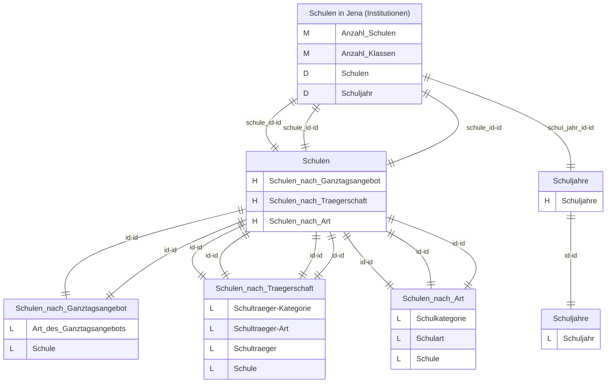
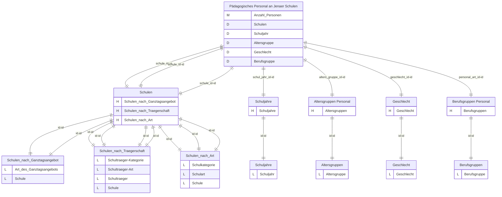
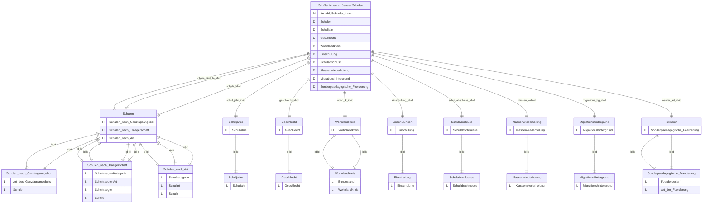
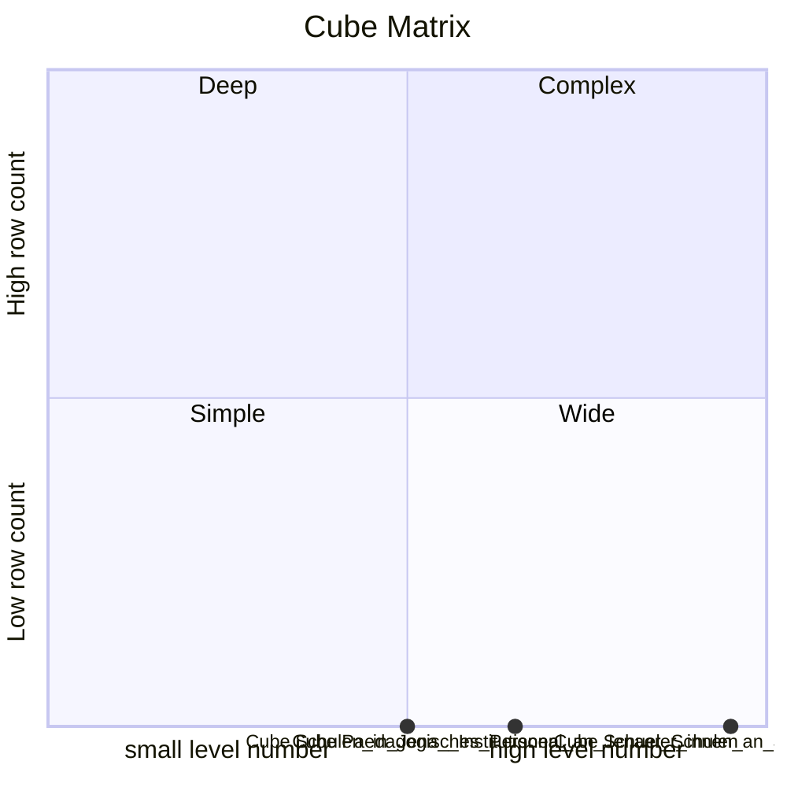

```mermaid
---
title: Diagram;
---
erDiagram
"fact_schueler✔"{
int schule_id "✔"
int schul_jahr_id "✔"
int geschlecht_id "✔"
int wohn_lk_id "✔"
int einschulung_id "✔"
int schul_abschluss_id "✔"
int klassen_wdh "✔"
int migrations_hg_id "✔"
int foerder_art_id "✔"
int anzahl_schueler "✔"
}
"fact_schulen✔"{
int schule_id "✔"
int schul_jahr_id "✔"
int anzahl_schulen "✔"
int anzahl_klassen "✔"
}
"sonderpaed_foerderbedarf❌"{
VARCHAR sonderpaed_bedarf "❌"
INTEGER id "❌"
}
"einschulung❌"{
VARCHAR einschulung "❌"
VARCHAR id "❌"
}
"klassen_wiederholung❌"{
VARCHAR id "❌"
VARCHAR klassenwiederholung "❌"
}
"geschlecht❌"{
VARCHAR bezeichnung "❌"
VARCHAR id "❌"
}
"schul_art❌"{
INTEGER schul_kategorie_id "❌"
VARCHAR schulart_name "❌"
INTEGER id "❌"
}
"schul_jahr❌"{
VARCHAR id "❌"
VARCHAR schul_jahr "❌"
INTEGER order "❌"
}
"foerderung_art❌"{
INTEGER sp_foerderbedarf_id "❌"
VARCHAR id "❌"
VARCHAR foerderung_art "❌"
}
"traeger❌"{
INTEGER traeger_art_id "❌"
VARCHAR traeger_name "❌"
INTEGER id "❌"
}
"ganztags_art❌"{
INTEGER id "❌"
VARCHAR schul_umfang "❌"
}
"schule❌"{
INTEGER schul_nummer "❌"
INTEGER traeger_id "❌"
INTEGER ganztags_art_id "❌"
VARCHAR schul_name "❌"
VARCHAR id "❌"
INTEGER schul_art_id "❌"
}
"schul_abschluss❌"{
VARCHAR schulabschluss "❌"
VARCHAR id "❌"
}
"bundesland❌"{
VARCHAR bezeichnung "❌"
INTEGER id "❌"
}
"fact_personal❌"{
VARCHAR anzahl_personen "❌"
INTEGER alters_gruppe_id "❌"
INTEGER schule_id "❌"
INTEGER schul_jahr_id "❌"
INTEGER personal_art_id "❌"
INTEGER geschlecht_id "❌"
}
"schul_kategorie❌"{
VARCHAR schul_kategorie_name "❌"
INTEGER id "❌"
}
"traeger_kategorie❌"{
INTEGER id "❌"
VARCHAR traeger_kategorie "❌"
}
"personal_art❌"{
VARCHAR bezeichnung "❌"
VARCHAR id "❌"
}
"traeger_art❌"{
INTEGER traeger_kat_id "❌"
INTEGER id "❌"
VARCHAR traeger_art "❌"
}
"migrations_hintergrund❌"{
VARCHAR id "❌"
VARCHAR migrations_hintergrund "❌"
}
"alters_gruppe❌"{
VARCHAR id "❌"
VARCHAR altersgruppe "❌"
}
"wohnort_landkreis❌"{
INTEGER bundesland_id "❌"
VARCHAR bezeichnung "❌"
VARCHAR id "❌"
}

"fact_schulen✔" ||--o{ "schule❌" : "schule_id-id"
"schule❌" ||--o{ "ganztags_art❌" : "ganztags_art_id-id"
"fact_schulen✔" ||--o{ "schule❌" : "schule_id-id"
"schule❌" ||--o{ "traeger❌" : "traeger_id-id"
"traeger❌" ||--o{ "traeger_art❌" : "traeger_art_id-id"
"traeger_art❌" ||--o{ "traeger_kategorie❌" : "traeger_kat_id-id"
"fact_schulen✔" ||--o{ "schule❌" : "schule_id-id"
"schule❌" ||--o{ "schul_art❌" : "schul_art_id-id"
"schul_art❌" ||--o{ "schul_kategorie❌" : "schul_kategorie_id-id"
"fact_schulen✔" ||--o{ "schul_jahr❌" : "schul_jahr_id-id"
"fact_personal❌" ||--o{ "schule❌" : "schule_id-id"
"schule❌" ||--o{ "ganztags_art❌" : "ganztags_art_id-id"
"fact_personal❌" ||--o{ "schule❌" : "schule_id-id"
"schule❌" ||--o{ "traeger❌" : "traeger_id-id"
"traeger❌" ||--o{ "traeger_art❌" : "traeger_art_id-id"
"traeger_art❌" ||--o{ "traeger_kategorie❌" : "traeger_kat_id-id"
"fact_personal❌" ||--o{ "schule❌" : "schule_id-id"
"schule❌" ||--o{ "schul_art❌" : "schul_art_id-id"
"schul_art❌" ||--o{ "schul_kategorie❌" : "schul_kategorie_id-id"
"fact_personal❌" ||--o{ "schul_jahr❌" : "schul_jahr_id-id"
"fact_personal❌" ||--o{ "alters_gruppe❌" : "alters_gruppe_id-id"
"fact_personal❌" ||--o{ "geschlecht❌" : "geschlecht_id-id"
"fact_personal❌" ||--o{ "personal_art❌" : "personal_art_id-id"
"fact_schueler✔" ||--o{ "schule❌" : "schule_id-id"
"schule❌" ||--o{ "ganztags_art❌" : "ganztags_art_id-id"
"fact_schueler✔" ||--o{ "schule❌" : "schule_id-id"
"schule❌" ||--o{ "traeger❌" : "traeger_id-id"
"traeger❌" ||--o{ "traeger_art❌" : "traeger_art_id-id"
"traeger_art❌" ||--o{ "traeger_kategorie❌" : "traeger_kat_id-id"
"fact_schueler✔" ||--o{ "schule❌" : "schule_id-id"
"schule❌" ||--o{ "schul_art❌" : "schul_art_id-id"
"schul_art❌" ||--o{ "schul_kategorie❌" : "schul_kategorie_id-id"
"fact_schueler✔" ||--o{ "schul_jahr❌" : "schul_jahr_id-id"
"fact_schueler✔" ||--o{ "geschlecht❌" : "geschlecht_id-id"
"fact_schueler✔" ||--o{ "wohnort_landkreis❌" : "wohn_lk_id-id"
"wohnort_landkreis❌" ||--o{ "bundesland❌" : "bundesland_id-id"
"fact_schueler✔" ||--o{ "einschulung❌" : "einschulung_id-id"
"fact_schueler✔" ||--o{ "schul_abschluss❌" : "schul_abschluss_id-id"
"fact_schueler✔" ||--o{ "klassen_wiederholung❌" : "klassen_wdh-id"
"fact_schueler✔" ||--o{ "migrations_hintergrund❌" : "migrations_hg_id-id"
"fact_schueler✔" ||--o{ "foerderung_art❌" : "foerder_art_id-id"
"foerderung_art❌" ||--o{ "sonderpaed_foerderbedarf❌" : "sp_foerderbedarf_id-id"
```

# Documentation
### CatalogName : complex_SchoolsTestData_German
### Schema Schulwesen : 
### Public Dimensions:

    Schulen, Schuljahre, Altersgruppen Personal, Geschlecht, Berufsgruppen Personal, Einschulungen, Klassenwiederholung, Schulabschluss, Migrationshintergrund, Wohnlandkreis, Inklusion

##### Dimension "Schulen":

Hierarchies:

    Schulen nach Ganztagsangebot, Schulen nach Trägerschaft, Schulen nach Art

##### Hierarchy Schulen nach Ganztagsangebot:

Tables: "schule,ganztags_art"

Levels: "Art des Ganztagsangebots, Schule"

###### Level "Art des Ganztagsangebots" :

    column(s): id

###### Level "Schule" :

    column(s): id

##### Hierarchy Schulen nach Trägerschaft:

Tables: "schule,traeger,traeger_art,traeger_kategorie"

Levels: "Schulträger-Kategorie, Schulträger-Art, Schulträger, Schule"

###### Level "Schulträger-Kategorie" :

    column(s): id

###### Level "Schulträger-Art" :

    column(s): id

###### Level "Schulträger" :

    column(s): id

###### Level "Schule" :

    column(s): id

##### Hierarchy Schulen nach Art:

Tables: "schule,schul_art,schul_kategorie"

Levels: "Schulkategorie, Schulart, Schule"

###### Level "Schulkategorie" :

    column(s): id

###### Level "Schulart" :

    column(s): id

###### Level "Schule" :

    column(s): id

##### Dimension "Schuljahre":

Hierarchies:

    Schuljahre

##### Hierarchy Schuljahre:

Tables: "schul_jahr"

Levels: "Schuljahr"

###### Level "Schuljahr" :

    column(s): id

##### Dimension "Altersgruppen Personal":

Hierarchies:

    Altersgruppen

##### Hierarchy Altersgruppen:

Tables: "alters_gruppe"

Levels: "Altersgruppe"

###### Level "Altersgruppe" :

    column(s): id

##### Dimension "Geschlecht":

Hierarchies:

    Geschlecht

##### Hierarchy Geschlecht:

Tables: "geschlecht"

Levels: "Geschlecht"

###### Level "Geschlecht" :

    column(s): id

##### Dimension "Berufsgruppen Personal":

Hierarchies:

    Berufsgruppen

##### Hierarchy Berufsgruppen:

Tables: "personal_art"

Levels: "Berufsgruppe"

###### Level "Berufsgruppe" :

    column(s): id

##### Dimension "Einschulungen":

Hierarchies:

    Einschulung

##### Hierarchy Einschulung:

Tables: "einschulung"

Levels: "Einschulung"

###### Level "Einschulung" :

    column(s): id

##### Dimension "Klassenwiederholung":

Hierarchies:

    Klassenwiederholung

##### Hierarchy Klassenwiederholung:

Tables: "klassen_wiederholung"

Levels: "Klassenwiederholung"

###### Level "Klassenwiederholung" :

    column(s): id

##### Dimension "Schulabschluss":

Hierarchies:

    Schulabschlüsse

##### Hierarchy Schulabschlüsse:

Tables: "schul_abschluss"

Levels: "Schulabschlüsse"

###### Level "Schulabschlüsse" :

    column(s): id

##### Dimension "Migrationshintergrund":

Hierarchies:

    Migrationshintergrund

##### Hierarchy Migrationshintergrund:

Tables: "migrations_hintergrund"

Levels: "Migrationshintergrund"

###### Level "Migrationshintergrund" :

    column(s): id

##### Dimension "Wohnlandkreis":

Hierarchies:

    Wohnlandkreis

##### Hierarchy Wohnlandkreis:

Tables: "wohnort_landkreis,bundesland"

Levels: "Bundesland, Wohnlandkreis"

###### Level "Bundesland" :

    column(s): id

###### Level "Wohnlandkreis" :

    column(s): id

##### Dimension "Inklusion":

Hierarchies:

    Sonderpädagogische Förderung

##### Hierarchy Sonderpädagogische Förderung:

Tables: "foerderung_art,sonderpaed_foerderbedarf"

Levels: "Förderbedarf, Art der Förderung"

###### Level "Förderbedarf" :

    column(s): id

###### Level "Art der Förderung" :

    column(s): id

---
### Cubes :

    Schulen in Jena (Institutionen), Pädagogisches Personal an Jenaer Schulen, Schüler:innen an Jenaer Schulen

---
#### Cube "Schulen in Jena (Institutionen)":

    

##### Table: "fact_schulen"

##### Dimensions:
##### Dimension: "Schulen -> Schulen":

##### Dimension: "Schuljahr -> Schuljahre":

### Cube "Schulen in Jena (Institutionen)" diagram:

---

---
---
#### Cube "Pädagogisches Personal an Jenaer Schulen":

    

##### Table: "fact_personal"

##### Dimensions:
##### Dimension: "Schulen -> Schulen":

##### Dimension: "Schuljahr -> Schuljahre":

##### Dimension: "Altersgruppe -> Altersgruppen Personal":

##### Dimension: "Geschlecht -> Geschlecht":

##### Dimension: "Berufsgruppe -> Berufsgruppen Personal":

### Cube "Pädagogisches Personal an Jenaer Schulen" diagram:

---

---
---
#### Cube "Schüler:innen an Jenaer Schulen":

    

##### Table: "fact_schueler"

##### Dimensions:
##### Dimension: "Schulen -> Schulen":

##### Dimension: "Schuljahr -> Schuljahre":

##### Dimension: "Geschlecht -> Geschlecht":

##### Dimension: "Wohnlandkreis -> Wohnlandkreis":

##### Dimension: "Einschulung -> Einschulungen":

##### Dimension: "Schulabschluss -> Schulabschluss":

##### Dimension: "Klassenwiederholung -> Klassenwiederholung":

##### Dimension: "Migrationshintergrund -> Migrationshintergrund":

##### Dimension: "Sonderpädagogische Förderung -> Inklusion":

### Cube "Schüler:innen an Jenaer Schulen" diagram:

---

---
### Cube Matrix for Schulwesen:

---
### Database :
---

---
## Validation result for schema Schulwesen
## ERROR : 
|Type|   |
|----|---|
|SCHEMA|Hierarchy: Table field must be empty in dimension with name Migrationshintergrund|
|SCHEMA|Hierarchy: Table field must be empty in dimension with name Schuljahre|
|SCHEMA|Hierarchy: Table field must be empty in dimension with name Klassenwiederholung|
|SCHEMA|Hierarchy: Table field must be empty in dimension with name Berufsgruppen Personal|
|SCHEMA|Hierarchy: Table field must be empty in dimension with name Einschulungen|
|SCHEMA|Hierarchy: Table field must be empty in dimension with name Schulabschluss|
|SCHEMA|Hierarchy: Table field must be empty in dimension with name Geschlecht|
|SCHEMA|Hierarchy: Table field must be empty in dimension with name Altersgruppen Personal|
|DATABASE|Table schul_art does not exist in database|
|DATABASE|Column id defined in field primaryKey does not exist in table geschlecht|
|DATABASE|Table schule does not exist in database|
|DATABASE|Table schul_jahr does not exist in database|
|DATABASE|Column id defined in field primaryKey does not exist in table alters_gruppe|
|DATABASE|Column id defined in field primaryKey does not exist in table schule|
|DATABASE|Table traeger_kategorie does not exist in database|
|DATABASE|Table personal_art does not exist in database|
|DATABASE|Column id defined in field primaryKey does not exist in table personal_art|
|DATABASE|Measure Anzahl Personen column anzahl_personen doesn't exist in table fact_personal of cube with name Pädagogisches Personal an Jenaer Schulen|
|DATABASE|Table sonderpaed_foerderbedarf does not exist in database|
|DATABASE|Table foerderung_art does not exist in database|
|DATABASE|Table traeger_art does not exist in database|
|DATABASE|Column id defined in field primaryKey does not exist in table foerderung_art|
|DATABASE|Table bundesland does not exist in database|
|DATABASE|Fact table fact_personal does not exist in database .|
|DATABASE|Table schul_kategorie does not exist in database|
|DATABASE|Table alters_gruppe does not exist in database|
|DATABASE|Table wohnort_landkreis does not exist in database|
|DATABASE|Column id defined in field primaryKey does not exist in table wohnort_landkreis|
|DATABASE|Table einschulung does not exist in database|
|DATABASE|Table klassen_wiederholung does not exist in database|
|DATABASE|Table schul_abschluss does not exist in database|
|DATABASE|Column id defined in field primaryKey does not exist in table migrations_hintergrund|
|DATABASE|Table migrations_hintergrund does not exist in database|
|DATABASE|Column id defined in field primaryKey does not exist in table schul_jahr|
|DATABASE|Table ganztags_art does not exist in database|
|DATABASE|Column id defined in field primaryKey does not exist in table schul_abschluss|
|DATABASE|Table geschlecht does not exist in database|
|DATABASE|Column id defined in field primaryKey does not exist in table klassen_wiederholung|
|DATABASE|Column id defined in field primaryKey does not exist in table einschulung|
|DATABASE|Table traeger does not exist in database|
## WARNING : 
|Type|   |
|----|---|
|DATABASE|Table: Schema must be set|
