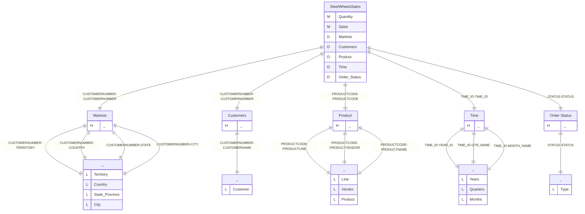
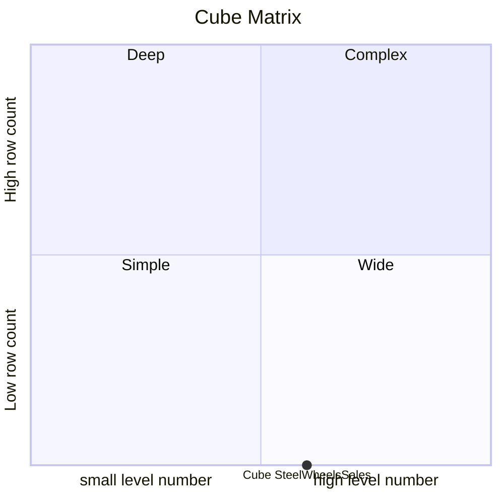
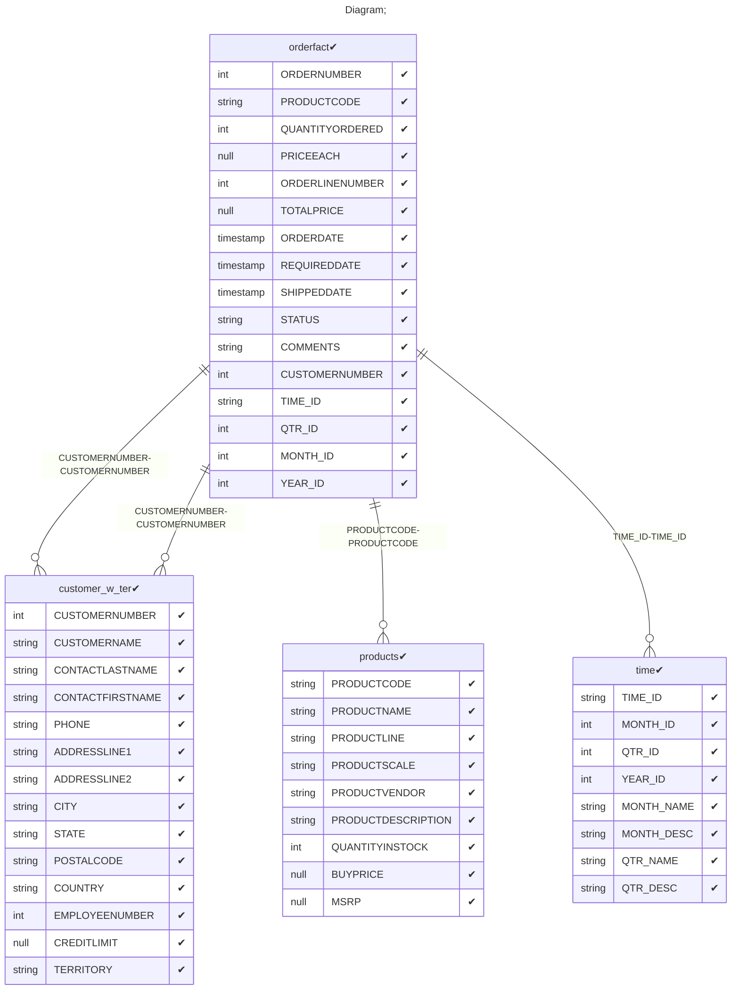

# Documentation
### CatalogName : complex_SteelWheel
### Schema SteelWheels : 
---
### Cubes :

    SteelWheelsSales

---
#### Cube "SteelWheelsSales":

    

##### Table: "orderfact"

##### Dimensions:
##### Dimension "Markets":

Hierarchies:

    Hierarchy0

##### Hierarchy Hierarchy0:

Tables: "customer_w_ter"

Levels: "Territory, Country, State Province, City"

###### Level "Territory" :

    column(s): TERRITORY

###### Level "Country" :

    column(s): COUNTRY

###### Level "State Province" :

    column(s): STATE

###### Level "City" :

    column(s): CITY

##### Dimension "Customers":

Hierarchies:

    Hierarchy0

##### Hierarchy Hierarchy0:

Tables: "customer_w_ter"

Levels: "Customer"

###### Level "Customer" :

    column(s): CUSTOMERNAME

##### Dimension "Product":

Hierarchies:

    

##### Hierarchy :

Tables: "products"

Levels: "Line, Vendor, Product"

###### Level "Line" :

    column(s): PRODUCTLINE

###### Level "Vendor" :

    column(s): PRODUCTVENDOR

###### Level "Product" :

    column(s): PRODUCTNAME

##### Dimension "Time":

Hierarchies:

    Hierarchy0

##### Hierarchy Hierarchy0:

Tables: "time"

Levels: "Years, Quarters, Months"

###### Level "Years" :

    column(s): YEAR_ID

###### Level "Quarters" :

    column(s): QTR_NAME

###### Level "Months" :

    column(s): MONTH_NAME

##### Dimension "Order Status":

Hierarchies:

    Hierarchy0

##### Hierarchy Hierarchy0:

Tables: ""

Levels: "Type"

###### Level "Type" :

    column(s): STATUS

### Cube "SteelWheelsSales" diagram:

---

---
### Cube Matrix for SteelWheels:

---
### Database :
---

---
## Validation result for schema SteelWheels
## ERROR : 
|Type|   |
|----|---|
|SCHEMA|Hierarchy: Table field must be empty in dimension with name Product|
## WARNING : 
|Type|   |
|----|---|
|DATABASE|Table: Schema must be set|
