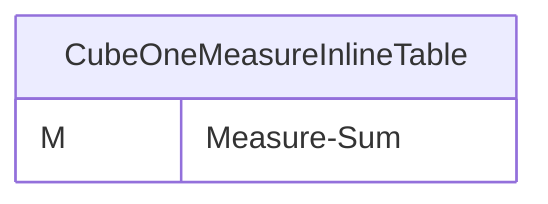

# Documentation
### CatalogName : min_Cube_InlineTable
## Olap Context Details:
## Schemas:
### Schema Minimal_Cubes_With_Inline_Tables : 
### Public Dimensions:

    

---
### Cubes :

    CubeOneMeasureInlineTable

---
#### Cube "CubeOneMeasureInlineTable":

    

##### Table: ""

##### Dimensions:
### Cube "CubeOneMeasureInlineTable" diagram:

---

---
## Validation result for schema Minimal_Cubes_With_Inline_Tables
## ERROR : 
|Type|   |
|----|---|
|SCHEMA|Cube with name CubeOneMeasureInlineTable must contain Dimensions|
