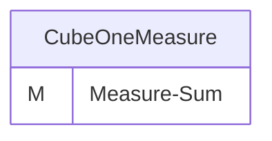
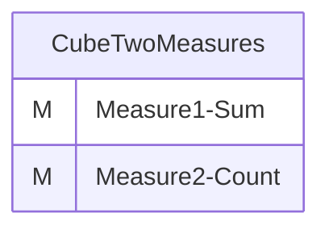
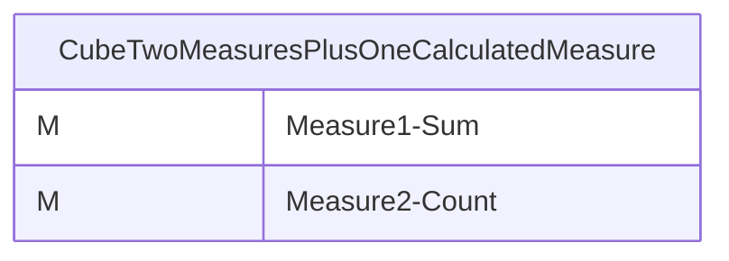
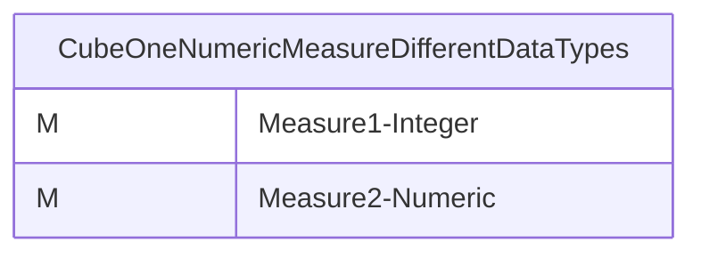
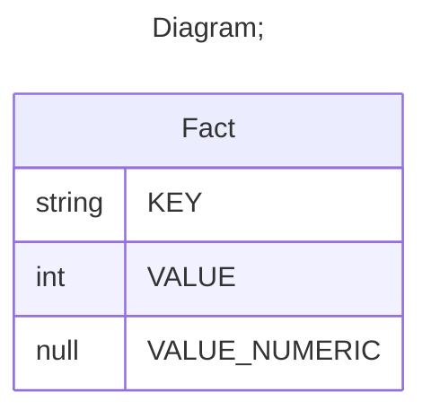

# Documentation
### CatalogName : min_Cube_Measure
## Olap Context Details:
## Schemas:
### Schema Minimal_Cubes_With_Measures : 
### Public Dimensions:

    

---
### Cubes :

    CubeOneMeasure, CubeTwoMeasures, CubeTwoMeasuresPlusOneCalculatedMeasure, CubeOneNumericMeasureDifferentDataTypes

---
#### Cube "CubeOneMeasure":

    

##### Table: "Fact"

##### Dimensions:
### Cube "CubeOneMeasure" diagram:

---

---
---
#### Cube "CubeTwoMeasures":

    

##### Table: "Fact"

##### Dimensions:
### Cube "CubeTwoMeasures" diagram:

---

---
---
#### Cube "CubeTwoMeasuresPlusOneCalculatedMeasure":

    

##### Table: "Fact"

##### Dimensions:
### Cube "CubeTwoMeasuresPlusOneCalculatedMeasure" diagram:

---

---
---
#### Cube "CubeOneNumericMeasureDifferentDataTypes":

    

##### Table: "Fact"

##### Dimensions:
### Cube "CubeOneNumericMeasureDifferentDataTypes" diagram:

---

---
### Database :
---

---
## Validation result for schema Minimal_Cubes_With_Measures
## ERROR : 
|Type|   |
|----|---|
|SCHEMA|Cube with name CubeOneMeasure must contain Dimensions|
|SCHEMA|Cube with name CubeOneNumericMeasureDifferentDataTypes must contain Dimensions|
|SCHEMA|Cube with name CubeTwoMeasuresPlusOneCalculatedMeasure must contain Dimensions|
|SCHEMA|Cube with name CubeTwoMeasures must contain Dimensions|
