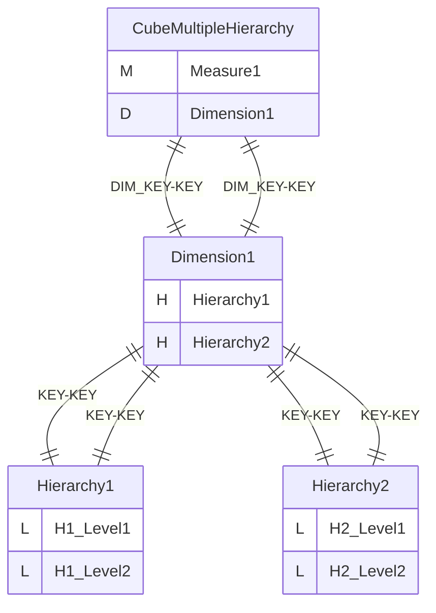
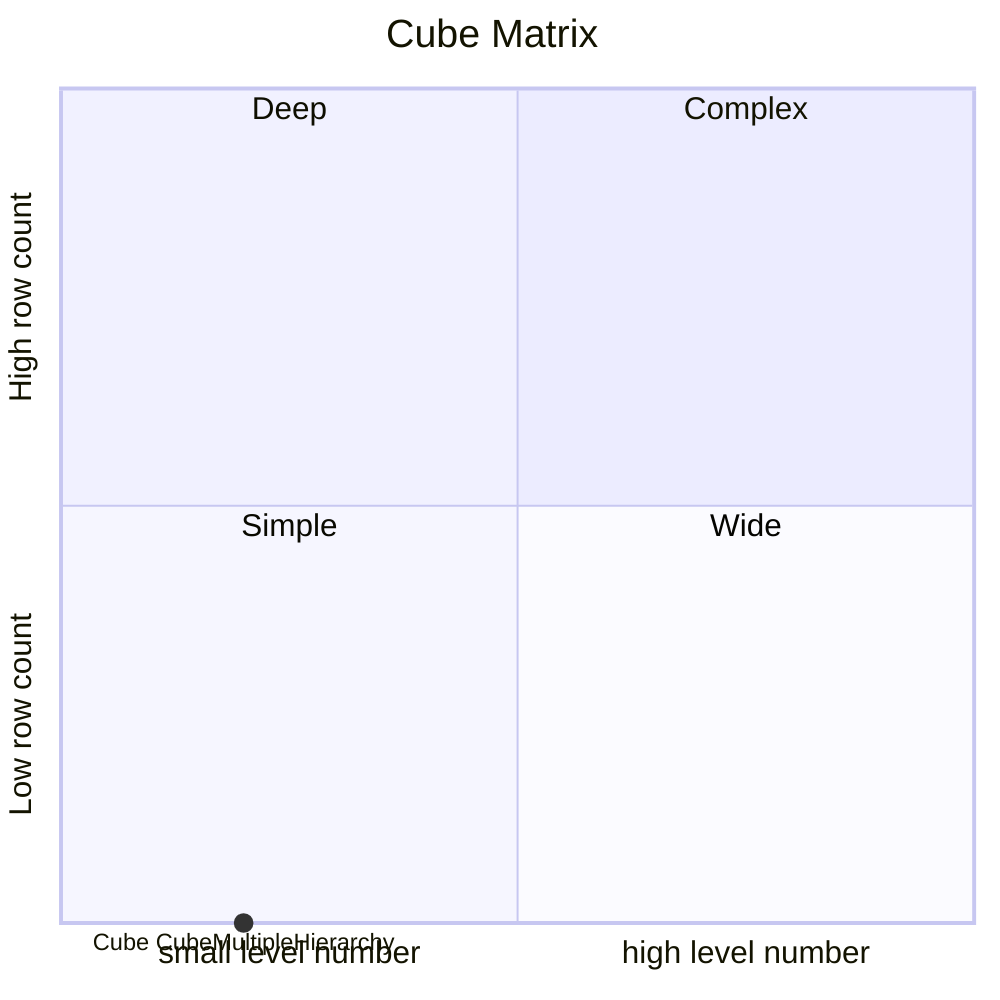
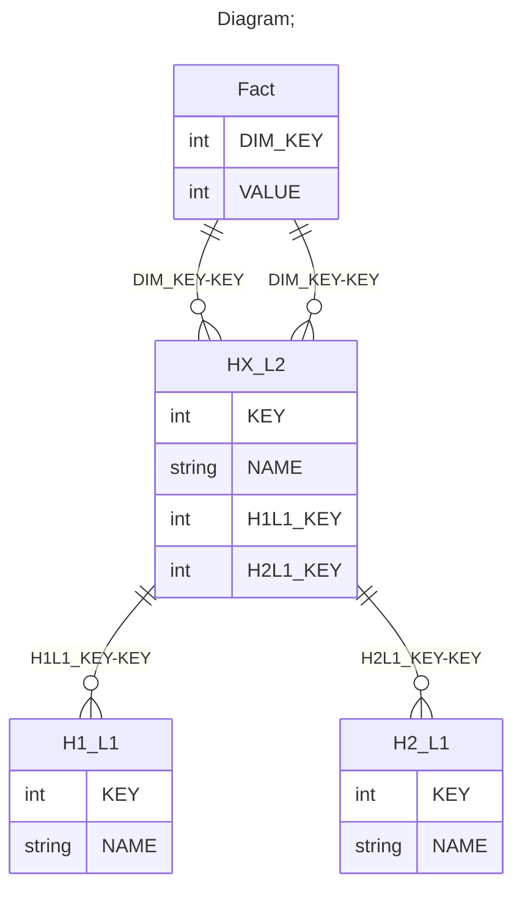

# Documentation
### CatalogName : min_Dimension_Hierarchy_multiple
### Schema Minimal_Multiple_Hierarchy : 
### Public Dimensions:

    Dimension1

##### Dimension "Dimension1":

Hierarchies:

    Hierarchy1, Hierarchy2

##### Hierarchy Hierarchy1:

Tables: "HX_L2,H1_L1"

Levels: "H1_Level1, H1_Level2"

###### Level "H1_Level1" :

    column(s): KEY

###### Level "H1_Level2" :

    column(s): KEY

##### Hierarchy Hierarchy2:

Tables: "HX_L2,H2_L1"

Levels: "H2_Level1, H2_Level2"

###### Level "H2_Level1" :

    column(s): KEY

###### Level "H2_Level2" :

    column(s): KEY

---
### Cubes :

    CubeMultipleHierarchy

---
#### Cube "CubeMultipleHierarchy":

    

##### Table: "Fact"

##### Dimensions:
##### Dimension: "Dimension1 -> Dimension1":

### Cube "CubeMultipleHierarchy" diagram:

---

---
### Cube Matrix for Minimal_Multiple_Hierarchy:

---
### Database :
---

---
## Validation result for schema Minimal_Multiple_Hierarchy
## WARNING : 
|Type|   |
|----|---|
|SCHEMA|Level: Type should be set for H1_Level2|
|SCHEMA|Level: Type should be set for H1_Level1|
|SCHEMA|Level: Type should be set for H2_Level1|
|SCHEMA|Level: Type should be set for H2_Level2|
|DATABASE|Table: Schema must be set|
