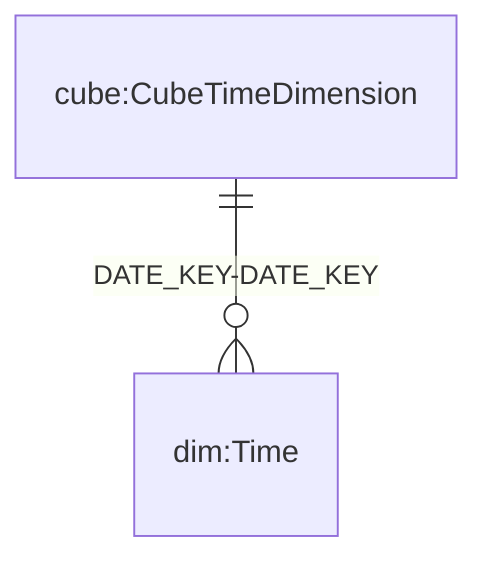
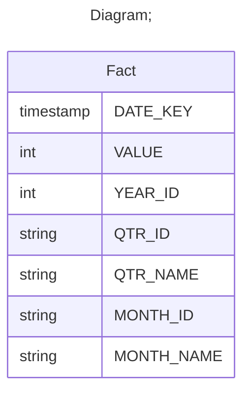

# Documentation
### CatalogName : min_Dimension_TimeDimension
## Olap Context Details:
## Schemas:
### Schema Minimal_Time_Dimension : 
### Public Dimensions:

    Time

##### Dimension "Time":

Hierarchies:

    Hierarchy0

##### Hierarchy Hierarchy0:

Tables: "Fact"

Levels: "Years, Quarters, Months"

###### Level "Years" :

    column(s): YEAR_ID

###### Level "Quarters" :

    column(s): QTR_NAME

###### Level "Months" :

    column(s): MONTH_NAME

---
### Cubes :

    CubeTimeDimension

---
#### Cube "CubeTimeDimension":

    

##### Table: "Fact"

##### Dimensions:
##### Dimension: "Time -> Time":

### Cube "CubeTimeDimension" diagram:

---

---
### Database :
---

---
## Validation result for schema Minimal_Time_Dimension
## WARNING : 
|Type|   |
|----|---|
|SCHEMA|Level: Type should be set for Years|
|SCHEMA|Level: Type should be set for Months|
|SCHEMA|Level: Type should be set for Quarters|
|DATABASE|Table: Schema must be set|
