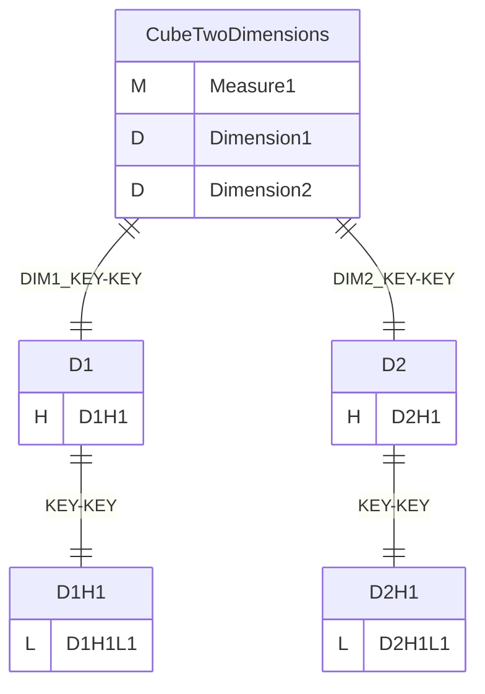
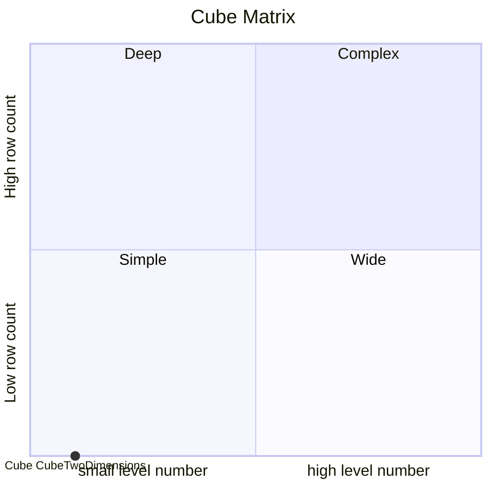
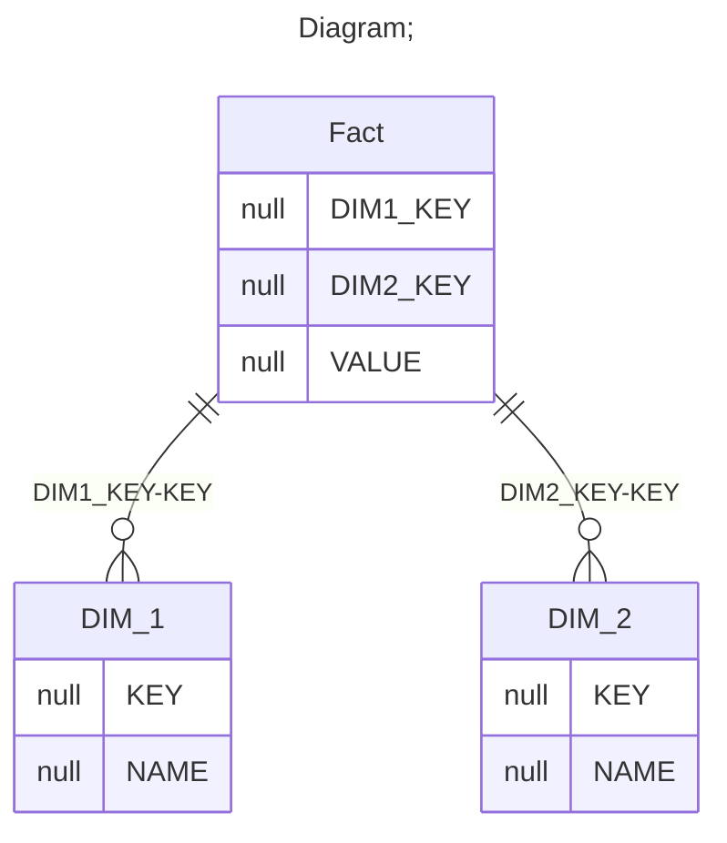

# Documentation
### CatalogName : min_Dimension_multiple
## Olap Context Details:
## Schemas:
### Schema Minimal_Two_Dimensions : 
### Public Dimensions:

    D1, D2

##### Dimension "D1":

Hierarchies:

    D1H1

##### Hierarchy D1H1:

Tables: "DIM_1"

Levels: "D1H1L1"

###### Level "D1H1L1" :

    column(s): KEY

##### Dimension "D2":

Hierarchies:

    D2H1

##### Hierarchy D2H1:

Tables: "DIM_2"

Levels: "D2H1L1"

###### Level "D2H1L1" :

    column(s): KEY

---
### Cubes :

    CubeTwoDimensions

---
#### Cube "CubeTwoDimensions":

    

##### Table: "Fact"

##### Dimensions:
##### Dimension: "Dimension1 -> D1":

##### Dimension: "Dimension2 -> D2":

### Cube "CubeTwoDimensions" diagram:

---

---
### Cube Matrix for Minimal_Two_Dimensions:

---
### Database :
---

---
## Validation result for schema Minimal_Two_Dimensions
## WARNING : 
|Type|   |
|----|---|
|SCHEMA|Level: Type should be set for D2H1L1|
|SCHEMA|Level: Type should be set for D1H1L1|
|DATABASE|Table: Schema must be set|
