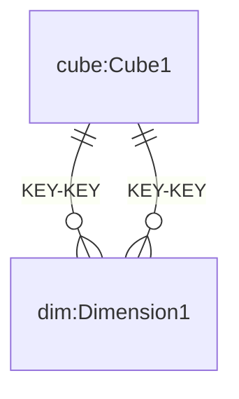
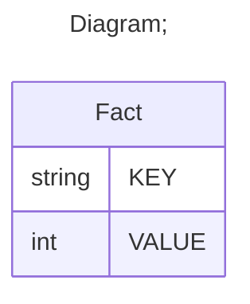

# Documentation
### CatalogName : min_Hierarchy_hasAll
## Olap Context Details:
## Schemas:
### Schema Minimal_hasAll : 
### Public Dimensions:

    Dimension1

##### Dimension "Dimension1":

Hierarchies:

    HierarchyWithHasAll, HierarchyWithoutHasAll

##### Hierarchy HierarchyWithHasAll:

Tables: "Fact"

Levels: "Level1"

###### Level "Level1" :

    column(s): KEY

##### Hierarchy HierarchyWithoutHasAll:

Tables: "Fact"

Levels: "Level2"

###### Level "Level2" :

    column(s): KEY

---
### Cubes :

    Cube1

---
#### Cube "Cube1":

    

##### Table: "Fact"

##### Dimensions:
##### Dimension: "Dimension1 -> Dimension1":

### Cube "Cube1" diagram:

---

---
### Database :
---

---
## Validation result for schema Minimal_hasAll
## WARNING : 
|Type|   |
|----|---|
|SCHEMA|Level: Type should be set for Level1|
|SCHEMA|Level: Type should be set for Level2|
|DATABASE|Table: Schema must be set|
