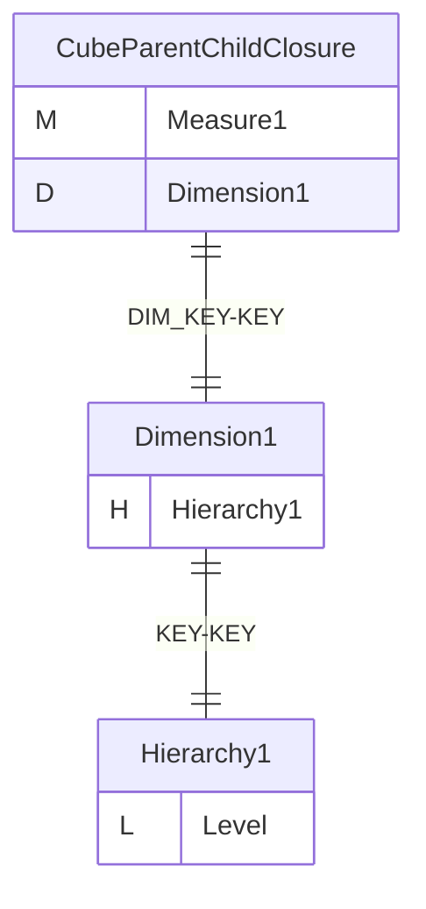
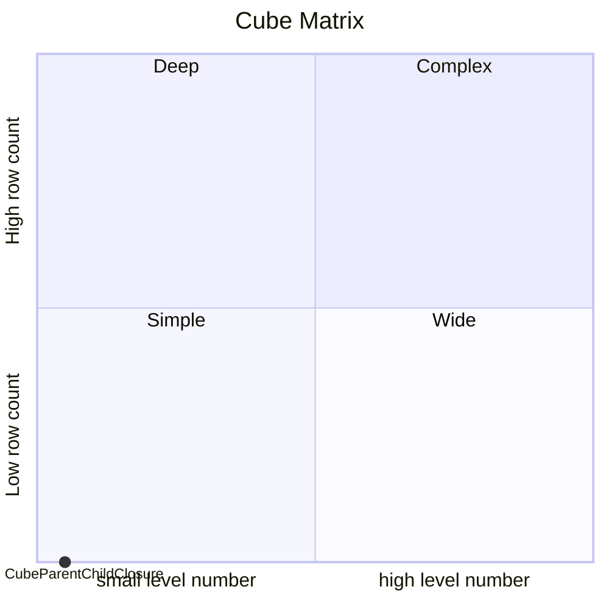
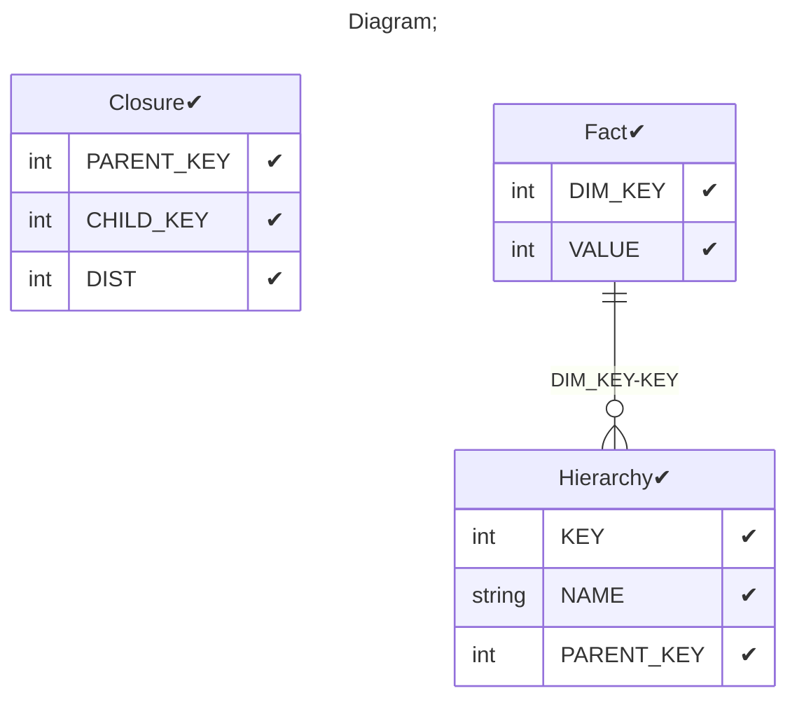

# Documentation
### CatalogName : min_Level_Closure_parent_child
### Schema Minimal_Parent_Child_With_Closure : 
### Public Dimensions:

    Dimension1

##### Dimension "Dimension1":

Hierarchies:

    Hierarchy1

##### Hierarchy Hierarchy1:

Tables: "Hierarchy"

Levels: "Level"

###### Level "Level" :

    column(s): KEY

---
### Cubes :

    CubeParentChildClosure

---
#### Cube "CubeParentChildClosure":

    

##### Table: "Fact"

##### Dimensions:
##### Dimension: "Dimension1 -> Dimension1":

### Cube "CubeParentChildClosure" diagram:

---

---
### Cube Matrix for Minimal_Parent_Child_With_Closure:

---
### Database :
---

---
## Validation result for schema Minimal_Parent_Child_With_Closure
## WARNING : 
|Type|   |
|----|---|
|DATABASE|Table: Schema must be set|
