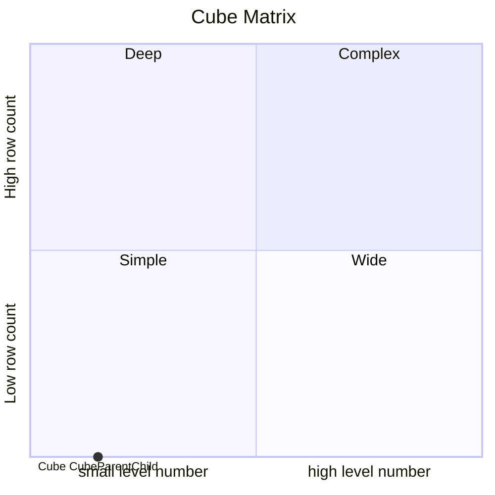

# Documentation
### CatalogName : min_Level_Column_parent_child
### Schema Minimal_Parent_Child_DifferentValueLevels : 
### Public Dimensions:

    Dimension1

##### Dimension "Dimension1":

Hierarchies:

    Hierarchy1

##### Hierarchy Hierarchy1:

Tables: "Hierarchy"

Levels: "Level1, Level2, Level3"

###### Level "Level1" :

    column(s): PARENT_L1

###### Level "Level2" :

    column(s): PARENT_L2

###### Level "Level3" :

    column(s): KEY

---
### Cubes :

    CubeParentChild

---
#### Cube "CubeParentChild":

    

##### Table: "Fact"

##### Dimensions:
##### Dimension: "Dimension1 -> Dimension1":

### Cube "CubeParentChild" diagram:

---

---
### Cube Matrix for Minimal_Parent_Child_DifferentValueLevels:

---
### Database :
---

---
## Validation result for schema Minimal_Parent_Child_DifferentValueLevels
## WARNING : 
|Type|   |
|----|---|
|SCHEMA|Level: Type should be set for Level3|
|SCHEMA|Level: Type should be set for Level1|
|SCHEMA|Level: Type should be set for Level2|
|DATABASE|Table: Schema must be set|
