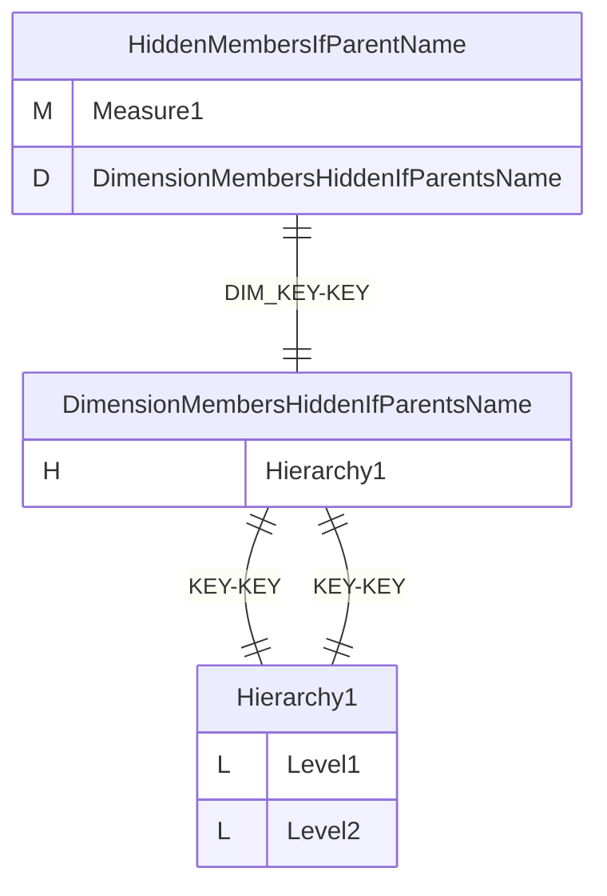
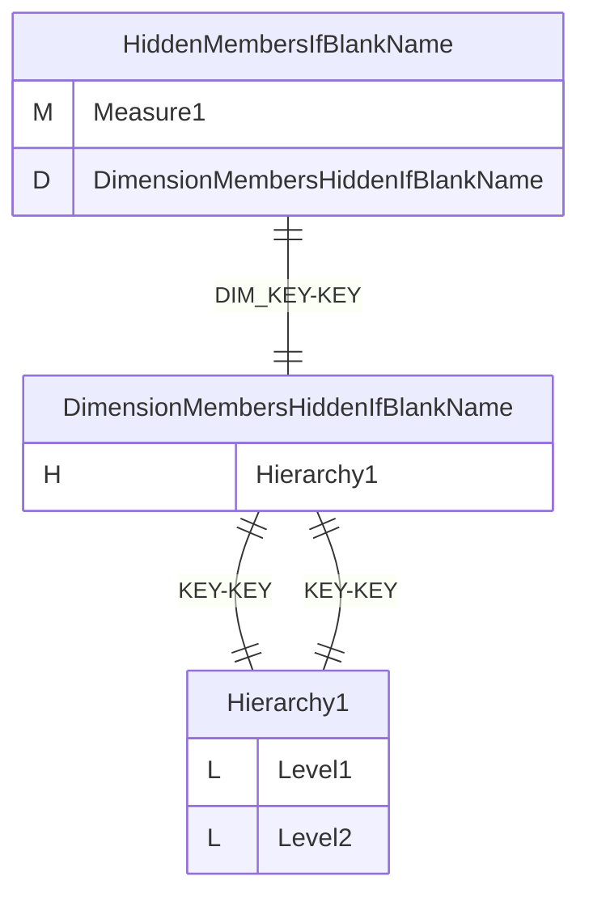
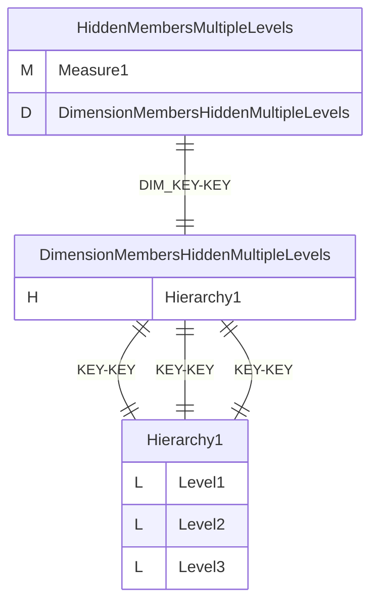
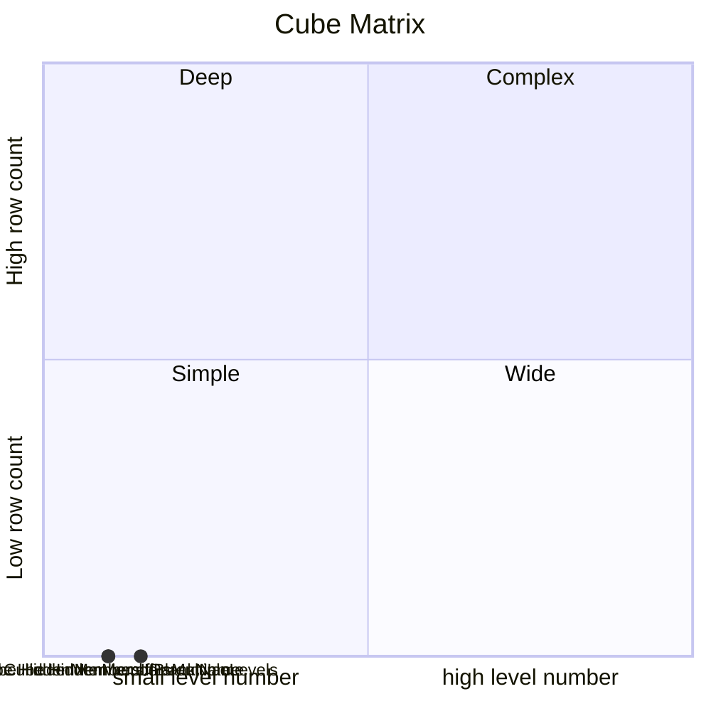

# Documentation
### CatalogName : min_Level_hideMemberIf
### Schema Minimal_Single_Hierarchy_Hidden_Members : 
### Public Dimensions:

    DimensionMembersHiddenIfParentsName, DimensionMembersHiddenIfBlankName, DimensionMembersHiddenMultipleLevels

##### Dimension "DimensionMembersHiddenIfParentsName":

Hierarchies:

    Hierarchy1

##### Hierarchy Hierarchy1:

Tables: "Level_2,Level_1"

Levels: "Level1, Level2"

###### Level "Level1" :

    column(s): KEY

###### Level "Level2" :

    column(s): KEY

##### Dimension "DimensionMembersHiddenIfBlankName":

Hierarchies:

    Hierarchy1

##### Hierarchy Hierarchy1:

Tables: "Level_2_NULL,Level_1"

Levels: "Level1, Level2"

###### Level "Level1" :

    column(s): KEY

###### Level "Level2" :

    column(s): KEY

##### Dimension "DimensionMembersHiddenMultipleLevels":

Hierarchies:

    Hierarchy1

##### Hierarchy Hierarchy1:

Tables: "Level_3_Multiple,Level_2_Multiple,Level_1_Multiple"

Levels: "Level1, Level2, Level3"

###### Level "Level1" :

    column(s): KEY

###### Level "Level2" :

    column(s): KEY

###### Level "Level3" :

    column(s): KEY

---
### Cubes :

    HiddenMembersIfParentName, HiddenMembersIfBlankName, HiddenMembersMultipleLevels

---
#### Cube "HiddenMembersIfParentName":

    

##### Table: "Fact"

##### Dimensions:
##### Dimension: "DimensionMembersHiddenIfParentsName -> DimensionMembersHiddenIfParentsName":

### Cube "HiddenMembersIfParentName" diagram:

---

---
---
#### Cube "HiddenMembersIfBlankName":

    

##### Table: "Fact"

##### Dimensions:
##### Dimension: "DimensionMembersHiddenIfBlankName -> DimensionMembersHiddenIfBlankName":

### Cube "HiddenMembersIfBlankName" diagram:

---

---
---
#### Cube "HiddenMembersMultipleLevels":

    

##### Table: "Fact_Multiple"

##### Dimensions:
##### Dimension: "DimensionMembersHiddenMultipleLevels -> DimensionMembersHiddenMultipleLevels":

### Cube "HiddenMembersMultipleLevels" diagram:

---

---
### Cube Matrix for Minimal_Single_Hierarchy_Hidden_Members:

---
### Database :
---

---
## Validation result for schema Minimal_Single_Hierarchy_Hidden_Members
## WARNING : 
|Type|   |
|----|---|
|DATABASE|Table: Schema must be set|
