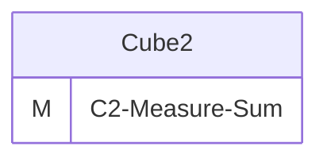
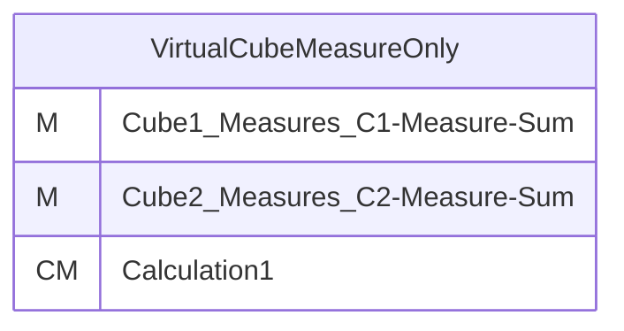
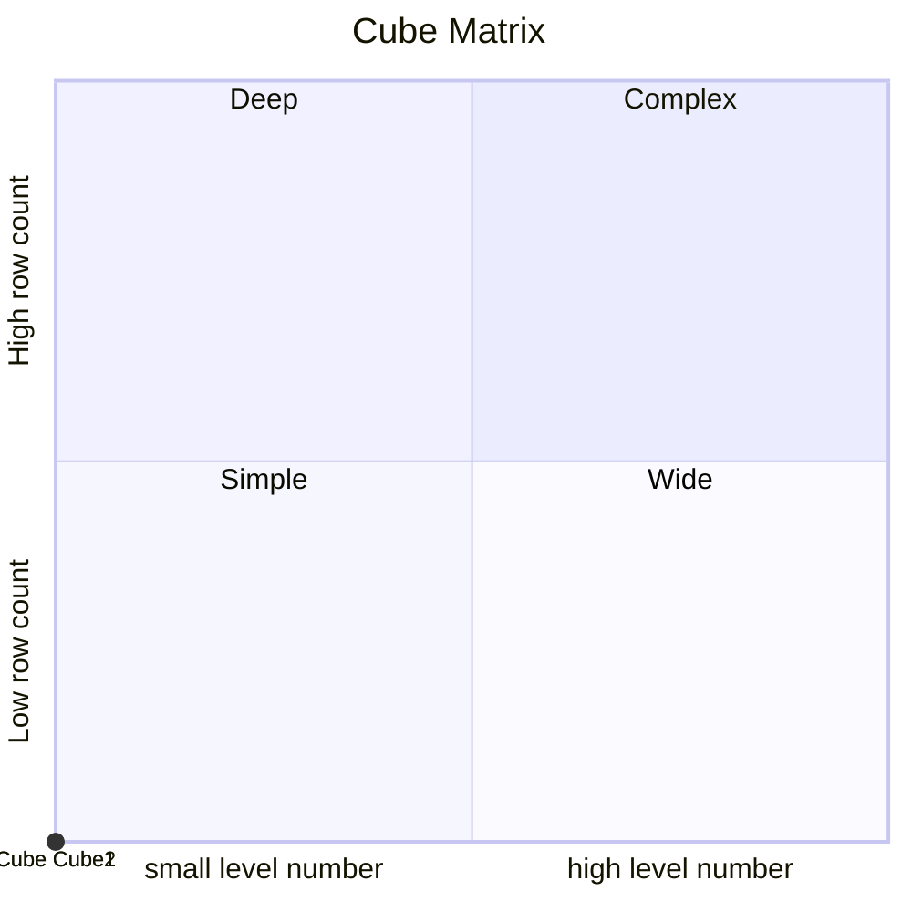
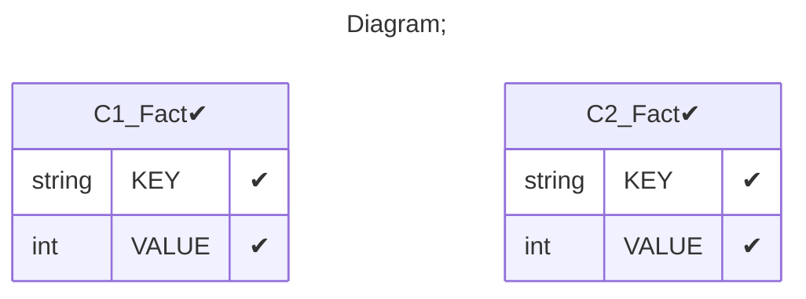

# Documentation
### CatalogName : min_VirtualCube_Measure_only
### Schema Minimal_Virtual_Cubes_With_Measures : 
---
### Cubes :

    Cube1, Cube2

---
#### Cube "Cube1":

    

##### Table: "C1_Fact"

---
#### Cube "Cube2":

    

##### Table: "C2_Fact"

### Cube "Cube1" diagram:

---

---
### Cube "Cube2" diagram:

---

---
### Virtual Cube "VirtualCubeMeasureOnly" diagram:

---

---
### Cube Matrix for Minimal_Virtual_Cubes_With_Measures:

---
### Database :
---

---
## Validation result for schema Minimal_Virtual_Cubes_With_Measures
## ERROR : 
|Type|   |
|----|---|
|SCHEMA|VirtualCube with name VirtualCubeMeasureOnly must contain dimensions |
