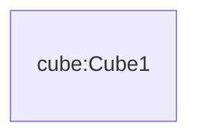
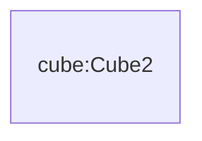
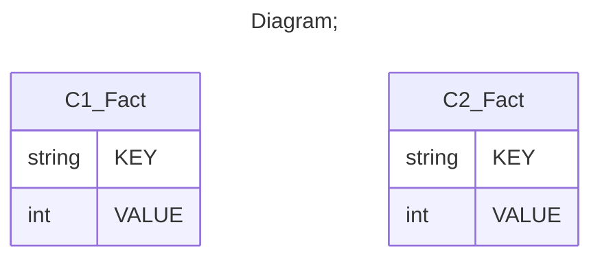

# Documentation
### CatalogName : min_VirtualCube_Measure_only
## Olap Context Details:
## Schemas:
### Schema Minimal_Virtual_Cubes_With_Measures : 
### Public Dimensions:

    

---
### Cubes :

    Cube1, Cube2

---
#### Cube "Cube1":

    

##### Table: "C1_Fact"

##### Dimensions:
### Cube "Cube1" diagram:

---

---
---
#### Cube "Cube2":

    

##### Table: "C2_Fact"

##### Dimensions:
### Cube "Cube2" diagram:

---

---
### Database :
---

---
## Validation result for schema Minimal_Virtual_Cubes_With_Measures
## ERROR : 
|Type|   |
|----|---|
|SCHEMA|Cube with name Cube1 must contain Dimensions|
|SCHEMA|Cube with name Cube2 must contain Dimensions|
|SCHEMA|VirtualCube with name VirtualCubeMeasureOnly must contain dimensions |
