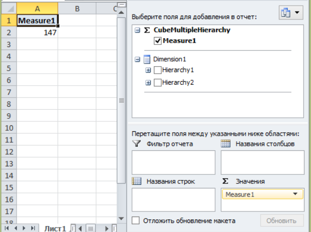
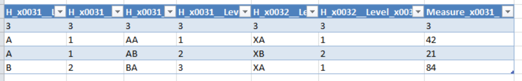

## Schema with single hierarchy
Simple schema with 2 hierarchy and two levels.

Schema have 3 tables:

Fact:

| DIM_KEY  |      VALUE    |
|----------|:-------------:|
|   1      |       42      |
|   2      |       21      |
|   3      |       84      |

H1_L1:

|   KEY    |     NAME      |
|----------|:-------------:|
|   1      |      A        |
|   2      |      B        |

H2_L1:

|   KEY    |     NAME      |
|----------|:-------------:|
|   1      |      XA        |
|   2      |      XB        |

HX_L2

|   KEY    |     NAME   |  H1L1_KEY  |  H2L1_KEY |
|----------|:----------:|:----------:|:---------:|
|   1      |      AA    |     1      |    1      |
|   2      |      AB    |     1      |    2      |
|   3      |      BA    |     2      |    1      |

Drill through example:

