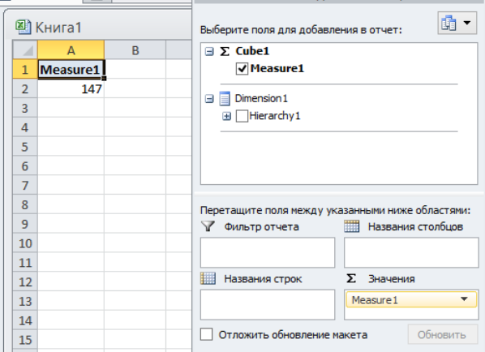
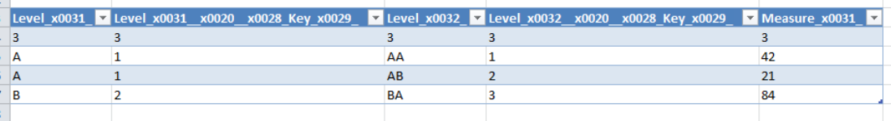

## Schema with single hierarchy
Simple schema with single hierarchy and two levels.

Schema have 3 tables:

Fact:

| DIM_KEY  |      VALUE    |
|----------|:-------------:|
|   1      |       42      |
|   2      |       21      |
|   3      |       84      |

Level1:

|   KEY    |     NAME      |
|----------|:-------------:|
|   1      |      A        |
|   2      |      B        |

Level2:

|   KEY    |     NAME   |   L1_KEY   |
|----------|:----------:|:----------:|
|   1      |      AA    |     1      |
|   2      |      AB    |     1      |
|   3      |      BA    |     2      |

Drill through example:

