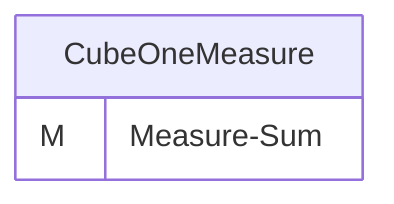
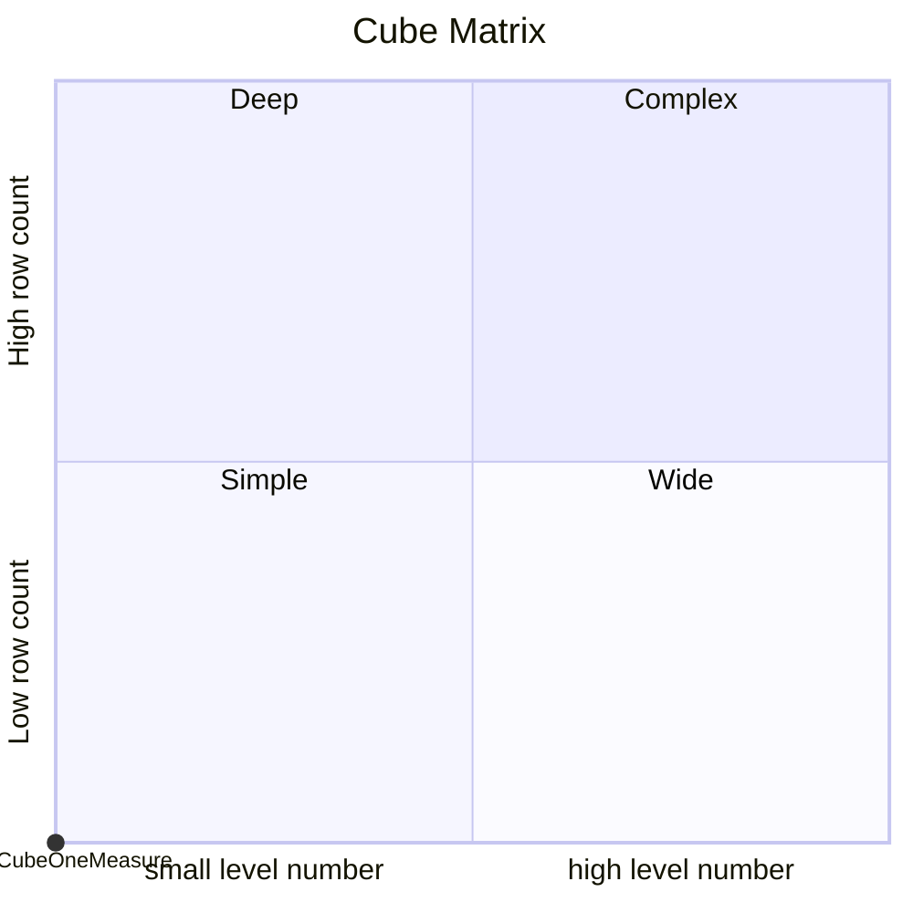
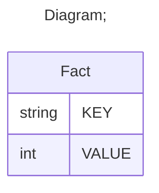

# Documentation
### CatalogName : tutorial_01-00_Cube
### Schema 01_Minimal_Cube_With_One_Measure : 

		
		A basic OLAP schema with a minimal cube
		
		Data cubes (<Cube>) are defined in an OLAP schema (<Schema>). Within the schema the name of each data cube must be unique. 
		This example schema contains one cube named "CubeOneMeasure".
		
		A cube is based on a fact table (<Table>) which refers to a database table containing one or more measurements to be aggregated (and optionally further columns defining factual dimensions). 
		In this case the database table representing the fact table is named "Fact" in the database, which is adressed in the name attribute within the <Table> tag.
		
		Each measurement of the cube is defined in a separate <Measure> element.
		The measurement in this example cube is named "Measure-Sum" (name attribute). It corresponds to the "VALUE" column (column attribute) in the database table "Fact" and is aggregated by summation (aggregator attribute).
		
  
---
### Cubes :

    CubeOneMeasure

---
#### Cube "CubeOneMeasure":

    

##### Table: "Fact"

### Cube "CubeOneMeasure" diagram:

---

---
### Cube Matrix for 01_Minimal_Cube_With_One_Measure:

---
### Database :
---

---
