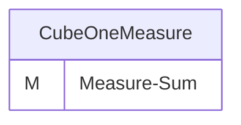
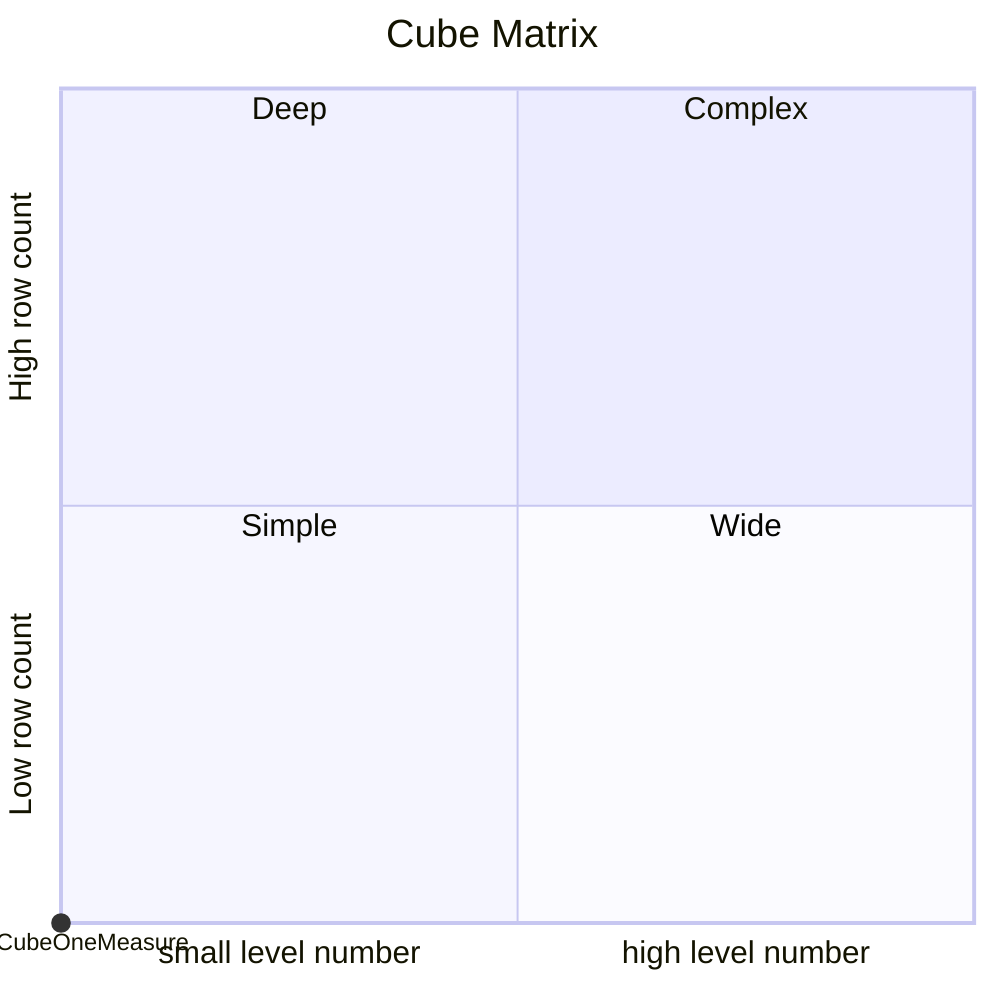

# Documentation
### CatalogName : tutorial_01-01_Cube_IncorrectDatabaseTableReference
## Olap Context Details:
## Schemas:
### Schema 01-01_Minimal_Cube_With_One_Measure_And_Incorrect_Table_Reference : 

	
    	This schema shows a minimal cube with an incorrect fact table reference.
		In this example the table "Fakt", which is referred to as the database fact table in the <Table> tag, does not exist in the database.
	
### Public Dimensions:

    

---
### Cubes :

    CubeOneMeasure

---
#### Cube "CubeOneMeasure":

    

##### Table: "Fakt"

##### Dimensions:
### Cube "CubeOneMeasure" diagram:

---

---
### Cube Matrix for 01-01_Minimal_Cube_With_One_Measure_And_Incorrect_Table_Reference:

---
## Validation result for schema 01-01_Minimal_Cube_With_One_Measure_And_Incorrect_Table_Reference
## ERROR : 
|Type|   |
|----|---|
|SCHEMA|Cube with name CubeOneMeasure must contain Dimensions|
|DATABASE|Cube with name CubeOneMeasure must contain measures|
|DATABASE|Fact table Fakt does not exist in database .|
