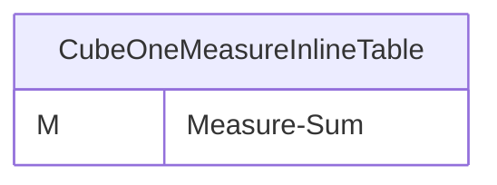
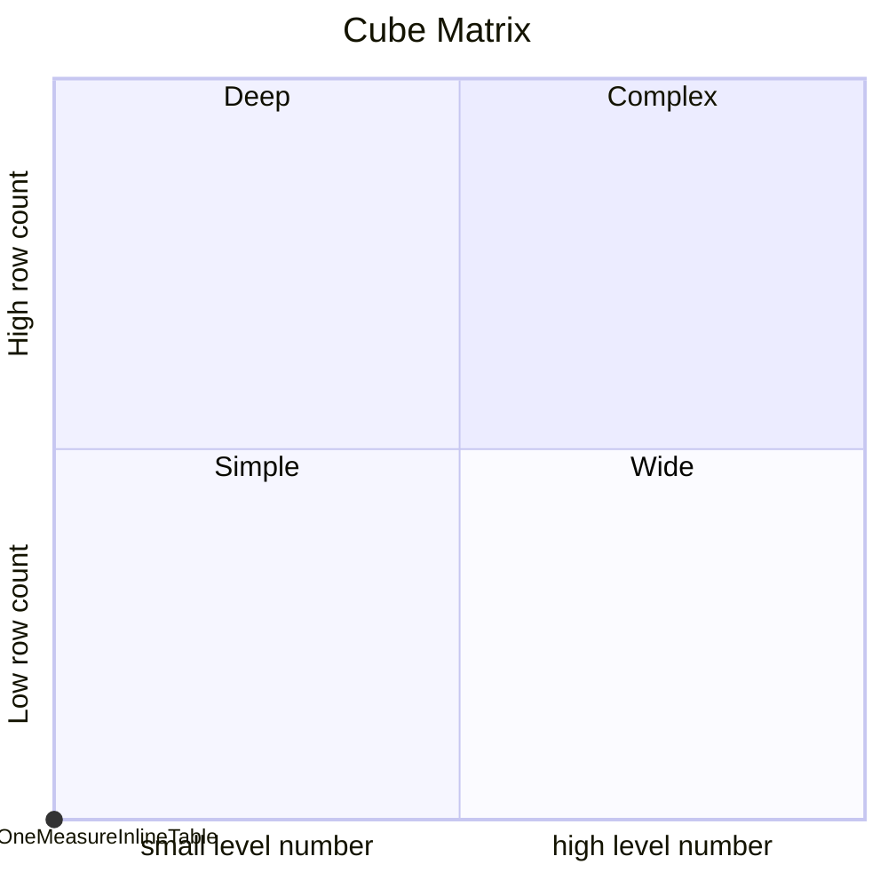

# Documentation
### CatalogName : tutorial_01-03_Cube_InlineTable
## Olap Context Details:
## Schemas:
### Schema Minimal_Cube_With_Inline_Tables : 

	
		A minimal cube based on an inline table
	
    	An inline table is a virtual table which is completely defined within the schema file instead of using an existing database table. Inline tables should only be used exceptionally.
		The <InlineTable> element consists of 2 main components:
		- the column definition (<ColumnDefs>) and
		- the table data held in the table rows (<Rows>).
		Within the <ColumnDefs> tag, every table column is represented by a <ColumnDef> element which defines the column name (name attribute) and  datatype (type attribute).
		Each row containing the data must be defined separately by a <Row> element within the <Rows> tag of the inline table. 
		For each table cell within a row, a separate <Value> element must be created which contains the column name in the name attribute and the value as the element's content. 
		
		In this example schema, an inline table named "Fact" is used as the fact table of the cube. Therefore, the <InlineTable> element is used instead of the <Table> element.
		It consists of the string column "KEY" and the numeric column "VALUE" (<ColumnDef> within <ColumnDefs>).
		The table has one row which holds the text "A" in the "KEY" column and the value 100.5 in the "VALUE" column (<Row> & <Value> within <Rows>)
		As the inline table is the only dataset the cube refers to, no external database is needed.	
	
### Public Dimensions:

    

---
### Cubes :

    CubeOneMeasureInlineTable

---
#### Cube "CubeOneMeasureInlineTable":

    

##### Table: ""

##### Dimensions:
### Cube "CubeOneMeasureInlineTable" diagram:

---

---
### Cube Matrix for Minimal_Cube_With_Inline_Tables:

---
## Validation result for schema Minimal_Cube_With_Inline_Tables
## ERROR : 
|Type|   |
|----|---|
|SCHEMA|Cube with name CubeOneMeasureInlineTable must contain Dimensions|
