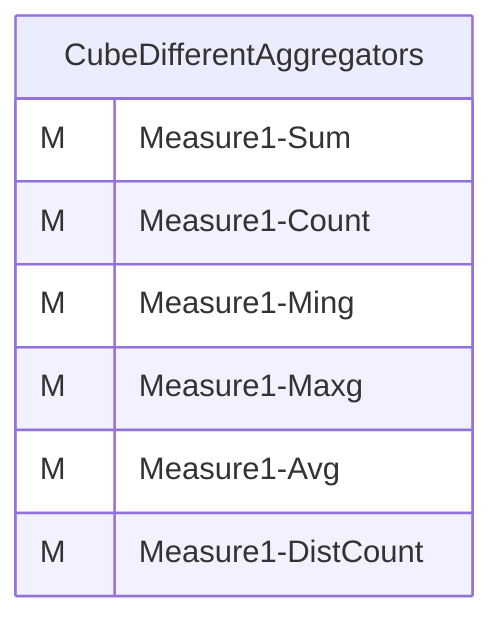
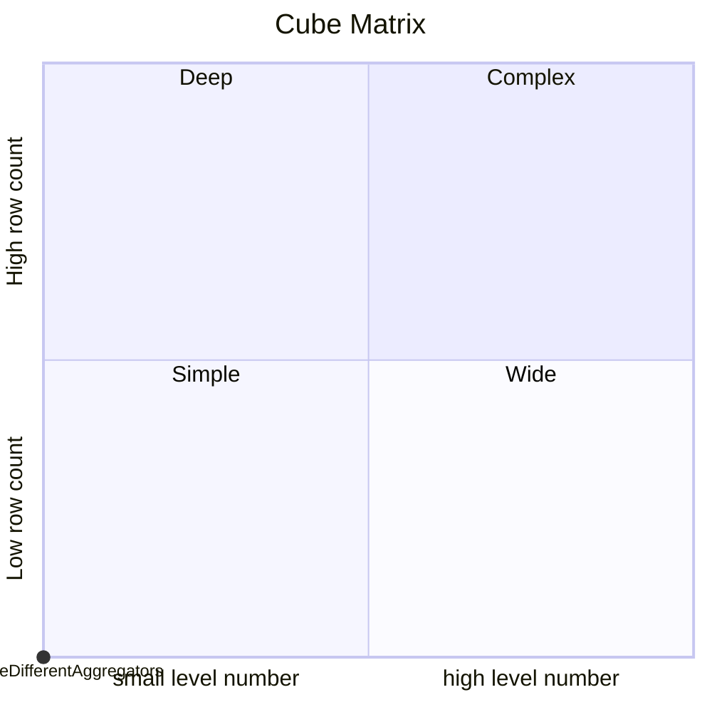
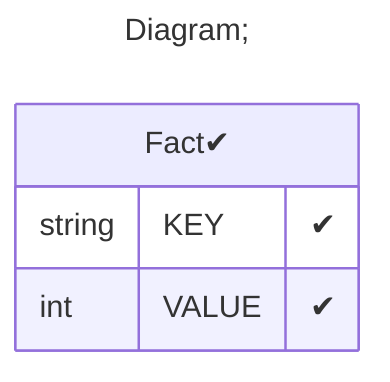

# Documentation
### CatalogName : tutorial_01-04-01_Cube_Measure_MeasuresWithDifferentAggregators
### Schema 01-03_Minimal_Cube_With_One_Measure_And_Different_Aggregators : 

		
		A minimal cube with one measurement column and different aggregators
		
		Measurement values in a data cube can be aggregated differently, depending on the chosen aggregation function in the aggregator attribute of the <Measure> tag. Available aggregators are:
		- sum: summation of numeric values
		- count: number of values
		- min: minimal value
		- max: maximal value
		- avg: average of numeric values
		- distinct-count: number of different values (without duplicate values)
		
		In this example cube every measure traces back to the "VALUE" column of the "Fact" database table, but uses another aggregator. 
		
  
---
### Cubes :

    CubeDifferentAggregators

---
#### Cube "CubeDifferentAggregators":

    

##### Table: "Fact"

### Cube "CubeDifferentAggregators" diagram:

---

---
### Cube Matrix for 01-03_Minimal_Cube_With_One_Measure_And_Different_Aggregators:

---
### Database :
---

---
