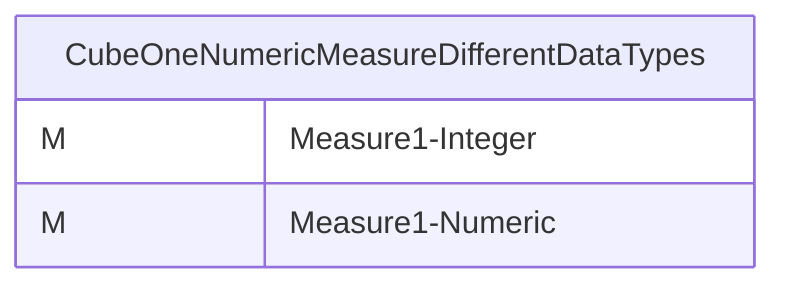
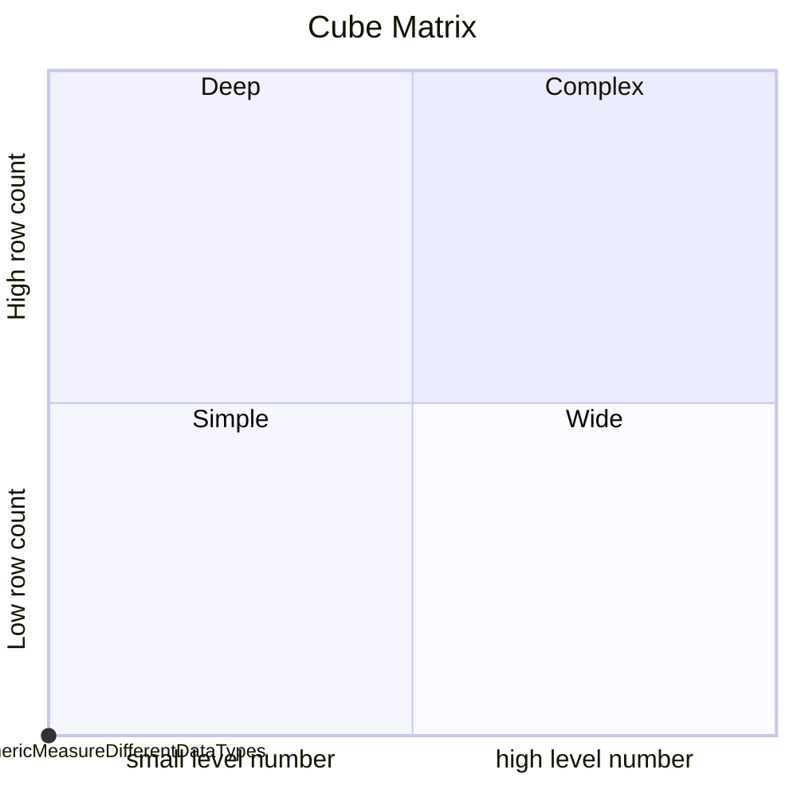
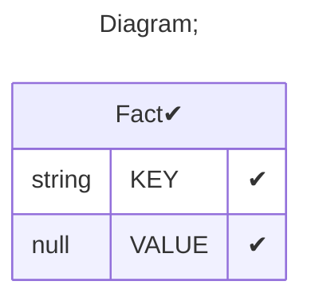

# Documentation
### CatalogName : tutorial_01-04-03_Cube_Measure_MeasureDatatypes
### Schema Minimal_Cube_With_Measures_Of_Different_Datatypes : 

		
		A minimal cube with measures of different datatypes

		The datatype of the measuse can be adapted by using the optional datatype attribute of the <Measure> element.
		- String
		- Numeric
		- Integer
		- Boolean
		- Date
		- Time
		- Timestamp
		If no datatype attribute is defined, the following default datatypes are used:
		- if the aggregator "count" or "distinct-count" is used: Integer
		- it another aggregator is used: Numeric

		In this example cube both measurements are generated from the "VALUE_NUMERIC" column of the "Fact" table, but one is provided with an Intger and the other one with a Numeric datatype.
		
  
---
### Cubes :

    CubeOneNumericMeasureDifferentDataTypes

---
#### Cube "CubeOneNumericMeasureDifferentDataTypes":

    

##### Table: "Fact"

### Cube "CubeOneNumericMeasureDifferentDataTypes" diagram:

---

---
### Cube Matrix for Minimal_Cube_With_Measures_Of_Different_Datatypes:

---
### Database :
---

---
