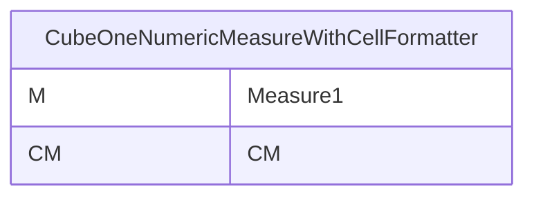
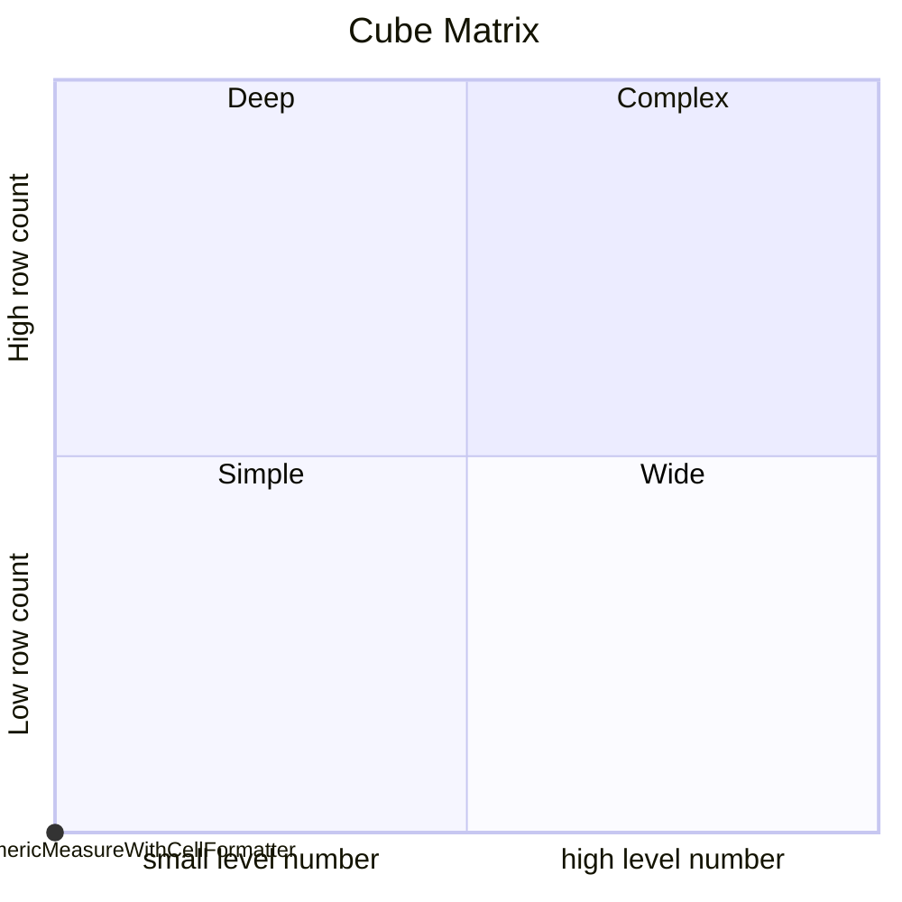
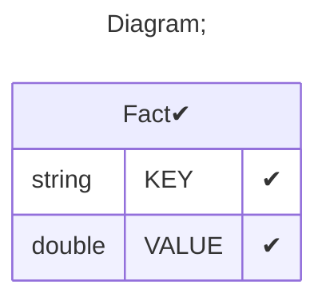

# Documentation
### CatalogName : tutorial_01-04-04-02_Cube_CalculatedMember_Wrong_CellFormatter
### Schema Minimal_Cube_With_CalculatedMember_CellFormatter : 

		
		A minimal cube with CellFormatter with class name in CalculatedMember

		
  
---
### Cubes :

    CubeOneNumericMeasureWithCellFormatter

---
#### Cube "CubeOneNumericMeasureWithCellFormatter":

    

##### Table: "Fact"

### Cube "CubeOneNumericMeasureWithCellFormatter" diagram:

---

---
### Cube Matrix for Minimal_Cube_With_CalculatedMember_CellFormatter:

---
### Database :
---

---
## Validation result for schema Minimal_Cube_With_CalculatedMember_CellFormatter
## ERROR : 
|Type|   |
|----|---|
|SCHEMA|Formatter: Class Name mondrian.rolap.format.CellFormatterWrong not found|
