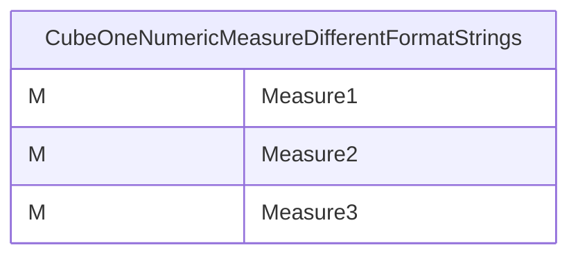
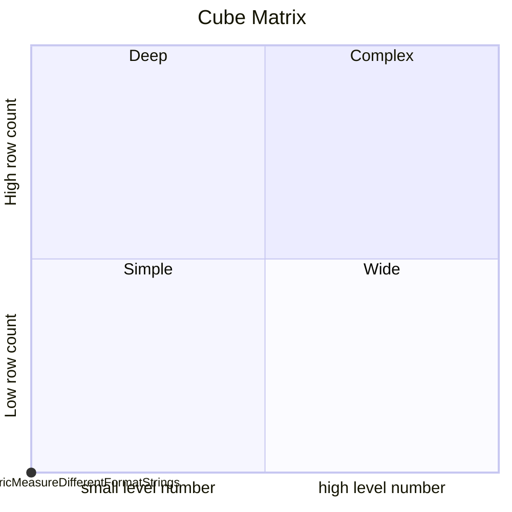

# Documentation
### CatalogName : tutorial_01-04-04_Cube_Measure_MeasureFormatStrings
## Olap Context Details:
## Schemas:
### Schema Minimal_Cube_With_Measures_Of_Different_Datatypes : 

		
		A minimal cube with two measures formatted by different format strings
		
		The displayed cell format of measures can be adapted by setting a formatString attribute. Further details see https://mondrian.pentaho.com/api/mondrian/util/Format.html. 
		
		In this sample cube the three measures derive from the same table column in the database, but have different expressions in the format String attribute.
		
  
### Public Dimensions:

    

---
### Cubes :

    CubeOneNumericMeasureDifferentFormatStrings

---
#### Cube "CubeOneNumericMeasureDifferentFormatStrings":

    

##### Table: "Fact"

##### Dimensions:
### Cube "CubeOneNumericMeasureDifferentFormatStrings" diagram:

---

---
### Cube Matrix for Minimal_Cube_With_Measures_Of_Different_Datatypes:

---
## Validation result for schema Minimal_Cube_With_Measures_Of_Different_Datatypes
## ERROR : 
|Type|   |
|----|---|
|SCHEMA|Cube with name CubeOneNumericMeasureDifferentFormatStrings must contain Dimensions|
|DATABASE|Cube with name CubeOneNumericMeasureDifferentFormatStrings must contain measures|
|DATABASE|Fact table Fact does not exist in database .|
