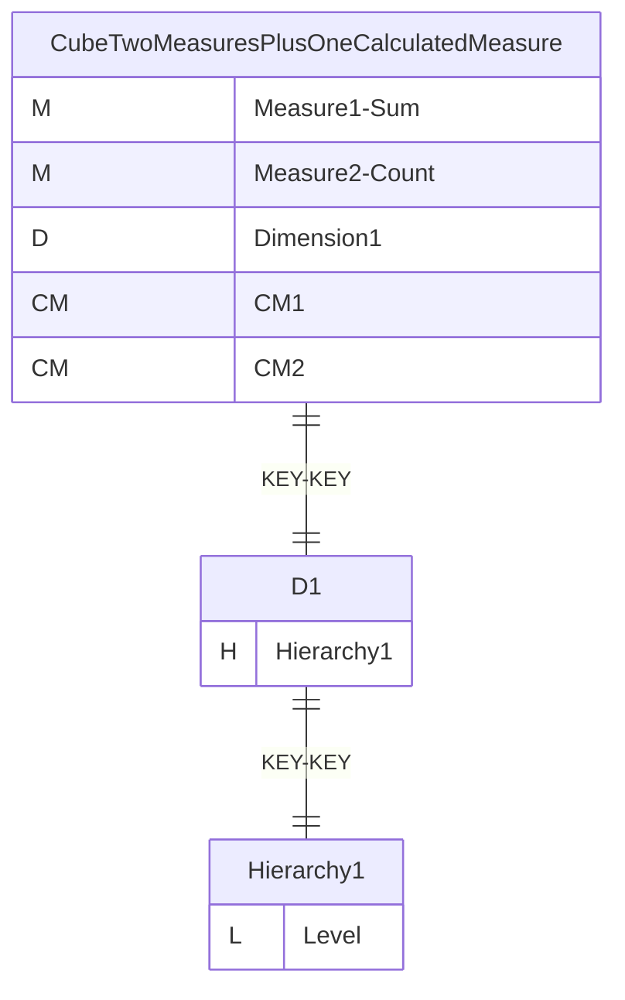
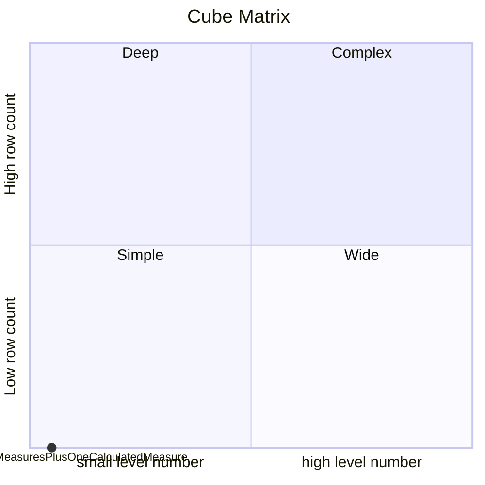
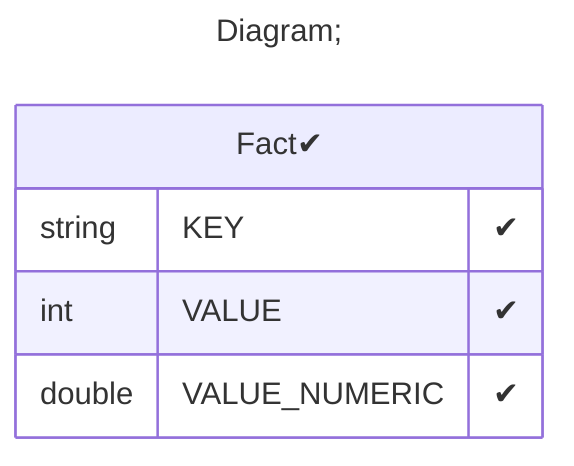

# Documentation
### CatalogName : tutorial_01-04-05_1_Cube_Measure_CalculatedMember
### Schema Minimal_Cubes_With_Two_Measures_Plus_One_Calculated_Measure : 

		
		A mininmal cube with a simple measure-based calculated member.

		
  
### Public Dimensions:

    D1

##### Dimension "D1":

Hierarchies:

    Hierarchy1

##### Hierarchy Hierarchy1:

Tables: "Fact"

Levels: "Level"

###### Level "Level" :

    column(s): KEY

---
### Cubes :

    CubeTwoMeasuresPlusOneCalculatedMeasure

---
#### Cube "CubeTwoMeasuresPlusOneCalculatedMeasure":

    

##### Table: "Fact"

##### Dimensions:
##### Dimension: "Dimension1 -> D1":

### Cube "CubeTwoMeasuresPlusOneCalculatedMeasure" diagram:

---

---
### Cube Matrix for Minimal_Cubes_With_Two_Measures_Plus_One_Calculated_Measure:

---
### Database :
---

---
