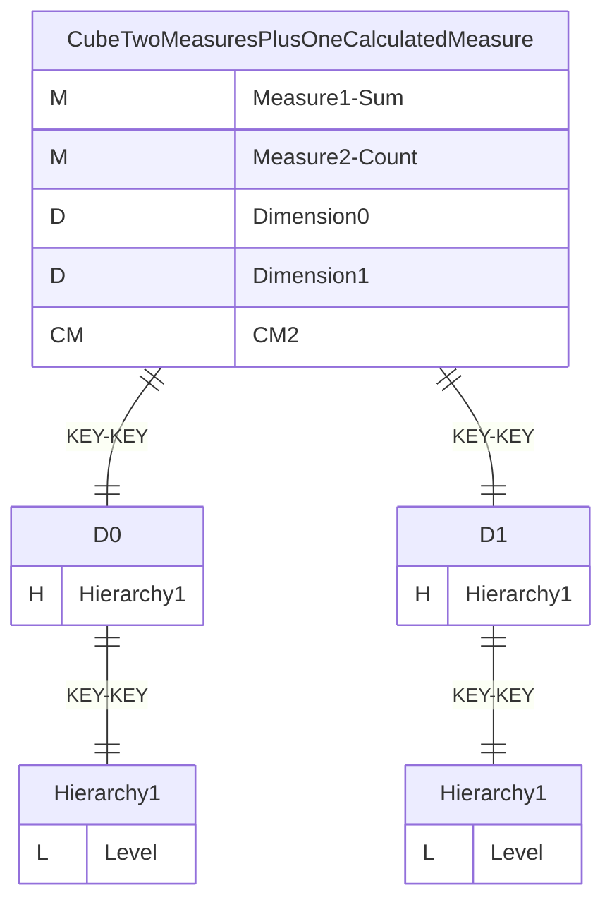
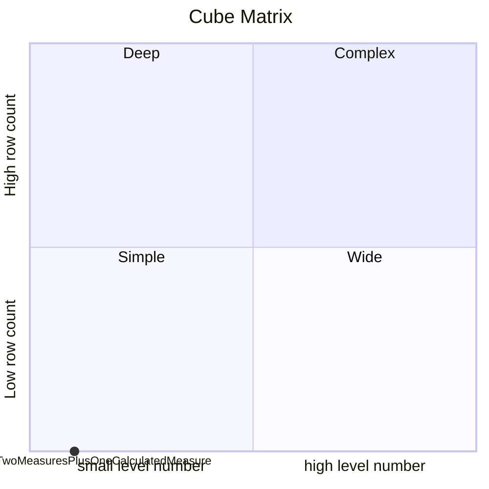
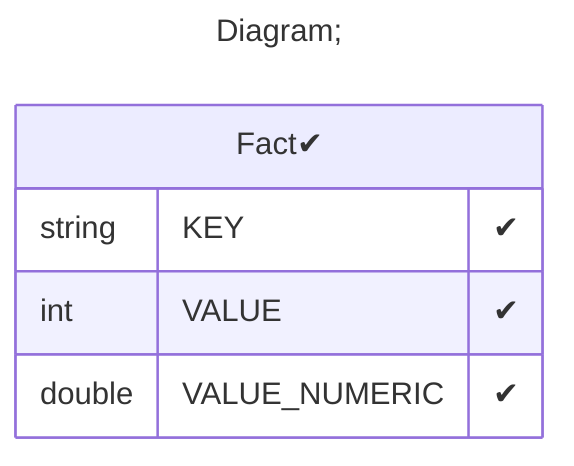

# Documentation
### CatalogName : tutorial_01-04-05_2_Cube_WithSeveralDimensionsWithSameHierarchyName_CalculatedMember
### Schema Minimal_Cubes_With_Two_Dimension_With_Same_Hierarchy_Name_Plus_One_Calculated_Member : 

		
		A minimal cube with two dimension with same hierarchy name plus one calculated member.
		Calculated member should use hierarchy from Dimension1

		
  
### Public Dimensions:

    D0, D1

##### Dimension "D0":

Hierarchies:

    Hierarchy1

##### Hierarchy Hierarchy1:

Tables: "Fact"

Levels: "Level"

###### Level "Level" :

    column(s): KEY

##### Dimension "D1":

Hierarchies:

    Hierarchy1

##### Hierarchy Hierarchy1:

Tables: "Fact"

Levels: "Level"

###### Level "Level" :

    column(s): KEY

---
### Cubes :

    CubeTwoMeasuresPlusOneCalculatedMeasure

---
#### Cube "CubeTwoMeasuresPlusOneCalculatedMeasure":

    

##### Table: "Fact"

##### Dimensions:
##### Dimension: "Dimension0 -> D0":

##### Dimension: "Dimension1 -> D1":

### Cube "CubeTwoMeasuresPlusOneCalculatedMeasure" diagram:

---

---
### Cube Matrix for Minimal_Cubes_With_Two_Dimension_With_Same_Hierarchy_Name_Plus_One_Calculated_Member:

---
### Database :
---

---
## Validation result for schema Minimal_Cubes_With_Two_Dimension_With_Same_Hierarchy_Name_Plus_One_Calculated_Member
## ERROR : 
|Type|   |
|----|---|
|SCHEMA|Dimension must be set for CalculatedMember with name CM2|
## WARNING : 
|Type|   |
|----|---|
|DATABASE|Table: Schema must be set|
