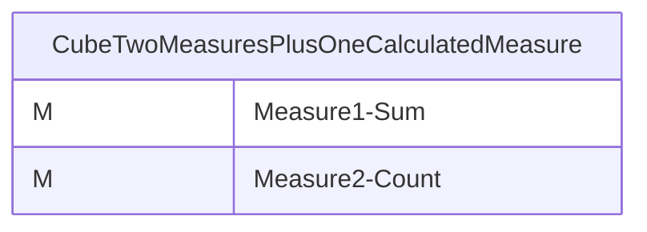
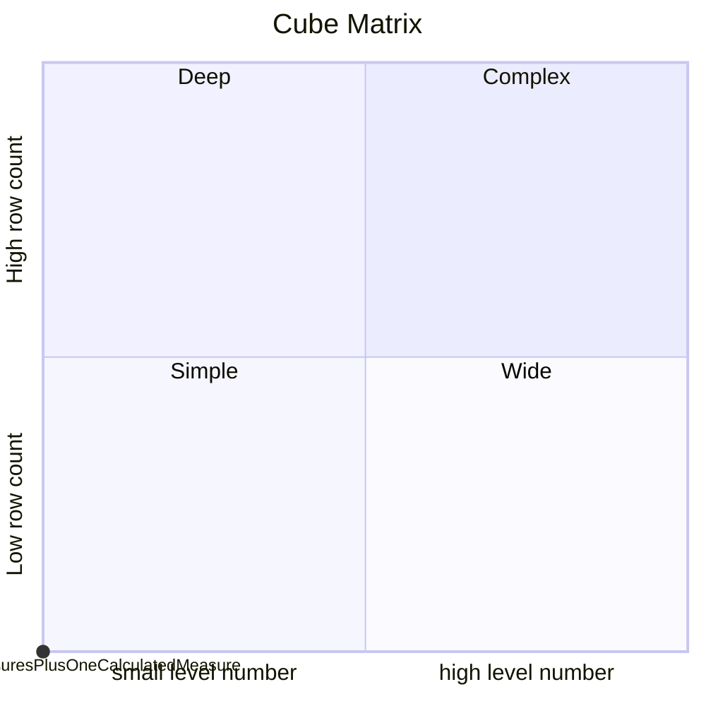
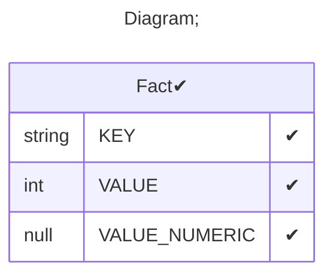

# Documentation
### CatalogName : tutorial_01-04-06_Cube_Measure_CalculatedMember_without_name_Error
### Schema Minimal_Cubes_With_Two_Measures_Plus_One_Calculated_Measure : 

		
		A mininmal cube with a simple measure-based calculated member without name.

		
  
---
### Cubes :

    CubeTwoMeasuresPlusOneCalculatedMeasure

---
#### Cube "CubeTwoMeasuresPlusOneCalculatedMeasure":

    

##### Table: "Fact"

### Cube "CubeTwoMeasuresPlusOneCalculatedMeasure" diagram:

---

---
### Cube Matrix for Minimal_Cubes_With_Two_Measures_Plus_One_Calculated_Measure:

---
### Database :
---

---
## Validation result for schema Minimal_Cubes_With_Two_Measures_Plus_One_Calculated_Measure
## ERROR : 
|Type|   |
|----|---|
|SCHEMA|Dimension must be set for CalculatedMember with name Measure3-Calculated|
|SCHEMA|CalculatedMember name must be set|
