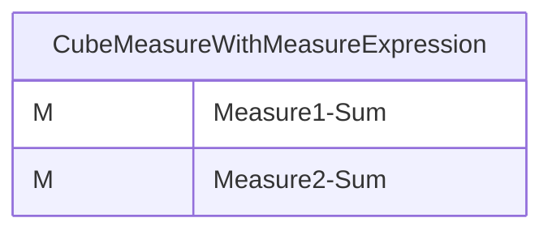
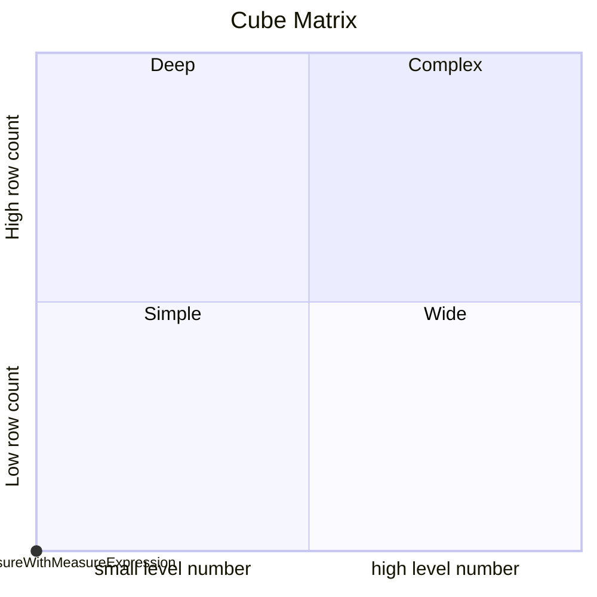
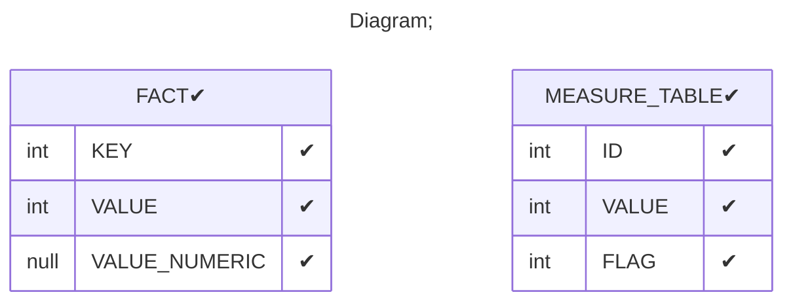

# Documentation
### CatalogName : tutorial_01-04-07_Cube_Measure_MeasureExpression
### Schema Minimal_Cubes_With_MeasureExpression : 

		
		A mininmal cube with a simple measure with MeasureExpression.

		
  
---
### Cubes :

    CubeMeasureWithMeasureExpression

---
#### Cube "CubeMeasureWithMeasureExpression":

    

##### Table: "FACT"

### Cube "CubeMeasureWithMeasureExpression" diagram:

---

---
### Cube Matrix for Minimal_Cubes_With_MeasureExpression:

---
### Database :
---

---
## Validation result for schema Minimal_Cubes_With_MeasureExpression
## ERROR : 
|Type|   |
|----|---|
|DATABASE|Syntax error in SQL statement "([*]CASE WHEN ""FACT"".""VALUE"" > 21 THEN 50 ELSE ""FACT"".""VALUE"" END)"; expected "(, SELECT, TABLE, VALUES"; SQL statement:(CASE WHEN "FACT"."VALUE" > 21 THEN 50 ELSE "FACT"."VALUE" END) [42001-224]|
