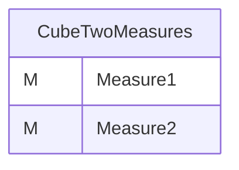
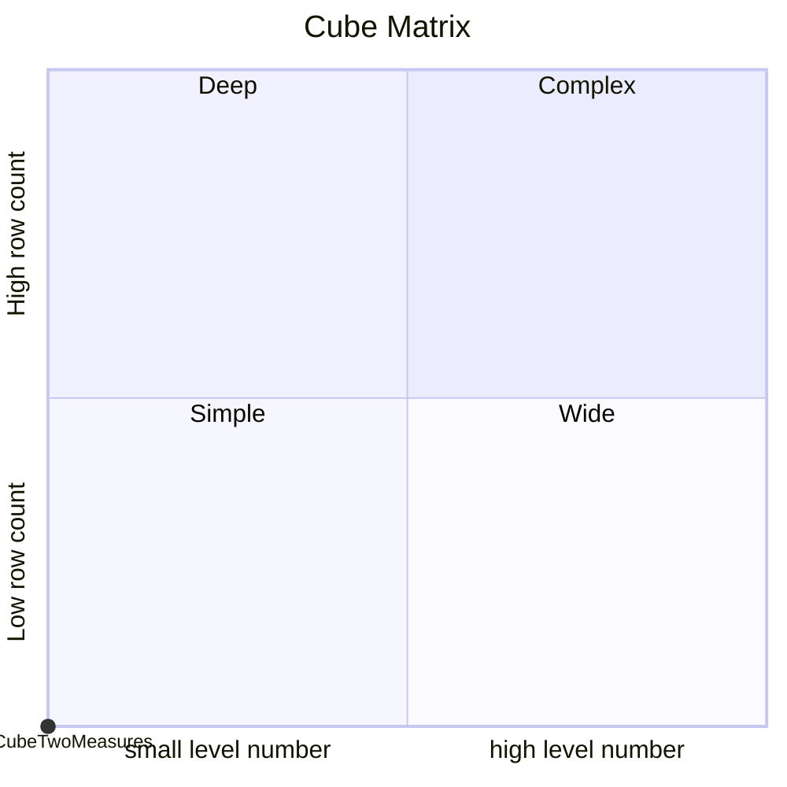
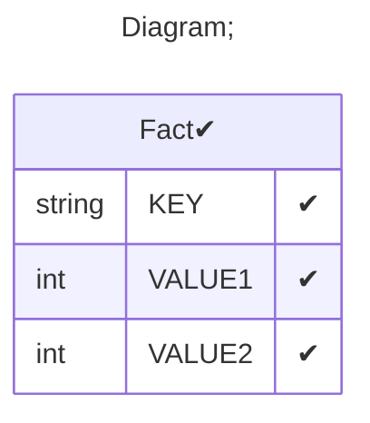

# Documentation
### CatalogName : tutorial_01-04_01_Cube_Measure_MultipleMeasures_defaultMeasure
### Schema Minimal_Cubes_With_Measures_with_defaultMeasure : 

		
		A minimal cube with two measures from different table columns with defaultMeasure
		Specifying defaultMeasure in <Cube> element allows users to explicitly specify any base measure as a default Measure.

		A data cube can contain multiple measures and they can be taken from different columns of the database fact table.
		Each measure must be defined by a separate <Measure> tag, in which the column attribute is used to assign the database table colum that holds the measure's data.
		All measures of the cube belong to a default cube dimension called "Measures", which can be adressed within the schema (e.g while adding a calculated measure).

		This sample cube contains the two measures "Measure 1", which traces back to the table column "VALUE1", and Measure2", which is derived from the table column "VALUE2".
		
  
---
### Cubes :

    CubeTwoMeasures

---
#### Cube "CubeTwoMeasures":

    

##### Table: "Fact"

### Cube "CubeTwoMeasures" diagram:

---

---
### Cube Matrix for Minimal_Cubes_With_Measures_with_defaultMeasure:

---
### Database :
---

---
