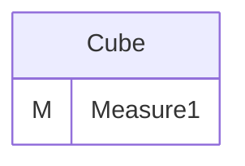
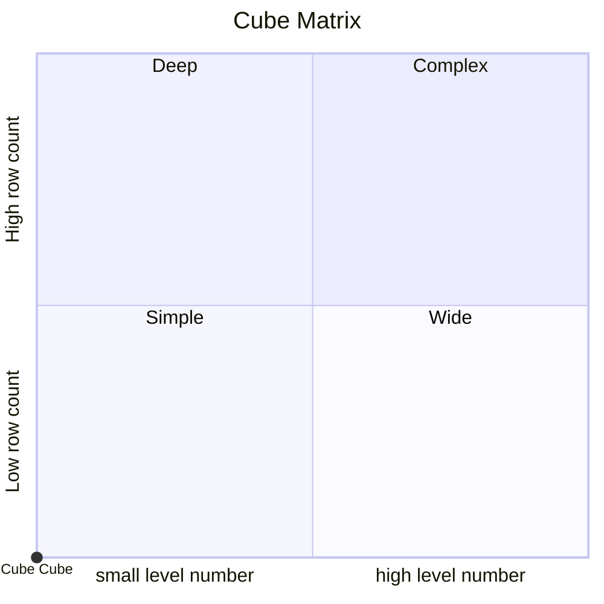
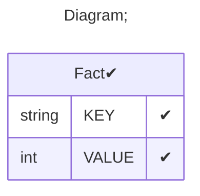

# Documentation
### CatalogName : tutorial_01-06_Cube_with_Absent_Fact_Table_Error
### Schema Minimal_Cubes_With_No_Fact_Reference : 

		
		A minimal cube with absent Fact reference.
		
  
---
### Cubes :

    Cube

---
#### Cube "Cube":

    

##### Table: ""

### Cube "Cube" diagram:

---

---
### Cube Matrix for Minimal_Cubes_With_No_Fact_Reference:

---
### Database :
---

---
## Validation result for schema Minimal_Cubes_With_No_Fact_Reference
## ERROR : 
|Type|   |
|----|---|
|SCHEMA|Fact name must be set for cube with name Cube|
