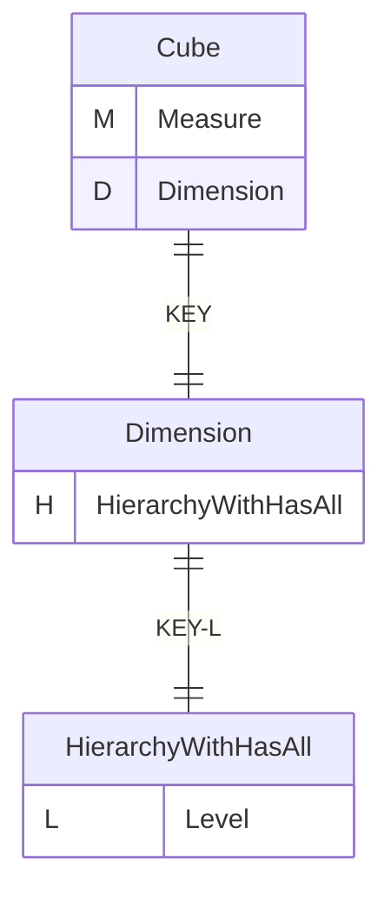
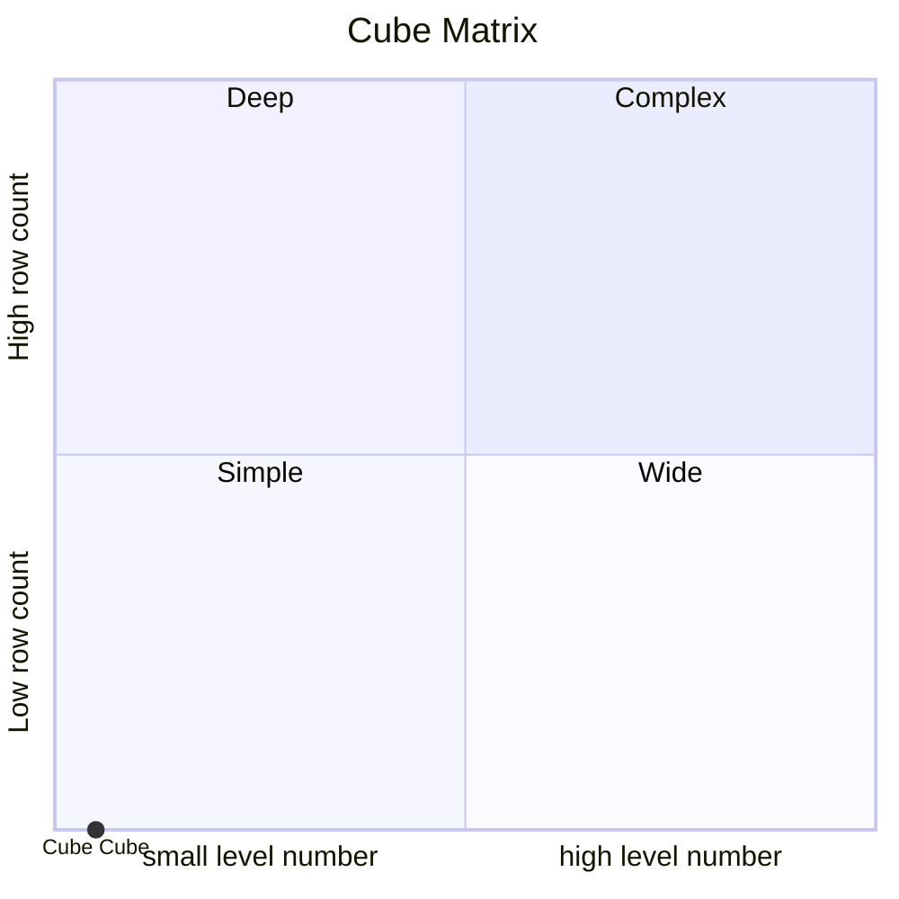
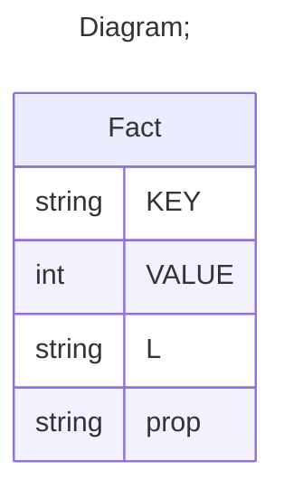

# Documentation
### CatalogName : tutorial_01-08_1_Cube_with_cub_dimension_with_level_with_property
### Schema Minimal_Cube_with_cube_dimension_level : 
---
### Cubes :

    Cube

---
#### Cube "Cube":

    

##### Table: "Fact"

##### Dimensions:
##### Dimension "Dimension":

Hierarchies:

    HierarchyWithHasAll

##### Hierarchy HierarchyWithHasAll:

Tables: "Fact"

Levels: "Level"

###### Level "Level" :

    column(s): L

### Cube "Cube" diagram:

---

---
### Cube Matrix for Minimal_Cube_with_cube_dimension_level:

---
### Database :
---

---
## Validation result for schema Minimal_Cube_with_cube_dimension_level
## WARNING : 
|Type|   |
|----|---|
|DATABASE|Table: Schema must be set|
