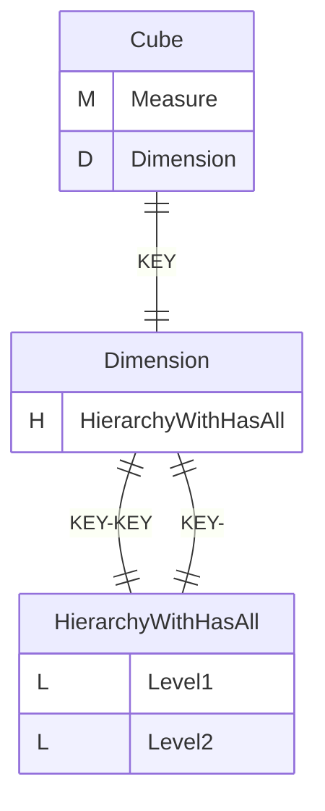
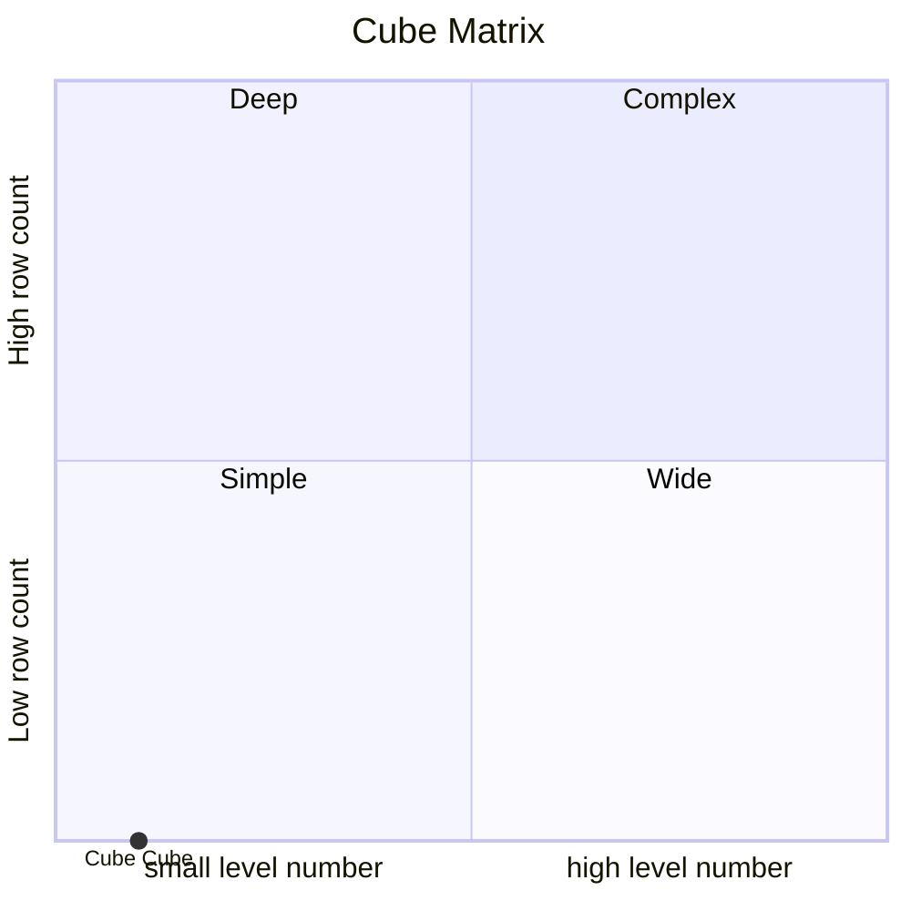
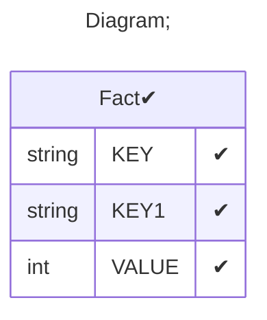

# Documentation
### CatalogName : tutorial_01-08_5_Cube_with_cub_dimension_with_level_expressions
### Schema Minimal_Cube_with_cube_dimension_level_with_expressions : 

    
		A basic OLAP schema with a level with expressions

		Data cubes (<Cube>) are defined in an OLAP schema (<Schema>). Within the schema the name of each data cube must be unique.
		This example schema contains one cube named "Cube".

		A cube is based on a fact table (<Table>) which refers to a database table containing one or more measurements to be aggregated (and optionally further columns defining factual dimensions).
		In this case the database table representing the fact table is named "Fact" in the database, which is adressed in the name attribute within the <Table> tag.

		Each measurement of the cube is defined in a separate <Measure> element.
		The measurement in this example cube is named "Measure" (name attribute). It corresponds to the "VALUE" column (column attribute) in the database table "Fact" and is aggregated by summation (aggregator attribute).
		Level is defined in <Level> element.
		Property is defined in <Property> element inside <Level> element. Property we can see in cell tooltip in excel

		
  
---
### Cubes :

    Cube

---
#### Cube "Cube":

    

##### Table: "Fact"

##### Dimensions:
##### Dimension "Dimension":

Hierarchies:

    HierarchyWithHasAll

##### Hierarchy HierarchyWithHasAll:

Tables: "Fact"

Levels: "Level1, Level2"

###### Level "Level1" :

    column(s): KEY

###### Level "Level2" :

    column(s): null

### Cube "Cube" diagram:

---

---
### Cube Matrix for Minimal_Cube_with_cube_dimension_level_with_expressions:

---
### Database :
---

---
## Validation result for schema Minimal_Cube_with_cube_dimension_level_with_expressions
## ERROR : 
|Type|   |
|----|---|
|SCHEMA|Level: Column must be set for hierarchy with name HierarchyWithHasAll|
|DATABASE|Syntax error in SQL statement "[*]""KEY"" || '___' || ""KEY1"""; SQL statement:"KEY" || '___' || "KEY1" [42000-224]|
|DATABASE|Syntax error in SQL statement "[*]""KEY1"" || ' ' || ""KEY"""; SQL statement:"KEY1" || ' ' || "KEY" [42000-224]|
|DATABASE|Syntax error in SQL statement "[*]""KEY1"" || '___' || ""KEY"""; SQL statement:"KEY1" || '___' || "KEY" [42000-224]|
|DATABASE|Syntax error in SQL statement "[*]""KEY"" || ' ' || ""KEY1"""; SQL statement:"KEY" || ' ' || "KEY1" [42000-224]|
## WARNING : 
|Type|   |
|----|---|
|DATABASE|Table: Schema must be set|
