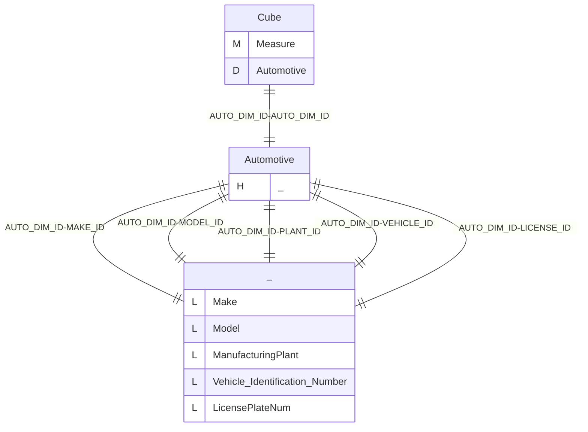
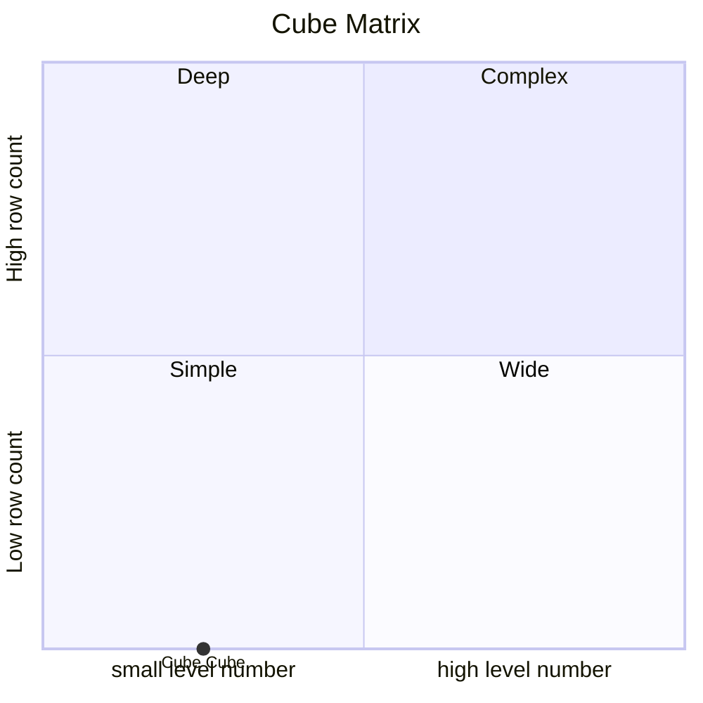
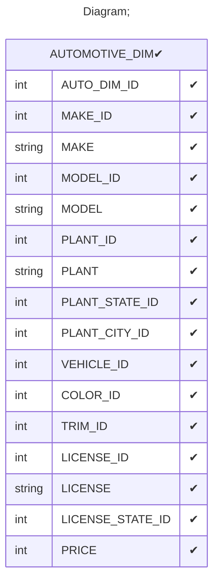

# Documentation
### CatalogName : tutorial_01-08_6_Cube_with_cub_dimension_with_functional_dependency_optimizations
### Schema Minimal_Cube_with_cube_dimension_with_functional_dependency_optimizations : 

    
		A basic OLAP schema with a level with with functional dependency optimizations

		In some circumstances, it may be possible to optimize performance by taking advantage of known
		functional dependencies in the data being processed. Such dependencies are typically the result
		of business rules associated with the systems producing the data, and often cannot be inferred
		just by looking at the data itself.
    Functional dependencies are declared to Mondrian using the dependsOnLevelValue attribute of the
    <Property> element and the uniqueKeyLevelName attribute of the <Hierarchy> element.
    The dependsOnLevelValue attribute of a member property is used to indicate that the value of the
    member property is functionally dependent on the value of the <Level> in which the member property
    is defined. In other words, for a given value of the level, the value of the property is invariant.
    The uniqueKeyLevelName attribute of a <Hierarchy> is used to indicate that the given level
    (if any) taken together with all higher levels in the hierarchy acts as a unique alternate key,
    ensuring that for any unique combination of those level values, there is exactly one combination
    of values for all levels below it.

		
  
---
### Cubes :

    Cube

---
#### Cube "Cube":

    

##### Table: "AUTOMOTIVE_DIM"

##### Dimensions:
##### Dimension "Automotive":

Hierarchies:

    Hierarchy0

##### Hierarchy Hierarchy0:

Tables: "AUTOMOTIVE_DIM"

Levels: "Make, Model, ManufacturingPlant, Vehicle Identification Number, LicensePlateNum"

###### Level "Make" :

    column(s): MAKE_ID

###### Level "Model" :

    column(s): MODEL_ID

###### Level "ManufacturingPlant" :

    column(s): PLANT_ID

###### Level "Vehicle Identification Number" :

    column(s): VEHICLE_ID

###### Level "LicensePlateNum" :

    column(s): LICENSE_ID

### Cube "Cube" diagram:

---

---
### Cube Matrix for Minimal_Cube_with_cube_dimension_with_functional_dependency_optimizations:

---
### Database :
---

---
## Validation result for schema Minimal_Cube_with_cube_dimension_with_functional_dependency_optimizations
## WARNING : 
|Type|   |
|----|---|
|DATABASE|Table: Schema must be set|
