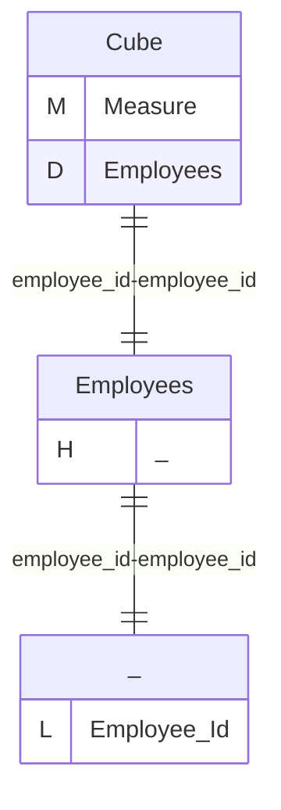
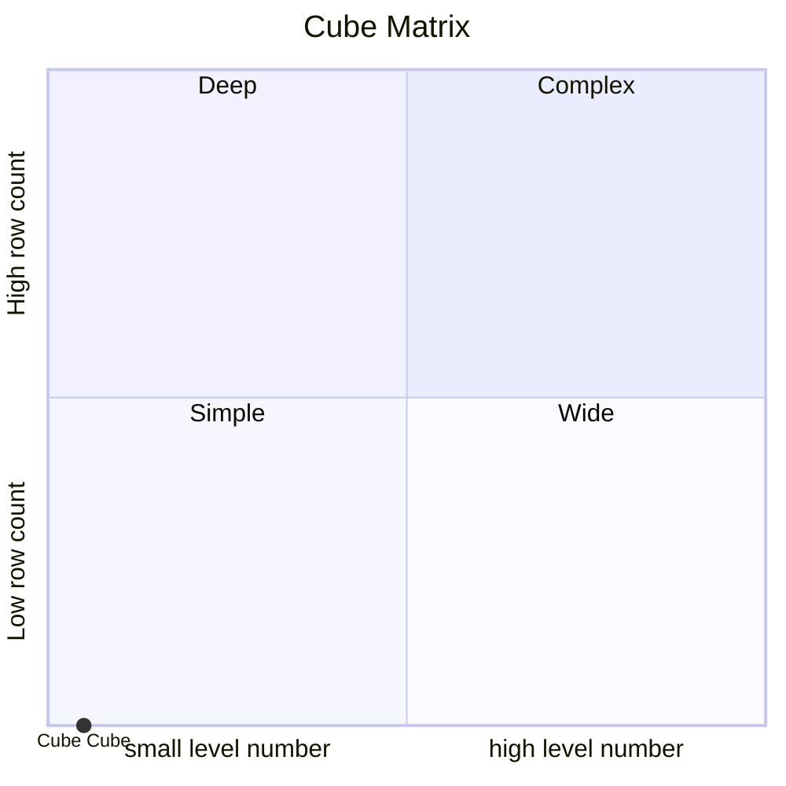
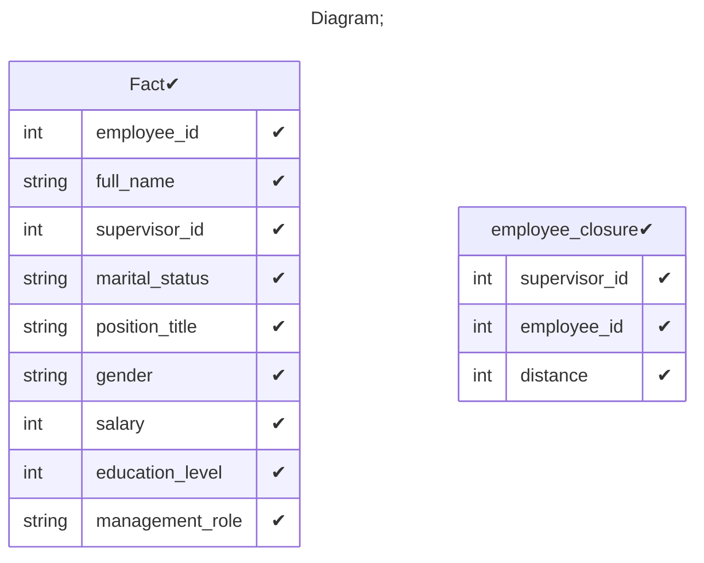

# Documentation
### CatalogName : tutorial_01-08_7_Cube_with_cub_dimension_with_level_with_closure_table
### Schema Minimal_Cube_with_cube_dimension_level_with_closure_table : 

    
		A basic OLAP schema with a level

		Data cubes (<Cube>) are defined in an OLAP schema (<Schema>). Within the schema the name of each data cube must be unique.
		This example schema contains one cube named "Cube".

    A closure table is a SQL table which contains a record for every employee/supervisor relationship,
    regardless of depth. (In mathematical terms, this is called the 'reflexive transitive closure'
    of the employee/supervisor relationship.
    The distance column is not strictly required, but it makes it easier to populate the table.)

		
  
---
### Cubes :

    Cube

---
#### Cube "Cube":

    

##### Table: "Fact"

##### Dimensions:
##### Dimension "Employees":

Hierarchies:

    Hierarchy0

##### Hierarchy Hierarchy0:

Tables: "Fact"

Levels: "Employee Id"

###### Level "Employee Id" :

    column(s): employee_id

### Cube "Cube" diagram:

---

---
### Cube Matrix for Minimal_Cube_with_cube_dimension_level_with_closure_table:

---
### Database :
---

---
## Validation result for schema Minimal_Cube_with_cube_dimension_level_with_closure_table
## WARNING : 
|Type|   |
|----|---|
|DATABASE|Table: Schema must be set|
