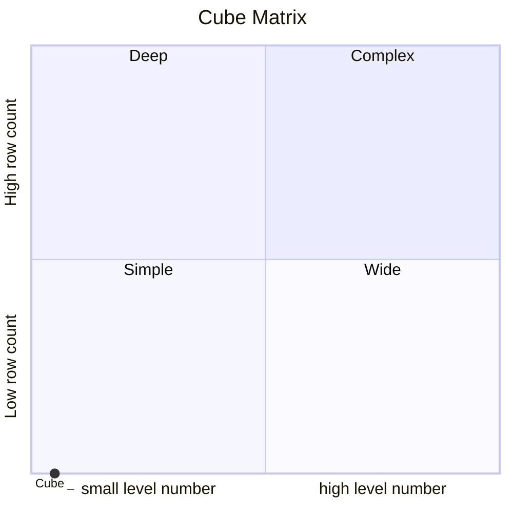
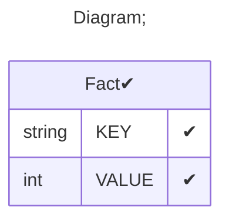

# Documentation
### CatalogName : tutorial_01-09_Cube_with_cub_without_name_Error
### Schema Minimal_Cube_with_cub_without_name : 
---
### Cubes :

    null

---
#### Cube "":

    

##### Table: "Fact"

##### Dimensions:
##### Dimension "Dimension":

Hierarchies:

    HierarchyWithHasAll

##### Hierarchy HierarchyWithHasAll:

Tables: "Fact"

Levels: "Level"

###### Level "Level" :

    column(s): KEY

### Cube Matrix for Minimal_Cube_with_cub_without_name:

---
### Database :
---

---
## Validation result for schema Minimal_Cube_with_cub_without_name
## ERROR : 
|Type|   |
|----|---|
|SCHEMA|Cube name must be set|
## WARNING : 
|Type|   |
|----|---|
|DATABASE|Table: Schema must be set|
