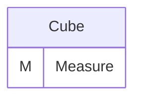
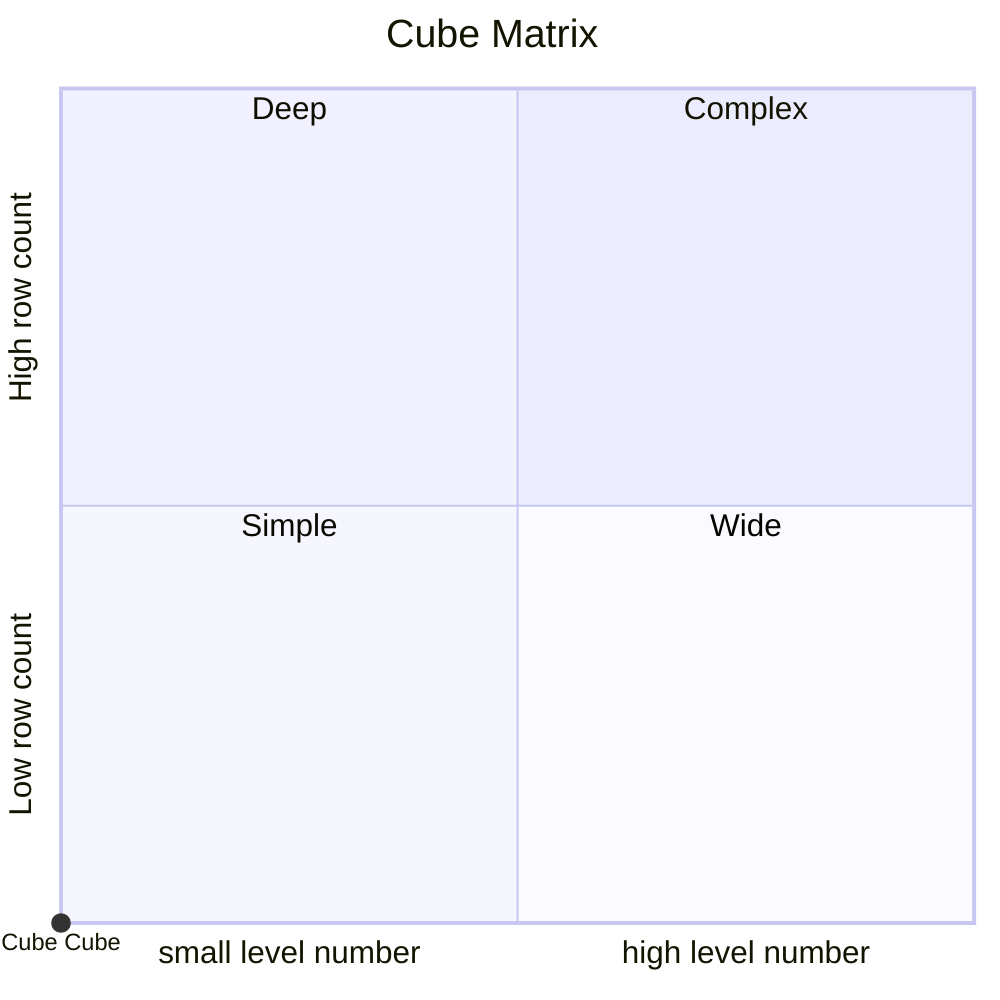
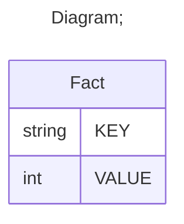

# Documentation
### CatalogName : tutorial_01-10_Cube_with_cub_with_share_dimension_without_name_Error
### Schema Minimal_Cube_with_cub_with_share_dimension_without_name : 
### Public Dimensions:

    null

##### Dimension "null":

Hierarchies:

    HierarchyWithHasAll

##### Hierarchy HierarchyWithHasAll:

Tables: "Fact"

Levels: "Level"

###### Level "Level" :

    column(s): KEY

---
### Cubes :

    Cube

---
#### Cube "Cube":

    

##### Table: "Fact"

### Cube "Cube" diagram:

---

---
### Cube Matrix for Minimal_Cube_with_cub_with_share_dimension_without_name:

---
### Database :
---

---
## Validation result for schema Minimal_Cube_with_cub_with_share_dimension_without_name
## ERROR : 
|Type|   |
|----|---|
|SCHEMA|Schema Dimension name must be set|
## WARNING : 
|Type|   |
|----|---|
|DATABASE|Table: Schema must be set|
