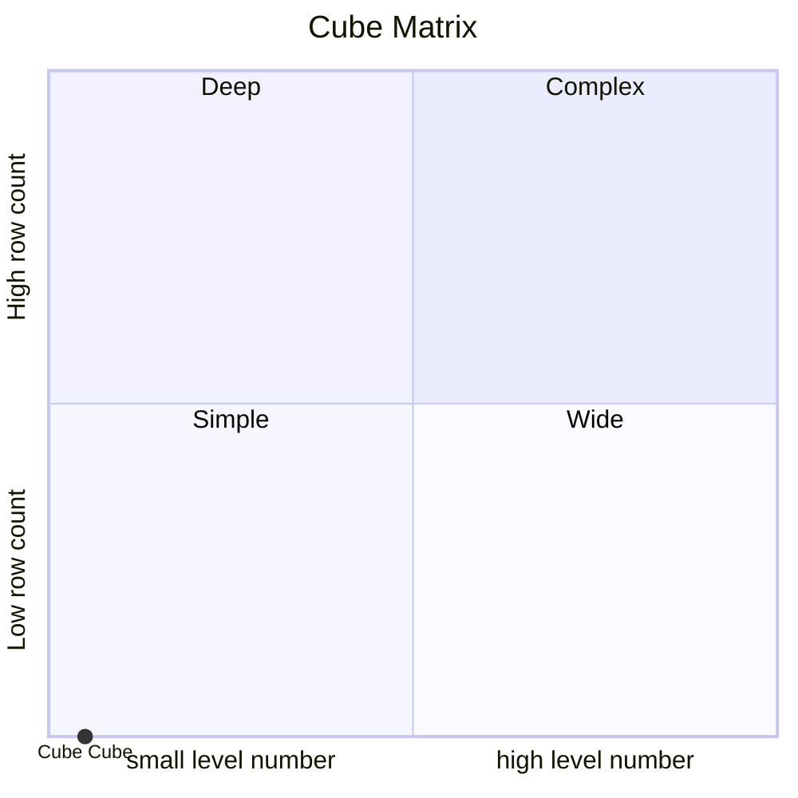
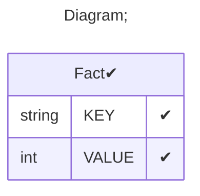

# Documentation
### CatalogName : tutorial_01-11_Cube_with_cub_with_dimension_without_name_Error
### Schema Cube_with_cub_with_dimension_without_name : 
---
### Cubes :

    Cube

---
#### Cube "Cube":

    

##### Table: "Fact"

##### Dimensions:
##### Dimension "":

Hierarchies:

    HierarchyWithHasAll

##### Hierarchy HierarchyWithHasAll:

Tables: "Fact"

Levels: "Level"

###### Level "Level" :

    column(s): KEY

### Cube "Cube" diagram:

---

```mermaid
%%{init: {
"theme": "default",
"themeCSS": [
    ".er.entityBox {stroke: black;}",
    ".er.attributeBoxEven {stroke: black;}",
    ".er.attributeBoxOdd {stroke: black;}",
    "[id^=entity-c] .er.entityBox { fill: lightgreen;} ",
    "[id^=entity-d] .er.entityBox { fill: powderblue;} ",
    "[id^=entity-h] .er.entityBox { fill: pink;} "
]
}}%%
erDiagram
c0["Cube"]{
M Measure ""
D _ ""
}
d00[""] {
H HierarchyWithHasAll ""
}
h000["HierarchyWithHasAll"] {
L Level ""
}
"c0" ||--|| "d00" : "KEY"
"d00" ||--|| "h000" : "KEY-KEY"
```
---
### Cube Matrix for Cube_with_cub_with_dimension_without_name:

---
### Database :
---

---
## Validation result for schema Cube_with_cub_with_dimension_without_name
## <span style='color: red;'>ERROR</span> : 
|Type|   |
|----|---|
|SCHEMA|Cube Dimension name must be set for element with name Cube|
## <span style='color: blue;'>WARNING</span> : 
|Type|   |
|----|---|
|DATABASE|Table: Schema must be set|
