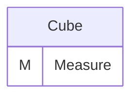
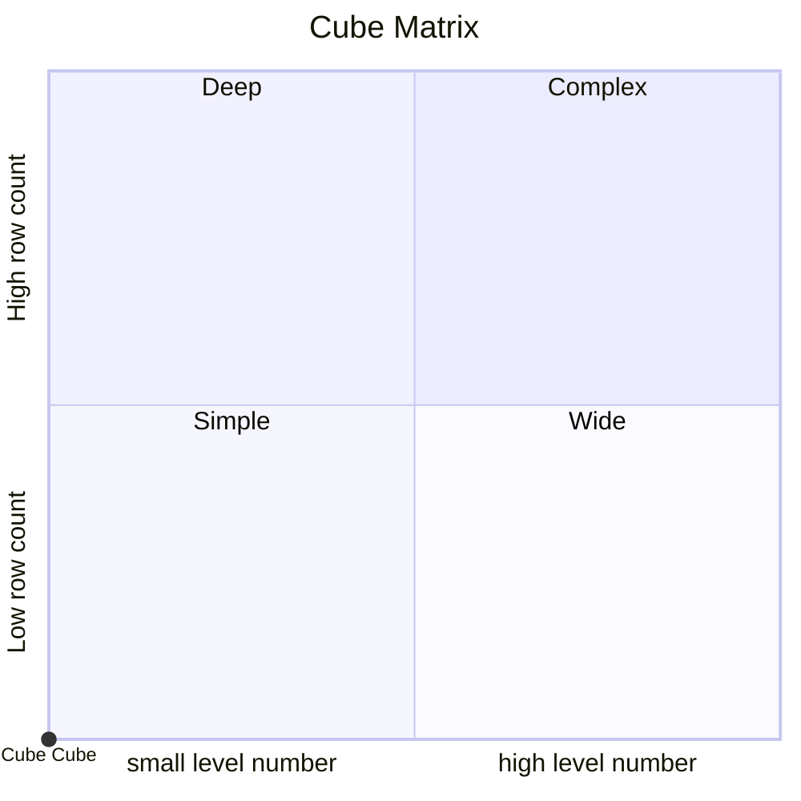
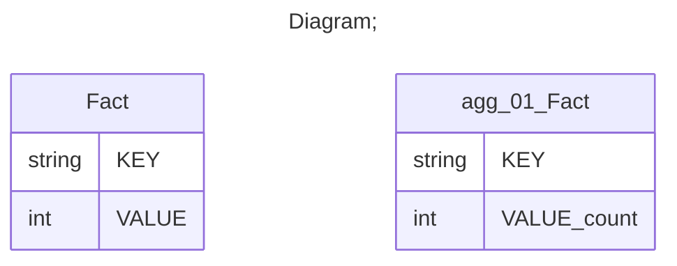

# Documentation
### CatalogName : tutorial_01-13_Cube_with_table_reference_with_wrong_AggExclude_Warning
### Schema Cube_with_reference_with_wrong_AggExclude_Warning : 
---
### Cubes :

    Cube

---
#### Cube "Cube":

    

##### Table: "Fact"

### Cube "Cube" diagram:

---

---
### Cube Matrix for Cube_with_reference_with_wrong_AggExclude_Warning:

---
### Database :
---

---
## Validation result for schema Cube_with_reference_with_wrong_AggExclude_Warning
## WARNING : 
|Type|   |
|----|---|
|DATABASE|Agg Exclude table agg_01_Fact1 does not exist in database .|
