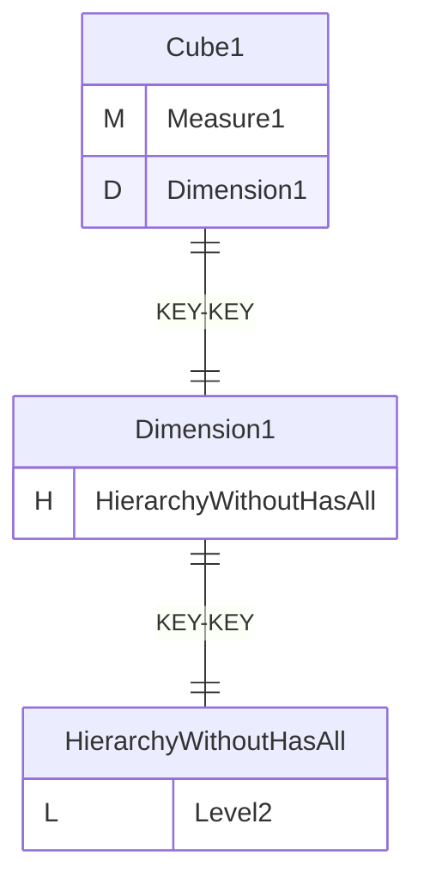
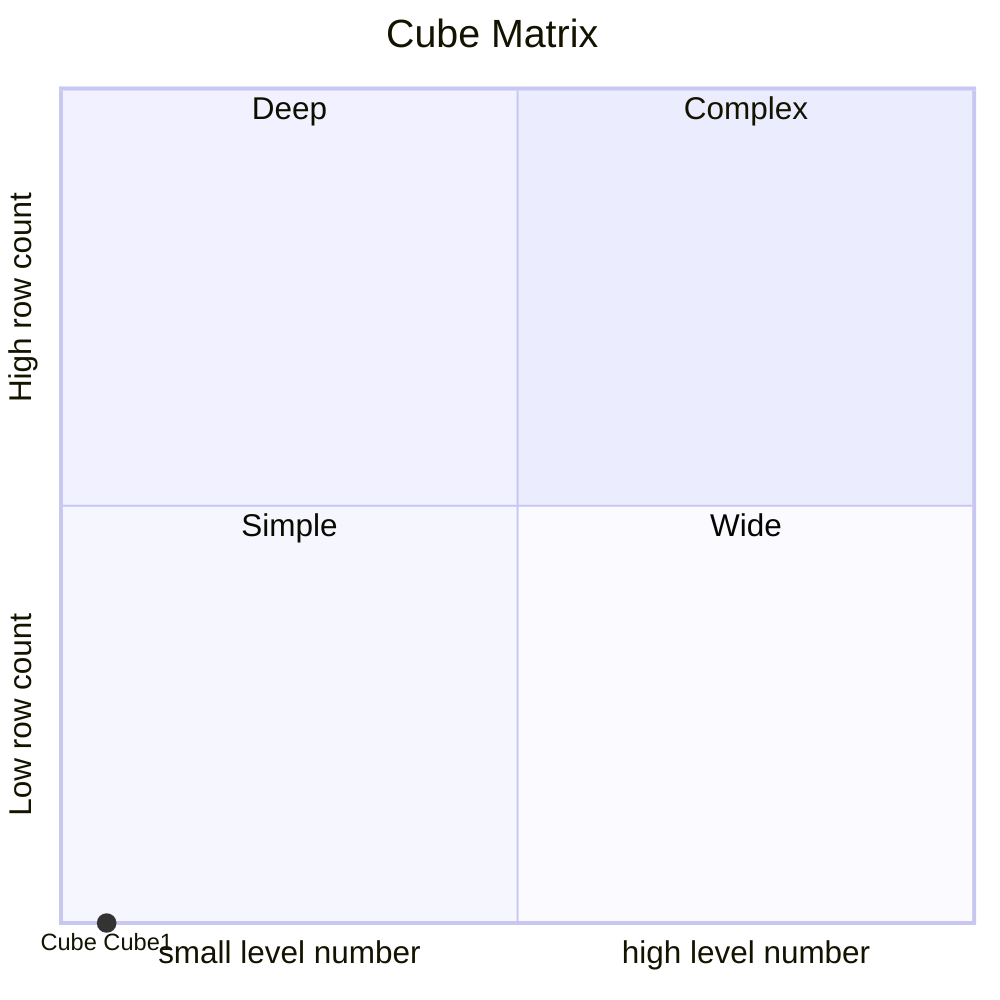
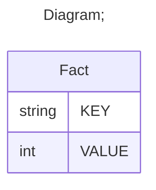

# Documentation
### CatalogName : tutorial_01-14_Cube_with_share_dimension_with_hierarchy_hasAll_false_with_ table_reference
### Schema Cube_with_share_dimension_with_hierarchy_hasAll_false_with_table_reference : 
### Public Dimensions:

    Dimension1

##### Dimension "Dimension1":

Hierarchies:

    HierarchyWithoutHasAll

##### Hierarchy HierarchyWithoutHasAll:

Tables: "Fact"

Levels: "Level2"

###### Level "Level2" :

    column(s): KEY

---
### Cubes :

    Cube1

---
#### Cube "Cube1":

    

##### Table: "Fact"

##### Dimensions:
##### Dimension: "Dimension1 -> Dimension1":

### Cube "Cube1" diagram:

---

---
### Cube Matrix for Cube_with_share_dimension_with_hierarchy_hasAll_false_with_table_reference:

---
### Database :
---

---
## Validation result for schema Cube_with_share_dimension_with_hierarchy_hasAll_false_with_table_reference
## WARNING : 
|Type|   |
|----|---|
|DATABASE|Table: Schema must be set|
