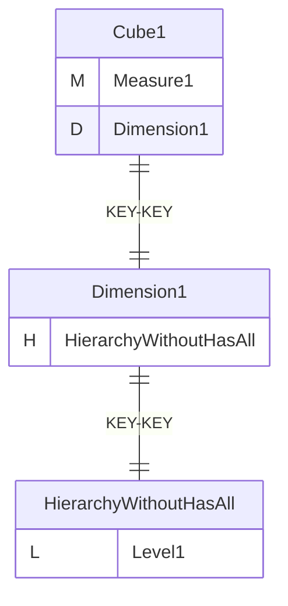
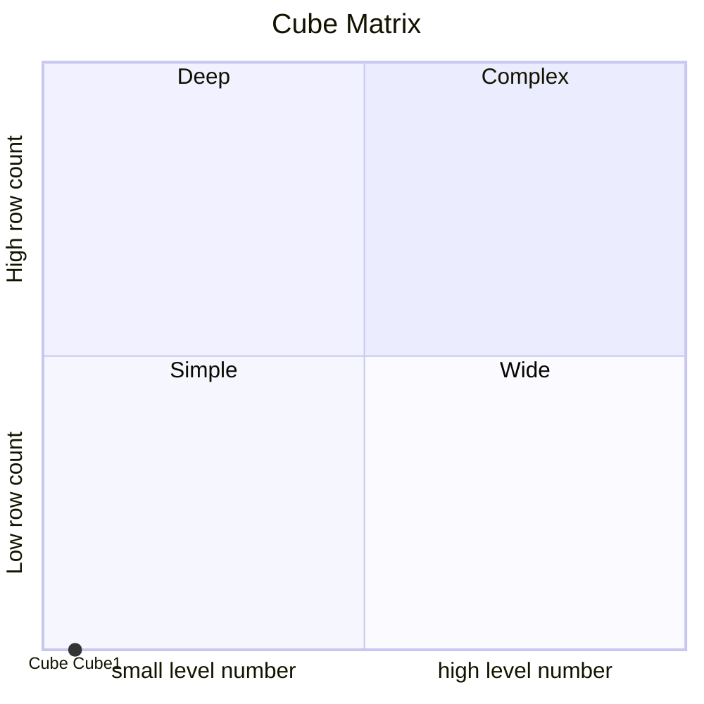
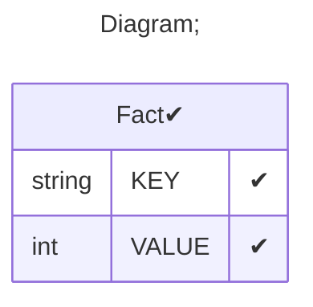

# Documentation
### CatalogName : tutorial_15-05_Cube_with_share_dimension_with_Hierarchy_hasAll_false
### Schema Minimal_1 : 

    By default, every hierarchy contains a top level called '(All)',
    which contains a single member called '(All {hierarchyName})'.
    This member is parent of all other members of the hierarchy, and thus represents a grand total.
    It is also the default member of the hierarchy; that is, the member which is used for
    calculating cell values when the hierarchy is not included on an axis or in the slicer.
    The allMemberName and allLevelName attributes override the default names of the all level
    and all member.

    If the Hierarchy element has hasAll="false", the 'all' level is suppressed.
    The default member of that dimension will now be the first member of the first level;
    for example, in a Time hierarchy, it will be the first year in the hierarchy.
    Changing the default member can be confusing, so you should generally use hasAll="true".
  
### Public Dimensions:

    Dimension1

##### Dimension "Dimension1":

Hierarchies:

    HierarchyWithoutHasAll

##### Hierarchy HierarchyWithoutHasAll:

Tables: "Fact"

Levels: "Level1"

###### Level "Level1" :

    column(s): KEY

---
### Cubes :

    Cube1

---
#### Cube "Cube1":

    

##### Table: "Fact"

##### Dimensions:
##### Dimension: "Dimension1 -> Dimension1":

### Cube "Cube1" diagram:

---

---
### Cube Matrix for Minimal_1:

---
### Database :
---

---
## Validation result for schema Minimal_1
## WARNING : 
|Type|   |
|----|---|
|DATABASE|Table: Schema must be set|
