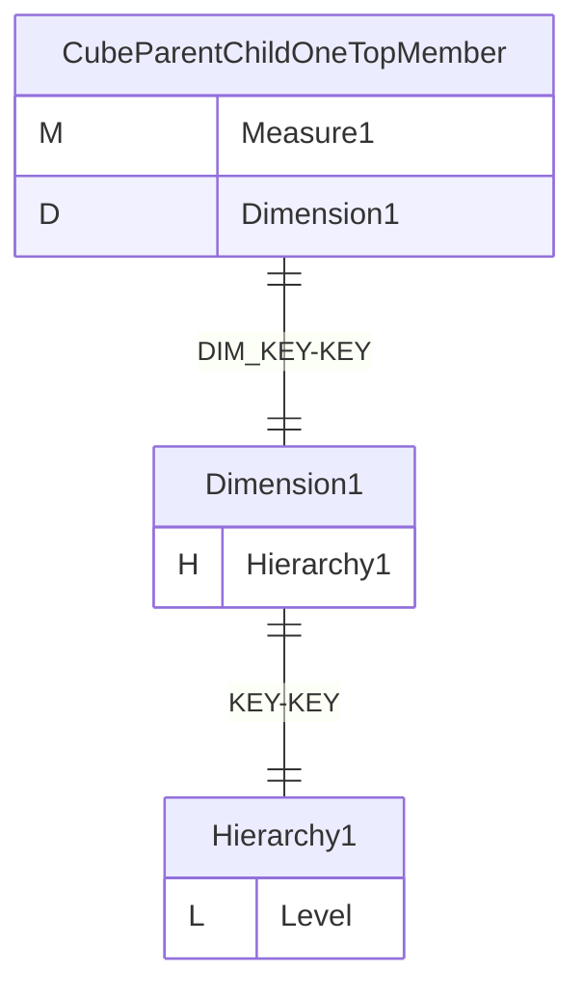
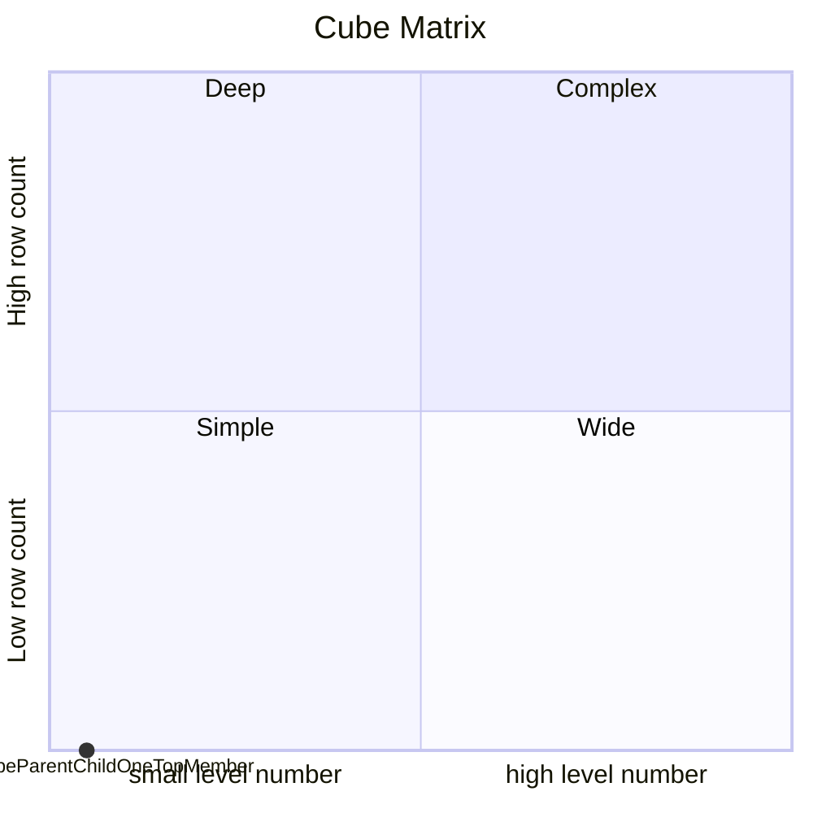
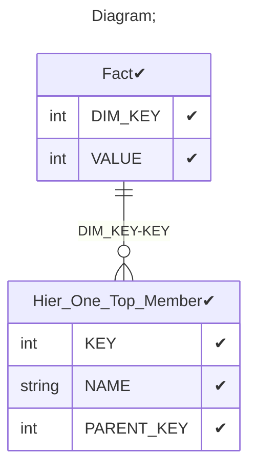

# Documentation
### CatalogName : tutorial_15-06_Cube_with_share_dimension_with_Level_parentColumn_parent_child_
### Schema Minimal_Parent_Child_Hierarchy : 

    The parentColumn attribute is the name of the column which
    links a member to its parent member; in this case,
    it is the foreign key column which points to an employee's
    supervisor. The ParentExpression child element of Level
    is equivalent to the parentColumn attribute, but allows you to
    define an arbitrary SQL expression, just like the Expression
    element. The parentColumn attribute (or ParentExpression element)
    is the only indication to Mondrian that a hierarchy has a
    parent-child structure.
    The nullParentValue attribute is the value which indicates
    that a member has no parent. The default is
    nullParentValue="null", but since many database don't index
    null values, schema designers sometimes use values as the
    empty string, 0, and -1 instead.

  
### Public Dimensions:

    Dimension1

##### Dimension "Dimension1":

Hierarchies:

    Hierarchy1

##### Hierarchy Hierarchy1:

Tables: "Hier_One_Top_Member"

Levels: "Level"

###### Level "Level" :

    column(s): KEY

---
### Cubes :

    CubeParentChildOneTopMember

---
#### Cube "CubeParentChildOneTopMember":

    

##### Table: "Fact"

##### Dimensions:
##### Dimension: "Dimension1 -> Dimension1":

### Cube "CubeParentChildOneTopMember" diagram:

---

---
### Cube Matrix for Minimal_Parent_Child_Hierarchy:

---
### Database :
---

---
## Validation result for schema Minimal_Parent_Child_Hierarchy
## WARNING : 
|Type|   |
|----|---|
|DATABASE|Table: Schema must be set|
