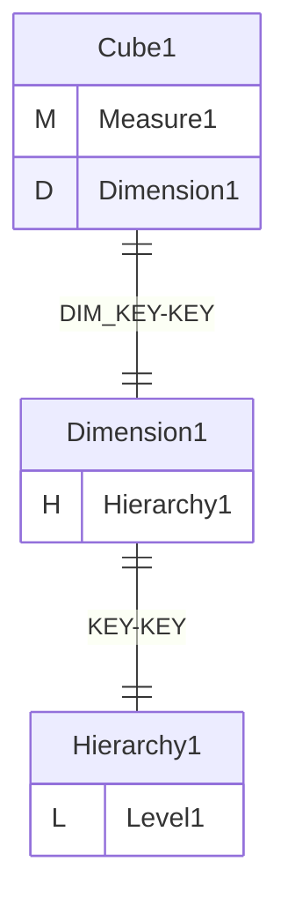
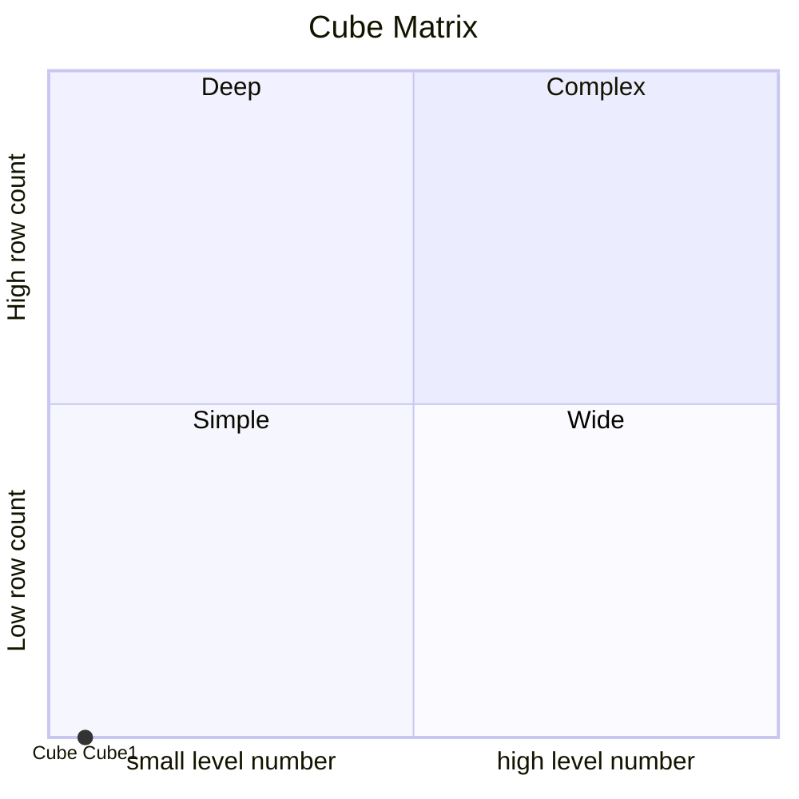
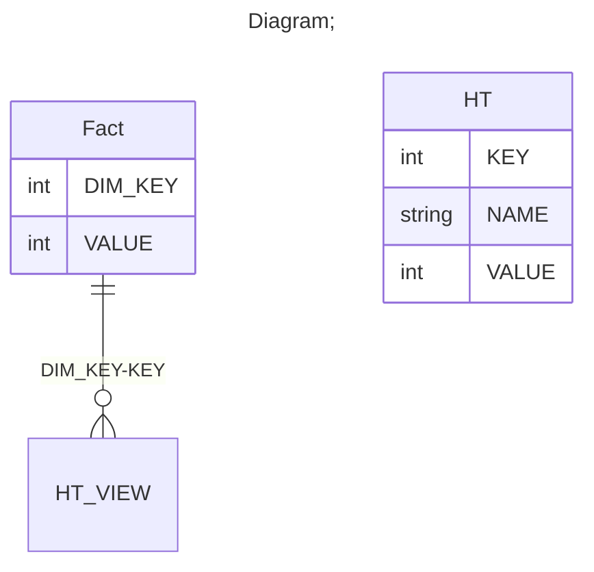

# Documentation
### CatalogName : tutorial_18_Cube_with_share_dimension_with_view_reference
### Schema Cube_with_share_dimension_with hierarchy_with_view_reference : 

  
		A basic OLAP schema with a level with reference with view
    Share dimension Dimension1 is defined in a <Dimension> element inside <Schema> element.
    Hierarchy is defined in a <Hierarchy> element inside <Dimension> element.
    Hierarchy have reference in view element
    Cube dimension Dimension1 have link on share dimension Dimension1 as source.

		Data cubes (<Cube>) are defined in an OLAP schema (<Schema>). Within the schema the name of each data cube must be unique.
		This example schema contains one cube named "Cube1".

		A cube is based on a fact table (<Table>) which refers to a database table containing one or more measurements to be aggregated (and optionally further columns defining factual dimensions).
		In this case the database table representing the fact table is named "Fact" in the database, which is adressed in the name attribute within the <Table> tag.

		Each measurement of the cube is defined in a separate <Measure> element.
		The measurement in this example cube is named "Measure" (name attribute). It corresponds to the "VALUE" column (column attribute) in the database table "Fact" and is aggregated by summation (aggregator attribute).
		Level is defined in <Level> element.
		Property is defined in <Property> element inside <Level> element. Property we can see in cell tooltip in excel

		
  
### Public Dimensions:

    Dimension1

##### Dimension "Dimension1":

Hierarchies:

    Hierarchy1

##### Hierarchy Hierarchy1:

Tables: "select * from HT"

Levels: "Level1"

###### Level "Level1" :

    column(s): KEY

---
### Cubes :

    Cube1

---
#### Cube "Cube1":

    

##### Table: "Fact"

##### Dimensions:
##### Dimension: "Dimension1 -> Dimension1":

### Cube "Cube1" diagram:

---

---
### Cube Matrix for Cube_with_share_dimension_with hierarchy_with_view_reference:

---
### Database :
---

---
