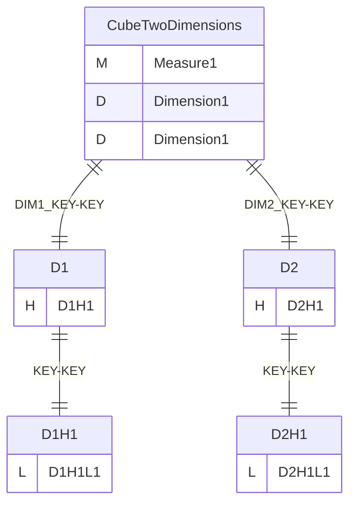
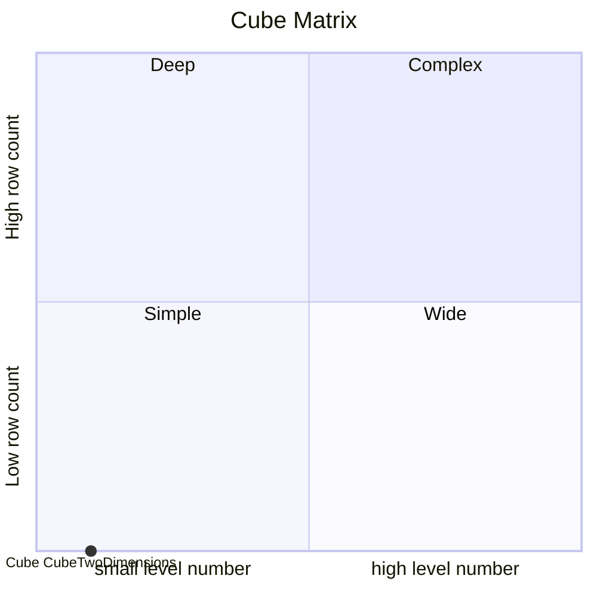
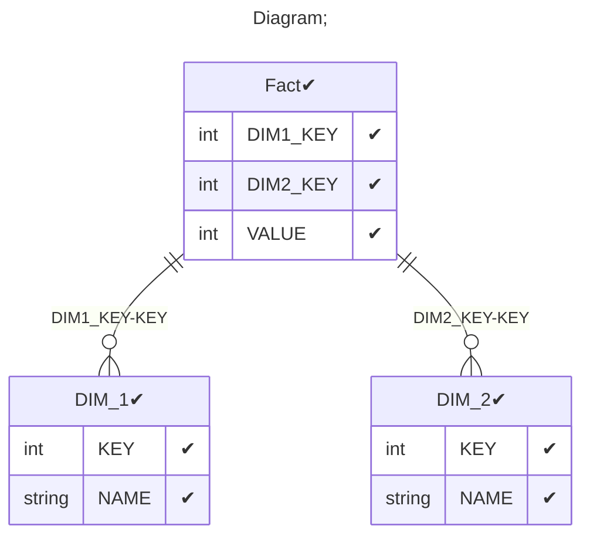

# Documentation
### CatalogName : tutorial_19_Cube_with_multiple_share_dimension_with_same_name_Error
### Schema Minimal_Cube_with_two_dimensions_with_same_name : 

    
		A basic OLAP schema with a level with reference with view
    Share dimension Dimension1 is defined in a <Dimension> element inside <Schema> element.
    Hierarchy is defined in a <Hierarchy> element inside <Dimension> element.
    Hierarchy have reference in view element
    Cube have two dimensions with one name Dimension1 for test case which have link on share dimension D1 and D2 as source.

		Data cubes (<Cube>) are defined in an OLAP schema (<Schema>). Within the schema the name of each data cube must be unique.
		This example schema contains one cube named "CubeTwoDimensions".

		A cube is based on a fact table (<Table>) which refers to a database table containing one or more measurements to be aggregated (and optionally further columns defining factual dimensions).
		In this case the database table representing the fact table is named "Fact" in the database, which is adressed in the name attribute within the <Table> tag.

		Each measurement of the cube is defined in a separate <Measure> element.
		The measurement in this example cube is named "Measure" (name attribute). It corresponds to the "VALUE" column (column attribute) in the database table "Fact" and is aggregated by summation (aggregator attribute).
		Level is defined in <Level> element.

		
  
### Public Dimensions:

    D1, D2, D1

##### Dimension "D1":

Hierarchies:

    D1H1

##### Hierarchy D1H1:

Tables: "DIM_1"

Levels: "D1H1L1"

###### Level "D1H1L1" :

    column(s): KEY

##### Dimension "D2":

Hierarchies:

    D2H1

##### Hierarchy D2H1:

Tables: "DIM_2"

Levels: "D2H1L1"

###### Level "D2H1L1" :

    column(s): KEY

##### Dimension "D1":

Hierarchies:

    D1H1

##### Hierarchy D1H1:

Tables: "DIM_1"

Levels: "D1H1L1"

###### Level "D1H1L1" :

    column(s): KEY

---
### Cubes :

    CubeTwoDimensions

---
#### Cube "CubeTwoDimensions":

    

##### Table: "Fact"

##### Dimensions:
##### Dimension: "Dimension1 -> D1":

##### Dimension: "Dimension1 -> D2":

### Cube "CubeTwoDimensions" diagram:

---

---
### Cube Matrix for Minimal_Cube_with_two_dimensions_with_same_name:

---
### Database :
---

---
## Validation result for schema Minimal_Cube_with_two_dimensions_with_same_name
## ERROR : 
|Type|   |
|----|---|
|SCHEMA|Schema Dimension with name D1 meets more then one time|
|SCHEMA|Cube Dimension with name Dimension1 meets more then one time in cube with name CubeTwoDimensions|
## WARNING : 
|Type|   |
|----|---|
|DATABASE|Table: Schema must be set|
