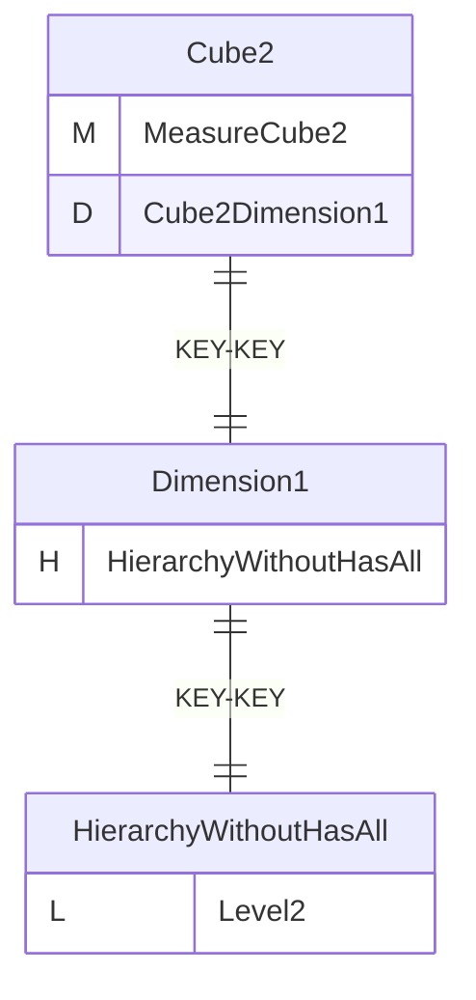
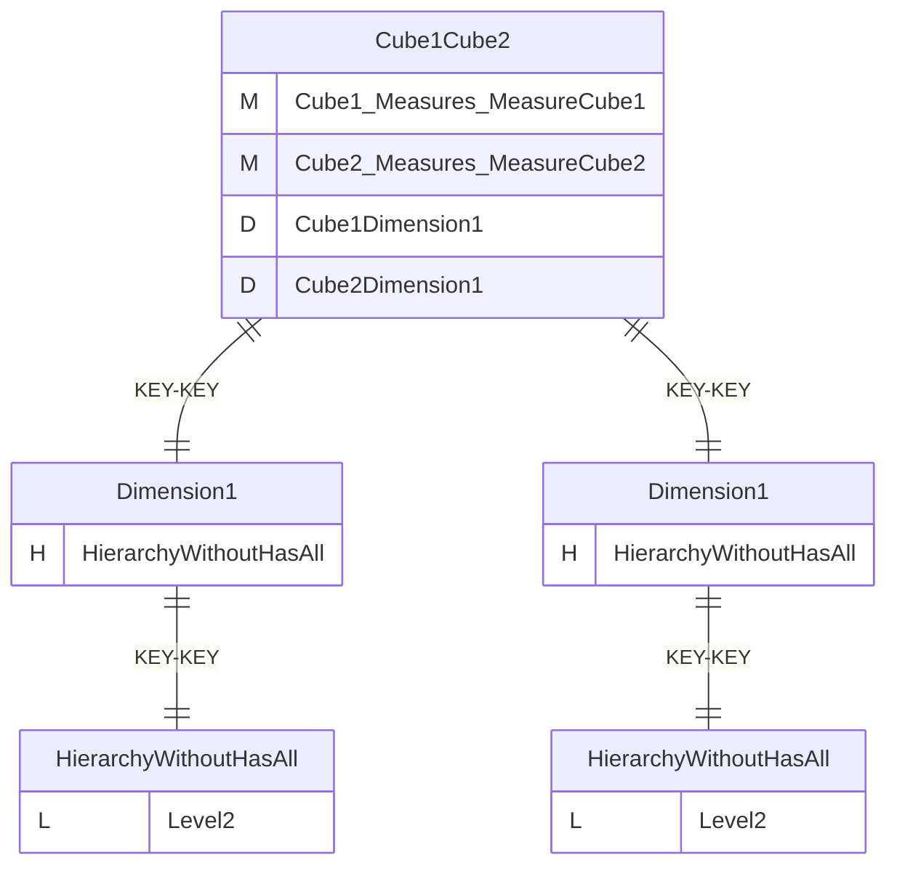
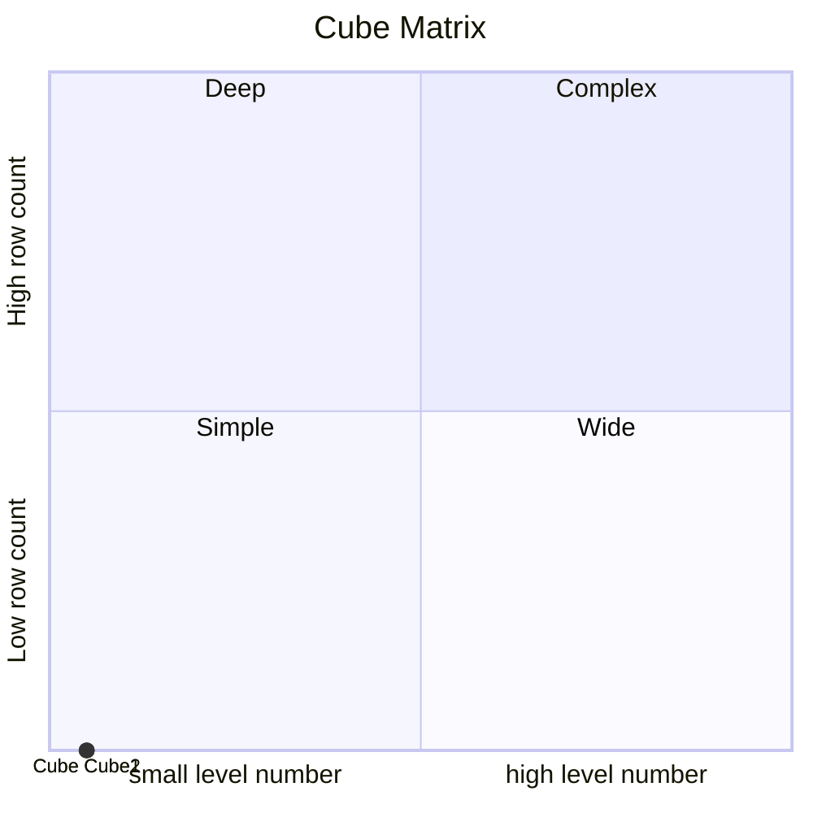
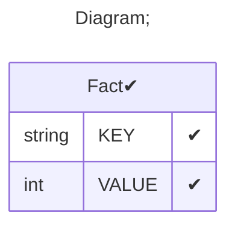

# Documentation
### CatalogName : tutorial_20-00_VirtualCube
### Schema Cube_with_virtual_cube : 

    
		A basic OLAP schema with virtual cube which have reference to Cube1, Cube2

		
  
### Public Dimensions:

    Dimension1

##### Dimension "Dimension1":

Hierarchies:

    HierarchyWithoutHasAll

##### Hierarchy HierarchyWithoutHasAll:

Tables: "Fact"

Levels: "Level2"

###### Level "Level2" :

    column(s): KEY

---
### Cubes :

    Cube1, Cube2

---
#### Cube "Cube1":

    

##### Table: "Fact"

##### Dimensions:
##### Dimension: "Cube1Dimension1 -> Dimension1":

---
#### Cube "Cube2":

    

##### Table: "Fact"

##### Dimensions:
##### Dimension: "Cube2Dimension1 -> Dimension1":

### Cube "Cube1" diagram:

---

---
### Cube "Cube2" diagram:

---

---
### Virtual Cube "Cube1Cube2" diagram:

---

---
### Cube Matrix for Cube_with_virtual_cube:

---
### Database :
---

---
## Validation result for schema Cube_with_virtual_cube
## WARNING : 
|Type|   |
|----|---|
|DATABASE|Table: Schema must be set|
