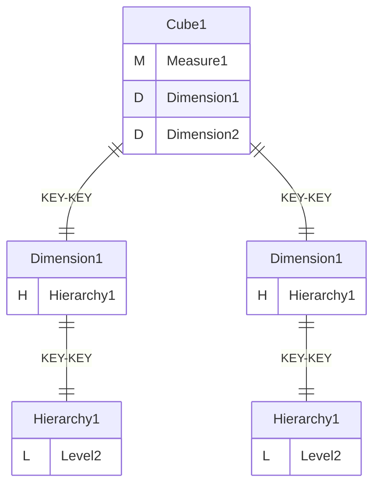
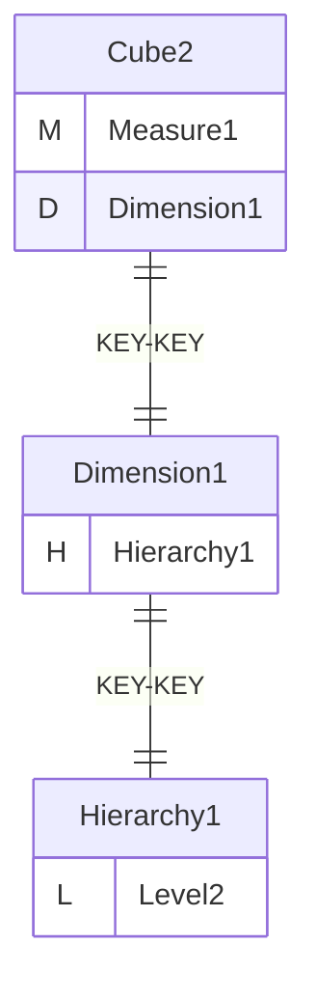
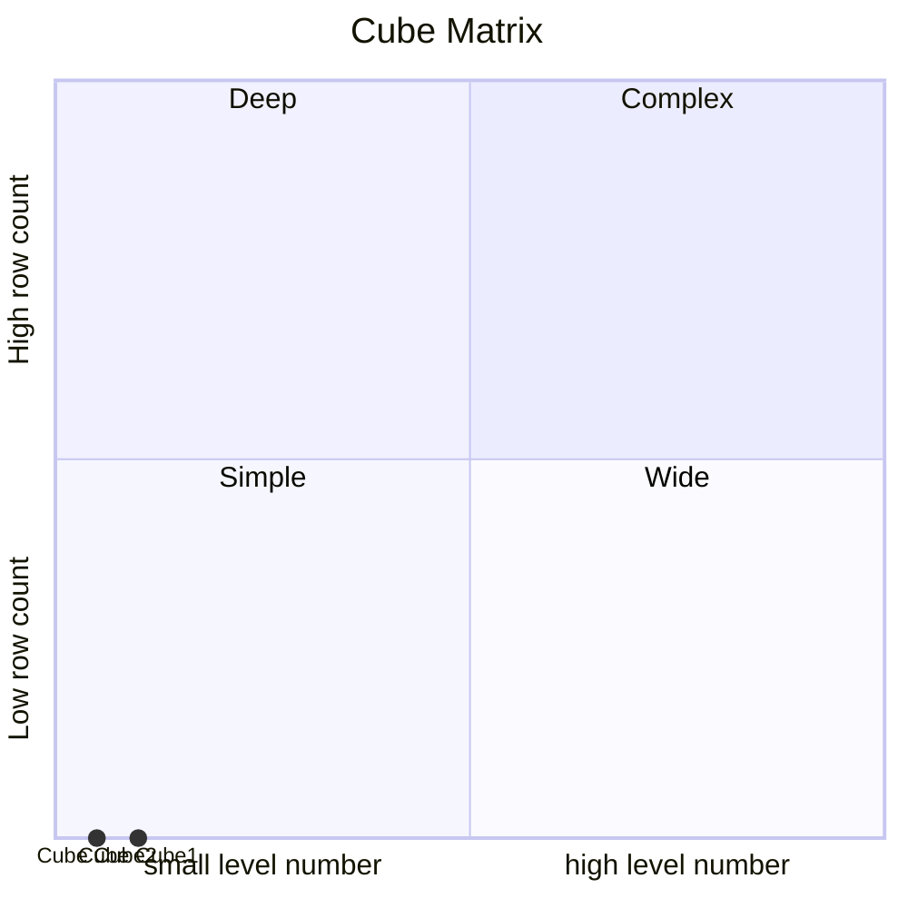
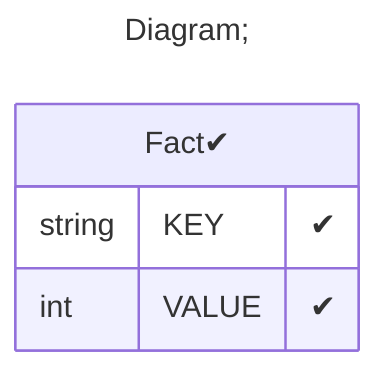

# Documentation
### CatalogName : tutorial_25_1_with_role_with_access_all_dimension_cube1_access_only
### Schema Cube_with_access_all_dimension_cube1_access_only : 

    Cube with examples of roles with SchemaGrant all_dimensions
    Cube1 - all access
    Cube2 - no access

  
### Public Dimensions:

    Dimension1

##### Dimension "Dimension1":

Hierarchies:

    Hierarchy1

##### Hierarchy Hierarchy1:

Tables: "Fact"

Levels: "Level2"

###### Level "Level2" :

    column(s): KEY

---
### Cubes :

    Cube1, Cube2

---
#### Cube "Cube1":

    

##### Table: "Fact"

##### Dimensions:
##### Dimension: "Dimension1 -> Dimension1":

##### Dimension: "Dimension2 -> Dimension1":

---
#### Cube "Cube2":

    

##### Table: "Fact"

##### Dimensions:
##### Dimension: "Dimension1 -> Dimension1":

### Roles :##### Role: "role1"

### Cube "Cube1" diagram:

---

---
### Cube "Cube2" diagram:

---

---
### Cube Matrix for Cube_with_access_all_dimension_cube1_access_only:

---
### Database :
---

---
## Validation result for schema Cube_with_access_all_dimension_cube1_access_only
## WARNING : 
|Type|   |
|----|---|
|DATABASE|Table: Schema must be set|
