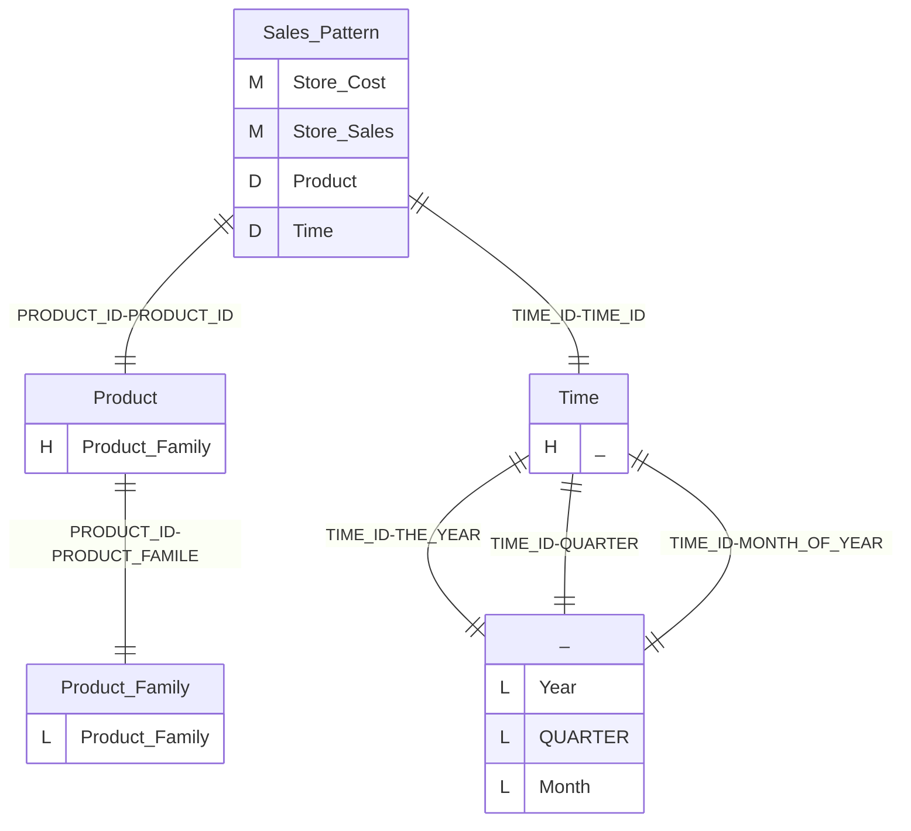
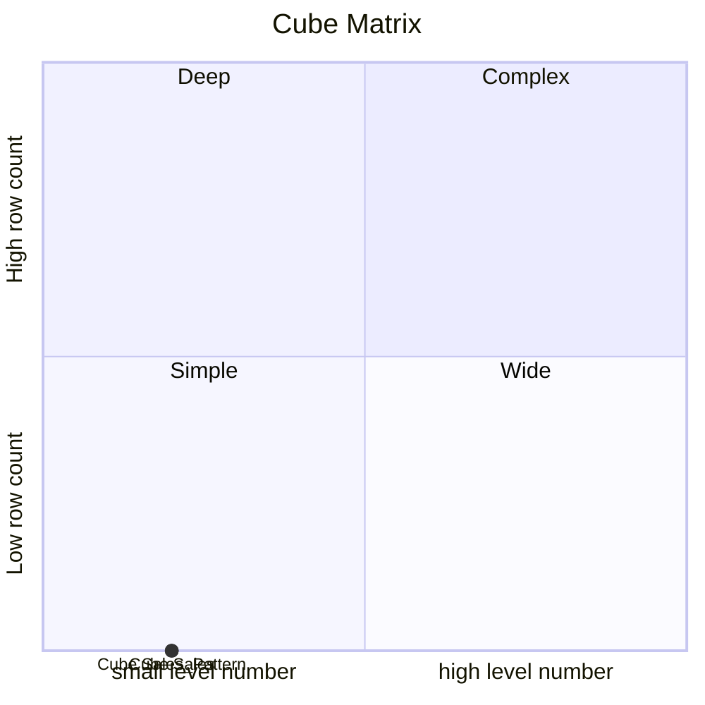
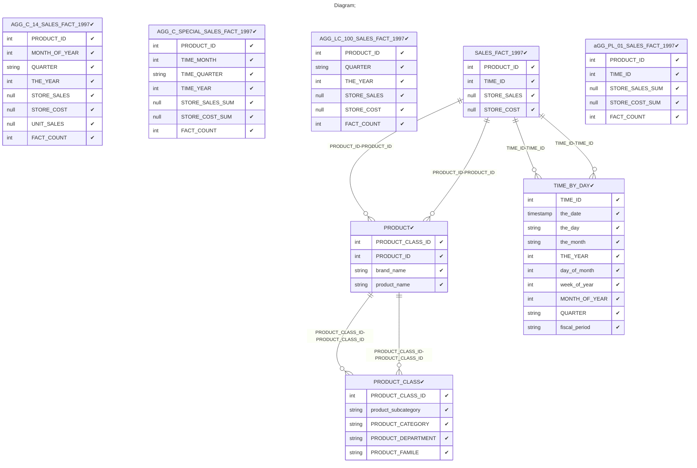

# Documentation
### CatalogName : tutorial_28_Cube_with_Aggregate_tables
### Schema Cube_with_Aggregate_tables : 

    Aggregate tables are a way to improve Mondrian's performance when the fact table contains
    a huge number of rows: a million or more. An aggregate table is essentially a pre-computed
    summary of the data in the fact table.
  
### Public Dimensions:

    Product, Time

##### Dimension "Product":

Hierarchies:

    Product Family

##### Hierarchy Product Family:

Tables: "PRODUCT,PRODUCT_CLASS"

Levels: "Product Family"

###### Level "Product Family" :

    column(s): PRODUCT_FAMILE

##### Dimension "Time":

Hierarchies:

    Hierarchy0

##### Hierarchy Hierarchy0:

Tables: "TIME_BY_DAY"

Levels: "Year, QUARTER, Month"

###### Level "Year" :

    column(s): THE_YEAR

###### Level "QUARTER" :

    column(s): QUARTER

###### Level "Month" :

    column(s): MONTH_OF_YEAR

---
### Cubes :

    Sales, Sales_Pattern

---
#### Cube "Sales":

    

##### Table: "SALES_FACT_1997"

##### Dimensions:
##### Dimension: "Product -> Product":

##### Dimension: "Time -> Time":

---
#### Cube "Sales_Pattern":

    

##### Table: "SALES_FACT_1997"

##### Dimensions:
##### Dimension: "Product -> Product":

##### Dimension: "Time -> Time":

### Cube "Sales" diagram:

---

---
### Cube "Sales_Pattern" diagram:

---

---
### Cube Matrix for Cube_with_Aggregate_tables:

---
### Database :
---

---
## Validation result for schema Cube_with_Aggregate_tables
## WARNING : 
|Type|   |
|----|---|
|DATABASE|Table: Schema must be set|
