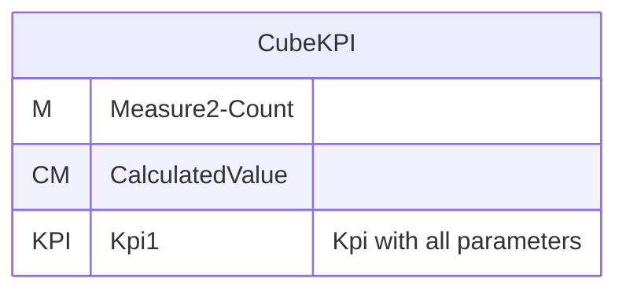
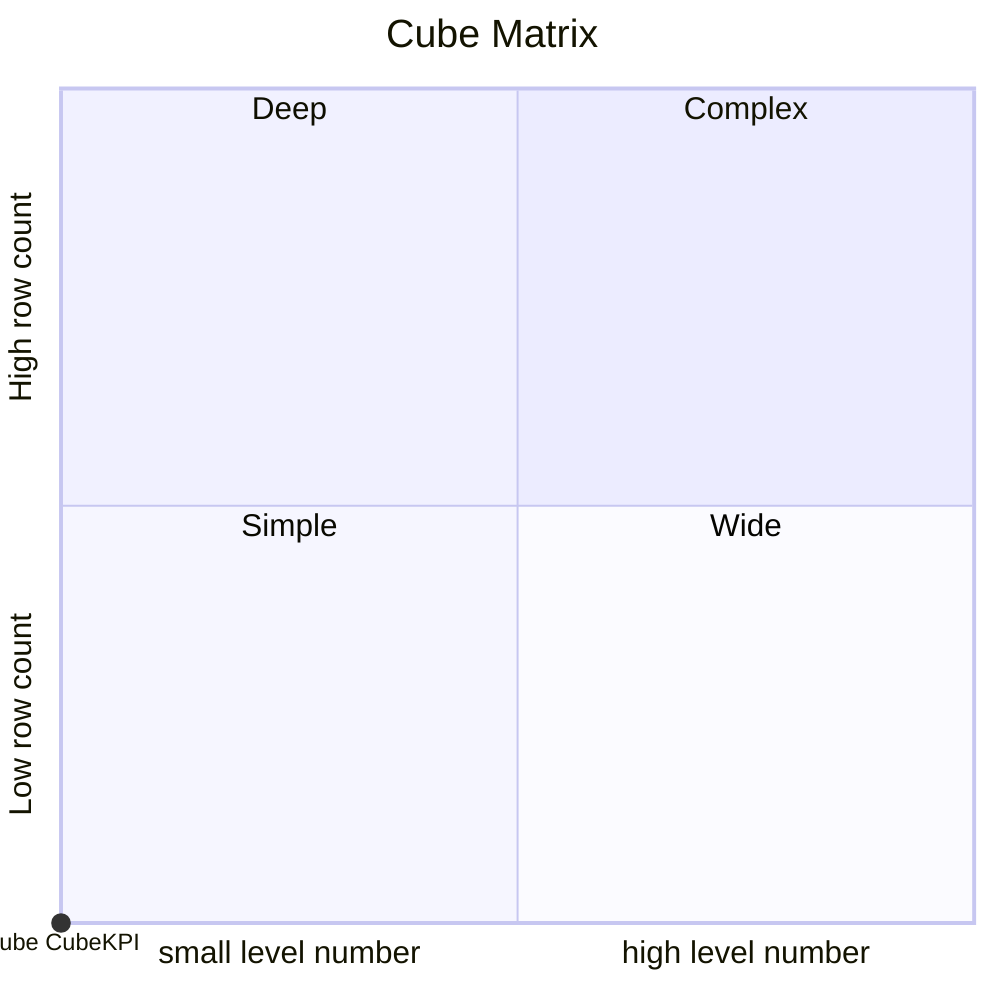
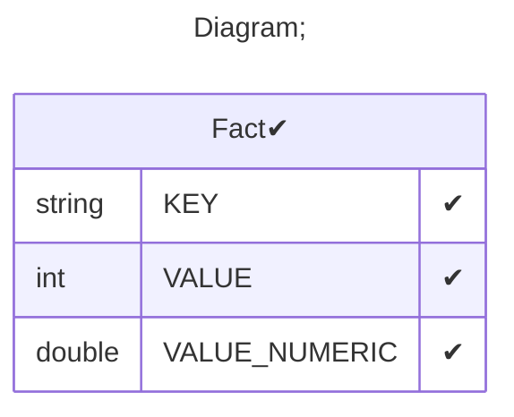

# Documentation
### CatalogName : tutorial_30-08_Cube_KPI_with_wrong_properties
### Schema Minimal_Cubes_With_KPI_All_Properties : 

		
		A minimal cube with Kpi with wrong kpi properties

		A KPI has four important properties which are value, goal, status and trend.
		Let's explain this by means of Profit Margin with the below calculation.

    Value: is the actual value of the KPI. This will be a numeric value. For example, this can be the Profit Margin.
      This might not be included in the fact table hence we may have to calculate or derive this column.

    Goal: every organization has a goal for this value. For example, the organization may look at the
      goal of achieving a five percent Profit Margin. Also, sometimes they may have different values for
      different business areas. For example, depending on the product category or sales territory,
      the sales margin goal will differ.

    Status: depending on the KPI value and the KPI goal, the KPI status can be defined.
      For an example, we can say that if the KPI value is greater than the goal it is great if it is not greater
      than the goal, but still greater than zero it is good and if less than zero or running at a loss it is bad.
      This Great, Good or Bad can be displayed to the user by means of a graphical representation such as an arrow,
      traffic lights or a gauge.

    Trend: trend is an optional parameter when defining a KPI, but still an important feature in a KPI.
      For example, you may have a great profit margin, but comparing with last year, it could be less.
      On the other hand, you might have a bad profit margin, but compared to last year it is improving.

    Weight:  The unique name of the member in the measures dimension for the KPI weight.

    StatusGraphic: The default graphical representation of the KPI status.
      (Traffic Light, Road Signs, Gauge - Ascending, Gauge - Descending, Thermometer, Cylinder, Smiley Face)

    TrendGraphic: The default graphical representation of the KPI trend.
      (Standard Arrow, Status Arrow - Ascending, Status Arrow - Descending, Smiley Face)

    DisplayFolder:  The display folder.

		
  
---
### Cubes :

    CubeKPI

---
#### Cube "CubeKPI":

    

##### Table: "Fact"

### Cube "CubeKPI" diagram:

---

---
### Cube Matrix for Minimal_Cubes_With_KPI_All_Properties:

---
### Database :
---

---
## Validation result for schema Minimal_Cubes_With_KPI_All_Properties
## ERROR : 
|Type|   |
|----|---|
|SCHEMA|KPI Trend have wrong format for KPI with name Kpi1 for cube with name CubeKPI|
|SCHEMA|KPI Status should start from '[measure].' for KPI with name Kpi1 for cube with name CubeKPI|
|SCHEMA|KPI Status have wrong format for KPI with name Kpi1 for cube with name CubeKPI|
|SCHEMA|Measure or calculated member Wrong absent for KPI Goal for KPI with name Kpi1 for cube with name CubeKPI|
|SCHEMA|KPI CurrentTimeMember have wrong format for KPI with name Kpi1 for cube with name CubeKPI|
|SCHEMA|KPI Weight have wrong format for KPI with name Kpi1 for cube with name CubeKPI|
|SCHEMA|KPI Value have wrong format for KPI with name Kpi1 for cube with name CubeKPI|
