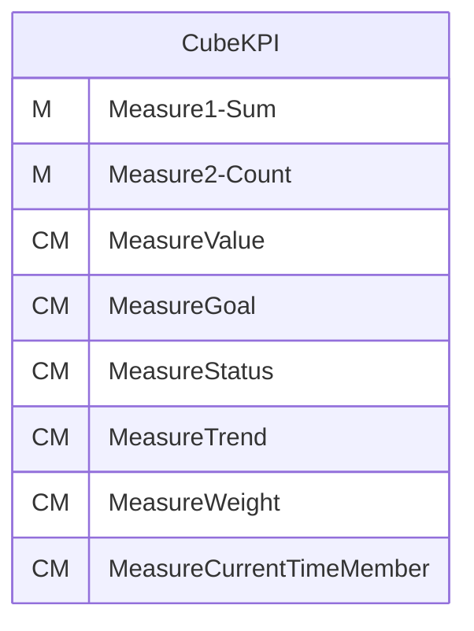
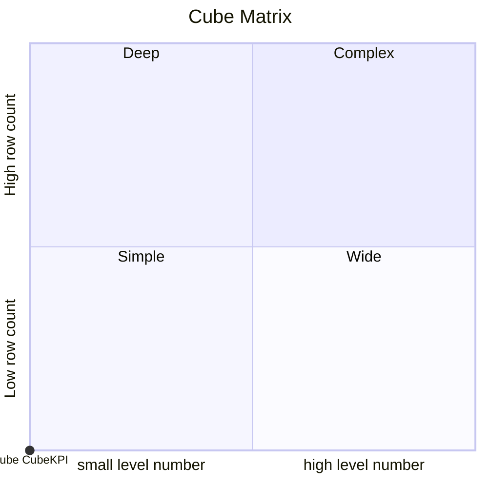
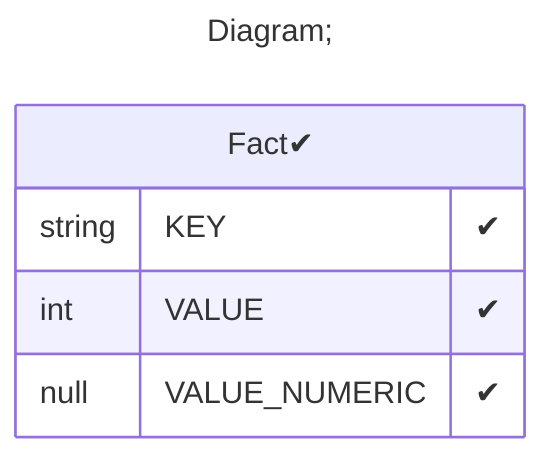

# Documentation
### CatalogName : tutorial_30_Cube_KPI
### Schema Minimal_Cubes_With_KPI : 

		
		A mininmal cube with Kpi
		
  
---
### Cubes :

    CubeKPI

---
#### Cube "CubeKPI":

    

##### Table: "Fact"

### Cube "CubeKPI" diagram:

---

---
### Cube Matrix for Minimal_Cubes_With_KPI:

---
### Database :
---

---
